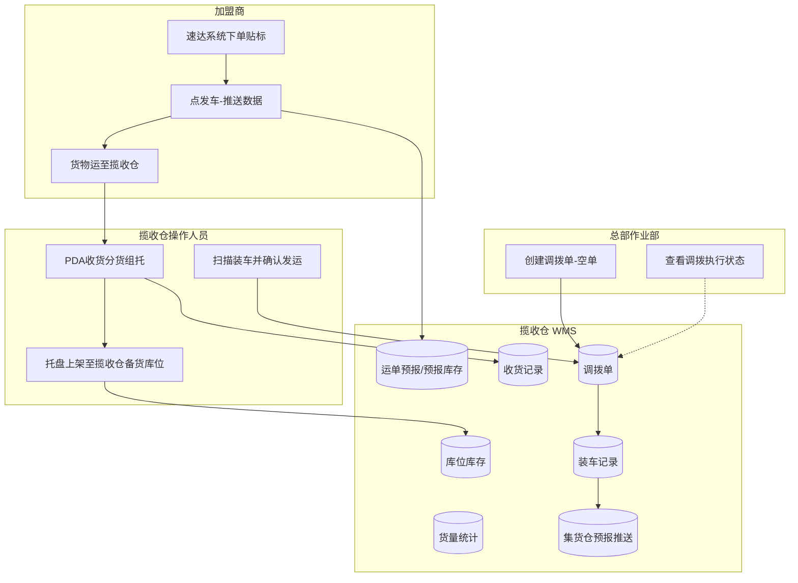

# 业务背景与介绍

> 文档定位：需求设计阶段基线文档，回答揽收仓 WMS"做什么、不做什么、优先级是什么"。\
> 版本：v1.0 | 状态：待评审

***

## 一、需求背景

加盟商入驻后，将在南昌和赣州设立两个虚拟集配站（即揽收仓），交由当地加盟商运营。揽收仓负责接收区域内加盟商从客户处揽收的货物，经收货、分货、组托后统一进行干线运输，调拨至德速集货仓库。

揽收仓不是独立的仓储系统，而是 WMS 的前置执行节点。它的核心价值在于：**在货物进入德速中心仓之前，完成集货、验货和标准化组托，减少中心仓的收货压力和沟通成本**。如果揽收仓环节缺失或依赖纸质流程，中心仓将直接面对数十个加盟商的零散到货，收货效率、库存准确性和异常追溯都将面临严重挑战。

当前现状：采用纸质版交接，加盟商在速达系统预报下单后贴标，按票集中装车，制作纸质送货单。所有货物前期集中送东莞仓，系统上线后再按渠道分送对应仓库。揽收仓无系统支撑，收货、分货、调拨、装车全链路依赖人工核对和纸质单据，效率低、易出错、不可追溯。

因此，揽收仓 WMS 是加盟商入驻后**必须优先建设的基础设施**，其需求基线应聚焦揽收仓核心作业链路（收货 → 分货 → 调拨装车 → 发运），而非一次性覆盖完整 WMS 能力。

***

## 二、当前痛点

| 痛点编号 | 痛点 | 影响 |
|---|---|---|
| P01 | 揽收仓收货依赖纸质单据，效率低、易出错 | 漏收错收难追溯，收货准确性无法保证 |
| P02 | 收货时无预报数据可对照 | 不清楚当天该收哪些货、从谁收、收多少 |
| P03 | 无调拨单 | 揽收仓不知道何时装车、装什么、发往哪里 |
| P04 | 装车时无系统扫描校验 | 漏装错装事后才发现，中心仓无法提前准备收货 |
| P05 | 揽收仓库存无系统记录 | 装车计划依赖人工盘点，库存账实不一致 |
| P06 | 分货依赖人工，多票混放错放难以避免 | 中心仓需重新分拣，增加额外操作成本 |
| P07 | 揽收仓发货各自独立操作，无系统支撑 | 总部无法实时掌握发货进度，收货计划难以安排 |

***

## 三、本期范围

| 范围类型     | 内容                                  | 说明                                        |        |
| -------- | ----------------------------------- | ----------------------------------------- | :---------- |
| **本期做**  | 接收速达系统推送的运单预报数据，作为揽收仓收货的数据源         | 运单数据由外部系统推送，WMS 不做运单创建，只做接收和执行            |        |
| **本期做**  | PDA 收货分货组托：逐箱扫描收货，按运单分配托盘并自动生成托号 | 收货、分货、绑托在同一操作中完成，PDA 为主要操作终端；**不产生库存变动**；支持一票一托、多票共托、大票多托 |        |
| **本期做**  | 托盘上架至揽收仓备货库位，系统记录备货库位         | **上架产生库位库存**，预报库存结转扣减；库位库存可查，支撑装车计划 |        |
| **本期做**  | 总部作业部统一创建调拨单（空单），创建时**须选择调出仓库、调入仓库** | 调拨单由总部管控（Q14）；不预填运单/托盘（Q11）；揽收仓不自行创建 |        |
| **本期做**  | PDA 扫描装车并确认发运：关联调拨单，点「发车」确认 | **不允许拆票发车**（Q15）；**不打印装车清单**（Q17）；装车确认后扣减库位库存并推送集货仓预报 |        |
| **本期做**  | 揽收仓库存查询，按托盘/运单/目的仓查看当前库存状态          | 查询预报库存与库位库存，支撑装车计划和日常盘点 |        |
| **本期做**  | 基础资料管理：仓库档案、区域/备货区配置、托盘管理           | 揽收仓作业的基础配置                                |        |
| **明确不做** | 加盟商系统开发（下单、贴标、发车功能）                 | 加盟商系统由速达客户端独立承载，非 WMS 范围                  |        |
| **明确不做** | 速达系统数据推送接口开发                        | 接口由速达侧提供，WMS 只做数据接收和消费                    |        |
| **明确不做** | 东莞中心仓收货后的完整 WMS 操作（上架、拣货、出库等）       | 与揽收仓共用一套 WMS，通过权限控制区分操作范围，东莞仓的完整 WMS 操作能力需独立评估 |        |
| **明确不做** | 德速集货仓（东莞）操作人员侧作业（到货清点、卸车、接收完成等）   | 揽收仓 WMS 仅负责装车确认后自动推送预报；本需求不涉及集货仓操作人员                     |        |
| **明确不做** | 与加盟商的费用结算、财务对账                      | 结算由前端系统与加盟商手动完成，WMS 只提供货量统计数据             |        |
| **明确不做** | 运输车辆调度、在途跟踪、自动排车                    | 运输由加盟商自行安排，WMS 不管理运力资源                    |        |
| **明确不做** | PDA 硬件选型、采购、设备管理                    | PDA 设备已确定，由公司统一配置，WMS 只做软件适配                  |        |
| **明确不做** | 复杂报表、经营分析、KPI 看板                    | 一期聚焦作业执行，数据先入库再谈分析                        |        |
| **明确不做** | 多仓协同、自动分仓、智能路由                      | 南昌和赣州各自独立发往东莞，不存在串行拼货，路由固定为平行模式                |        |

## 六、已确认问题

| 问题编号 | 已确认问题 | 确认结论 |
|---|---|---|
| Q01 | 加盟商系统"发车"功能是否与揽收仓 WMS 同步开发 | 同步开发，加盟商系统"发车"与 WMS 同期上线 |
| Q02 | 有单无货（预报 N 票实到 N-1 票）的处理规则 | 揽收仓清点后通知上游，上游撤销发车，重新编辑后**全量覆盖**下发（Q16）；**撤销须无入库单**（Q13，含收货中不可撤销） |
| Q03 | 调拨单创建频率与规则 | 加盟商需调拨到集货仓时，通知总部创建即可，按需触发 |
| Q04 | 标签规范与打印 | 统一在加盟商系统打印标签，揽收仓不补打 |
| Q05 | 南昌与赣州的路由关系 | 南昌→东莞 / 赣州→东莞，平行独立发运，不存在南昌→赣州→东莞串行 |
| Q06 | PDA 设备选型与离线扫描 | 设备已确定，暂不需要离线扫描 |
| Q07 | 揽收仓与东莞中心仓的系统关系 | 共用一套 WMS 系统，通过权限控制区分操作范围 |
| Q08 | 盘点功能 | 一期暂不需要 |
| Q09 | 是否允许多次收货合并一张入库单 | **不允许**；**一运单对应一入库单（共用表一条记录）**，不将多运单合并为一条 |
| Q10 | 上架库位分配规则 | **人工选择**库位；PDA 上架时由操作员指定揽收仓备货库位 |
| Q11 | 调拨空单是否预填计划装车运单/托盘 | **否**；实装由 PDA 现场扫描决定 |
| Q12 | 有托盘时装车扫描方式 | **扫任一箱号即关联整托**装车 |
| Q13 | 上游撤销预报时的入库单状态校验 | 已生成入库单（**收货中 / 已绑托 / 已上架**）均**不允许撤销** |
| Q14 | 创建调拨单是否须指定调出/调入仓库 | **是**；调出仓库、调入仓库为必填项 |
| Q15 | 是否允许拆票发车 | **不允许**；装车扫描时同一运单须整票关联至本次调拨 |
| Q16 | 收货订单重发更新策略 | **全量覆盖** |
| Q17 | 装车清单是否打印 | **不打印** |
| Q18 | 大票多托上限 | **无上限** |
| Q19 | 调出仓库与调入仓库能否相同 | **不能相同**；创建调拨单时校验阻断 |

***

## 四、业务目标

### 4.1 目标需求（要解决什么问题）

| 目标需求        | 说明                                           |
| ----------- | -------------------------------------------- |
| T01 揽收作业数字化 | 让揽收仓从"纸质送货单 + 人工核对"进入 PDA 扫描驱动，收货、分货、装车全链路留痕 |
| T02 库存可信 | 预报计预报库存；分货绑托无库存化；上架计入库位库存；装车发运扣减库位库存，账实一致 |
| T03 调拨可协同   | 总部创建调拨计划，揽收仓执行装车，发车后状态可追溯，中心仓可提前准备收货         |
| T04 最小闭环优先  | 一期聚焦揽收仓核心作业链路，不做复杂报表、智能调度、完整财务结算             |

### 4.2 业务需求（业务上要做到什么）

| 业务需求         | 对应目标    | 说明                             |
| ------------ | ------- | ------------------------------ |
| B01 运单预报接收 | T01 | 接收速达系统推送的运单数据，生成收货订单并计入预报库存，揽收仓据此知道「今天要收哪些货」 |
| B02 PDA 收货分货组托 | T01、T02 | 到货后逐箱扫描，在同一操作中完成收货确认、按运单分配托盘、生成托号；**不产生库存变动** |
| B03 托盘上架 | T02 | 组托完成后托盘上架至**揽收仓备货库位**，**产生库位库存**，预报库存结转扣减 |
| B04 调拨计划执行   | T03     | 总部创建调拨单后，揽收仓按计划扫描装车            |
| B05 装车发运确认 | T03 | PDA 扫描装车并确认发运（点「发车」）；系统在同一事务内完成调拨完结、**库位库存扣减**，并自动推送集货仓预报（无独立预报流程） |

### 4.3 功能需求（系统需要提供什么能力）

| 功能需求          | 对应业务需求  | 说明               |
| ------------- | ------- | ---------------- |
| F01 运单预报管理 | B01 | 接收并展示速达推送的运单预报数据；落库后产生预报库存；撤销校验入库单（Q13）；重发**全量覆盖**（Q16） |
| F02 PDA 收货分货组托 | B02 | 逐箱扫描收货，在同一操作中完成运单分配托盘、生成托号；**无库存化**（Q09）；**大票多托无上限**（Q18） |
| F03 托盘上架 | B03 | 组托完成后上架至揽收仓备货库位；**库位人工选择**（Q10）；预报库存 −、库位库存 + |
| F04 调拨单管理 | B04 | 总部创建调拨单（空单，不预填运单/托盘 Q11）；**调出仓库、调入仓库必填**（Q14） |
| F05 装车扫描与发车 | B05 | PDA 扫描装车；**不允许拆票发车**（Q15）；有托扫一箱即关联整托（Q12）；**不打印装车清单**（Q17）；库位库存 −；确认后自动推送集货仓预报 |
| F06 揽收仓库存查询 | B03 | 按托盘/运单/目的仓查询预报库存与库位库存 |

> 功能编号与优先级详见《销售管理业务功能需求一览表》。

***

## 五、业务流程概要

以下为宏观泳道级流程，仅描述主路径，不展开异常分支与逆向流程细节。

> 虚线框外：集货仓到货清点、接收完成等操作人员作业不在本需求范围。

**流程要点（需求层约束）：**

1. **加盟商发车**：加盟商在速达系统点"发车"后，运单数据推送至 WMS，生成收货订单并**产生预报库存**。此步骤为揽收仓收货的前提，无预报则 PDA 无法扫描收货。
2. **揽收仓收货分货组托**：操作人员使用 PDA 逐箱扫描运单标签，在同一操作中完成收货确认、按运单分配托盘、自动生成托号；**本阶段无库存化**，仅产生作业记录。支持一票一托、多票共托（小票最多 5 票）、大票多托（**无上限**，Q18）。
3. **托盘上架**：组托完成后，托盘上架至**揽收仓备货库位**，**库位由操作员人工选择**（Q10）；预报库存 −、库位库存 +，库位库存可查。
4. **调拨装车确认**：总部作业部创建调拨单（空单，**须选择调出仓库、调入仓库**，Q14；不预填运单/托盘，Q11）。PDA 扫描关联至调拨单，**不允许拆票发车**（Q15），有托盘时扫一箱即关联整托；装车完成后点「发车」确认发运，**不打印装车清单**（Q17）。
5. **集货仓预报推送**：装车确认发运后，系统**随即自动推送**集货仓预报数据（非独立流程或人工环节）；**揽收仓侧功能至此结束**，不涉及德速集货仓（东莞）操作人员作业。

***

*本文档为需求设计层产出。详细流程推演、异常分支、状态机、字段清单见后续业务设计与 PRD。*
