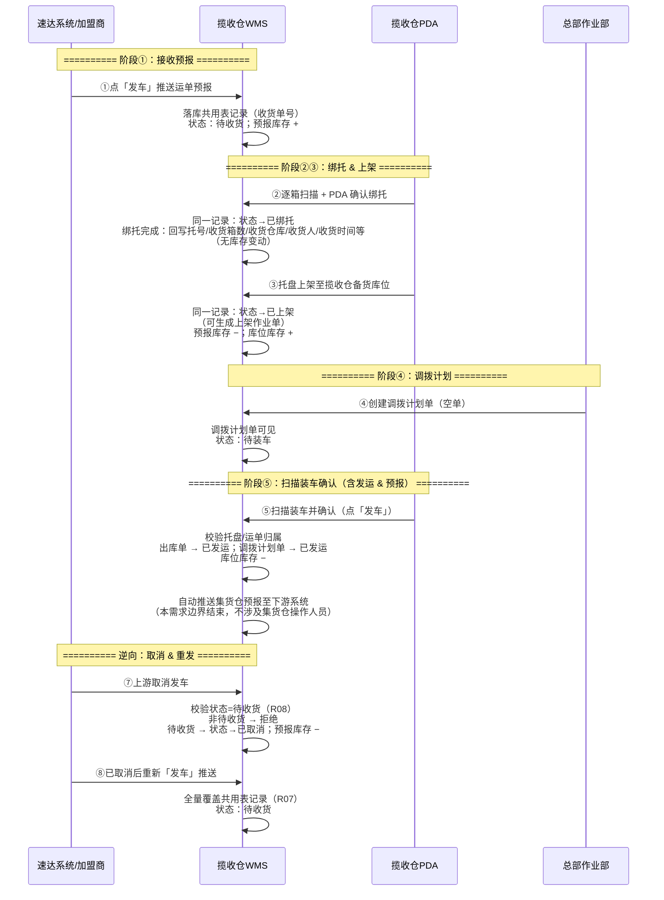
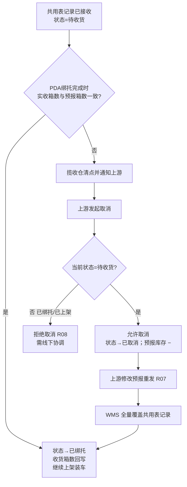

# 揽收仓-流程推演

> **覆盖场景**：正向揽收作业链路 / 上游取消与预报更新逆向链路  
> **不展开范围**：加盟商费用结算与财务对账、德速集货仓（东莞）操作人员侧作业、运输调度与在途跟踪（见 `context/01-业务背景与介绍.md` 本期范围）  
> **参考文档**：《加盟商揽收仓管理后台主PRD》V1.1、《收货订单-入库单字段清单》  
> **规则优先级**：状态机、取消边界、单据模型以**主 PRD**为准；本文与主 PRD 冲突时以主 PRD 裁决  
> **版本**：V1.1 | 2026-08-30

---

## 一、推演范围

本文件覆盖揽收仓 WMS **从接收上游预报到向集货仓发出调拨预报** 的完整业务链路，关注多单据、多角色、跨系统的数据流转与库存变化，而非单一作业界面说明。

### 1.1 正向链路

```
接收预报数据 → 分货绑托 → 创建调拨计划 → 扫描装车确认 → 推送集货仓预报
```


| 阶段       | 业务动作                            | 主要产出                                | 规则来源                                |
| -------- | ------------------------------- | ----------------------------------- | ----------------------------------- |
| ① 接收预报   | 加盟商在速达系统点「发车」，运单数据推送至 WMS       | 收货订单（待收货）+ **预报库存**                 | `context/01` §三 F01、§五 流程要点 1       |
| ② 分货绑托   | PDA 逐箱扫描，同一操作完成收货确认、运单分配托盘、生成托号 | 共用表记录状态→**已绑托** + 托号/明细回写（**无库存变动**） | 主 PRD §5.1、`context/01` §三 F02 |
| ③ 托盘上架   | 组托完成后上架至**揽收仓备货库位**                 | 上架作业单 + **库位库存**                    | `context/01` §三 F03、§五 流程要点 3       |
| ④ 创建调拨计划 | 总部作业部按需创建调拨单（空单）                | 调拨计划单                               | `context/01` §三 F04、Q03             |
| ⑤ 扫描装车确认 | PDA 扫描货物关联调拨单，操作员确认装车完成（点「发车」）  | 出库单（已出库）；**库位库存 −**；系统随即自动推送集货仓预报数据 | `context/01` §三 F05、§五 流程要点 4–5、B05 |


**库存变化摘要（正向）**：


| 阶段       | 库存类型        | 变化        | 说明                          |
| -------- | ----------- | --------- | --------------------------- |
| ① 接收预报   | 预报库存        | **+**     | 按收货订单预报件数/箱数计入，表示「在途待收」     |
| ② 分货绑托   | —           | **无**     | 同一共用表记录回写托号等，**不做库存化** |
| ③ 托盘上架   | 预报库存 / 库位库存 | **− / +** | 按上架数量扣减预报库存、增加揽收仓库位库存   |
| ⑤ 扫描装车确认 | 库位库存        | **−**     | 装车确认发运后扣减；集货仓预报随确认同步推送      |


> **两类库存口径**：**预报库存**（待收预期）与 **库位库存**（上架入账、可装车）。分货绑托不产生库存变动；装车扣减库位库存。

### 1.2 逆向链路

```
接收预报数据 → 上游取消预报 → 上游修改预报数据重新下发 → 更新预报数据
```


| 阶段         | 业务动作                      | 主要影响                              | 规则来源                   |
| ---------- | ------------------------- | --------------------------------- | ---------------------- |
| ① 预报已接收    | WMS 已落库，状态=待收货，揽收仓可开始 PDA 绑托 | 共用表记录处于可执行态                        | 主 PRD §5.1 |
| ② 上游取消 | 速达侧发起取消发车 | WMS 校验**状态=待收货**（R08）；否则拒绝；通过则状态→**已取消**、预报库存 − | R08、S02 |
| ③ 上游修改重发 | 原单已取消后再次「发车」推送 | **全量覆盖**共用表记录；状态回待收货；预报库存按新预报重建（R07） | R07、S02 |
| ④ WMS 更新预报 | WMS 接收并刷新明细 | 揽收仓按最新预报继续/重新绑托 | R07 |


> ⚠️ **取消边界（R08）**：**仅待收货**可取消，取消后状态=**已取消**；**已绑托 / 已上架**均拒绝（加盟商与 WMS 均不可）。全局枚举虽含收货中 / 已收货（现网自营/集货仓路径），**加盟揽收仓路径不进入该两态**（主 PRD §5.1）。

### 1.3 本期不推演

- 加盟商下单、贴标、标签打印（速达客户端范围）
- **德速集货仓（东莞）操作人员**侧作业：到货清点、卸车、「接收完成」等（本需求不涉及该角色）
- 集货仓收货后的完整 WMS 作业（`context/01` §三 明确不做）
- 费用结算、财务对账、应收/收款（WMS 仅提供货量统计）

---

## 二、涉及角色


| 角色             | 职责                                              | 参与节点                 |
| -------------- | ----------------------------------------------- | -------------------- |
| 加盟商 / 速达客户端操作员 | 录入运单、贴标、点「发车」推送预报；异常时取消并重新编辑下发                  | ① 接收预报；逆向 ②③         |
| 揽收仓操作人员        | PDA 收货分货绑托、托盘上架、装车扫描并确认发运                       | ② 分货绑托；③ 上架；⑤ 扫描装车确认 |
| 总部作业部          | 按需创建调拨计划单（空单），查看调拨执行状态                          | ④ 创建调拨计划；监控 ⑤        |
| WMS 系统         | 接收/存储预报、驱动 PDA 作业、记录库存、生成调拨与出库、向集货仓**系统自动推送**预报 | 全链路                  |
| 速达系统（外部）       | 运单数据源、发车推送、取消与重发                                | ①；逆向 ②③              |


> ⚠️ **角色边界**：本需求**不涉及**德速集货仓（东莞）操作人员；揽收仓 WMS 职责止于装车确认后自动推送集货仓预报，下游收货作业不在本期范围。

---

## 三、涉及单据与职责

> **单据口径（主 PRD §3.1）**：**收货订单 ══ 入库单**，共用同一数据表、**同一记录**（主键=**收货单号**）；菜单分「收货订单」「入库管理」两视图，不是上下游两张单。一运单一条记录，PDA 绑托/上架在同一记录上推进状态。

| 单据/记录     | 层级  | 核心职责                                                  | 上游         | 下游                      | 库存/往来影响                         |
| --------- | --- | ----------------------------------------------------- | ---------- | ----------------------- | ------------------------------- |
| **收货订单 / 入库单** | 预报+执行共用层 | 承载速达推送预报；PDA 绑托/上架在同一记录推进状态。**加盟路径**：待收货 → 已绑托 → 已上架；或 待收货 → 已取消。不进收货中、已收货 | 速达系统（发车推送） | 上架作业（PDA，作业层） | **预报库存 +**（按预报箱数）；取消/重发联动调整；绑托无库存变动；上架 预报−/库位+ |
| **上架作业单** | 执行层 | 将已组托货物从**初始库位**移至**目标库位**（揽收仓备货库位，Q10 人工选择）；**不改变共用表单据层级，仅承载 PDA 作业记录** | 绑托结果（同记录） | 调拨计划单（可被装车引用）           | 与共用表「PDA 上架完成」动作联动：**预报库存 −**、**库位库存 +**    |
| **调拨计划单** | 计划层 | 总部创建的调拨计划（空单，Q11）；**须选择调出/调入仓库**（Q14）；**一计划多运单**，明细按运单回写件数/重量/体积 | 总部作业部手工创建 | 出库单 | 无直接库存变动；调出/调入仓约束装车，防错装 |
| **出库单**   | 结果层 | 装车扫描确认的结果单据，关联调拨计划与实装托盘/运单；确认完成即代表发运                  | 调拨计划单      | 集货仓预报数据（系统自动推送，非独立单据流程） | **库位库存 −**；装车确认时同步向集货仓传递预报信息    |


> **往来影响说明**：本期 WMS **不涉及**应收、应付、收款等财务往来（`context/01` §三 明确不做「与加盟商的费用结算、财务对账」）。系统仅沉淀货量统计数据供前端/manual 结算使用。

---

## 四、主流程时序图




**关键里程碑**：

- 🏁 **M1 预报就绪**：共用表记录落库（状态=待收货），预报库存已计入，PDA 可开始绑托
- 🏁 **M2 备货完成**：上架作业单完成，库位库存可查
- 🏁 **M3 发运闭环**：装车确认完成，出库单已发运，集货仓预报已自动推送（揽收仓侧流程结束）

---

## 五、单据联动规则表


| 上游动作            | 触发条件                      | 下游单据/记录         | 继承/传递数据                  | 后置影响                                               | 待确认            |
| --------------- | ------------------------- | --------------- | ------------------------ | -------------------------------------------------- | -------------- |
| 速达「发车」推送        | 加盟商完成贴标并点发车；接口推送成功；运单号无未取消有效单        | 共用表记录（收货订单/入库单视图） | 见《收货订单-入库单字段清单》§一、§二、§七 TMS 映射  | 生成**收货单号**；状态→待收货；**预报库存 +**；PDA 可绑托                      | 报文格式与失败重试（TQ03） |
| PDA 确认绑托 | 状态=待收货；箱号匹配预报；运单号匹配        | 同一共用表记录 + 明细托号 | 托号、箱号、收货箱数、收货人、收货时间、**收货仓库**、绑托完成时间 | 状态→**已绑托**；**绑托完成时一次性回写**收货箱数/收货仓库/收货人/收货时间（非首扫、非扫描过程中写头部）；**无库存变动**；支持一票一托、多票共托、大票多托（Q18） | —              |
| PDA 上架完成 | 状态=已绑托；组托完成点确认 | 同一共用表记录（可关联上架作业单） | 上架完成时间 | 状态→**已上架**；**预报库存 −**、**库位库存 +**（目标库位）；**目标库位人工选择**（Q10） | — |
| 总部创建调拨计划 | 加盟商通知需调拨；按需触发（Q03） | 调拨计划单 | **调出仓库、调入仓库**（必填，Q14） | 状态 → 待装车；空单不预填运单（Q11）；实装由 PDA 扫描回写明细 | — |
| PDA 装车扫描 | 调拨计划单为待装车；货物在库位库存中 | 调拨计划单明细 + 出库单 | 运单号、客户代码、件数、重量、体积 | **不允许拆票发车**（Q15）；校验与调入仓库一致（Q14）；有托扫一箱关联整托（Q12） | — |
| PDA 装车确认（点「发车」） | 装车扫描完成；操作员确认 | 出库单（已发运）+ 集货仓预报 | 调拨计划单号、实装运单清单 | **库位库存 −**；调拨计划单 → 已发运；随即自动推送集货仓预报；**不打印装车清单**（Q17） | 预报推送接口格式与失败重试 |
| 上游取消 | 上游发起取消（R08）；**状态须=待收货** | 同一共用表记录（状态变更） | — | 非待收货：**拒绝**；待收货：状态→**已取消**、预报库存 − | — |
| 上游修改重发 | 原单状态=已取消后重新发车（R07） | 同一共用表记录（更新） | 最新箱数/件数、运单明细 | **全量覆盖**头部与明细；回写字段重置；状态→待收货；预报库存按新预报箱数重建 | — |


---

## 六、关键异常分支

### 6.1 预报件数 ≠ 收货件数（有单无货 / 多单少货 / 少单多货）

**规则来源**：Q02、R09 — 差异不改预报；须**状态=待收货**时走取消重发（R08）



| 子场景 | 处理方式 | 库存影响 |
| :--- | :--- | :--- |
| 预报 N 票，实到 N−1 票（有单无货） | 通知上游 → **待收货**时取消（R08）→ 全量重发（R07） | **已绑托/已上架不可取消**；须在 **PDA 确认绑托前**协调 |
| 预报件数 > 实收件数 | 同上 | 绑托完成前**收货箱数未回写**；已绑托后不可取消 |
| 预报件数 < 实收件数（多货无单） | 绑托扫描时无预报箱号应被拦截 | 不进入已绑托；头部收货箱数不回写 |

> ✅ **统一原则**：件数差异不由 WMS 自行改预报；由上游在**待收货**时取消后全量重发（R07/R08）。**收货箱数仅在 PDA 确认绑托完成、状态→已绑托时回写**，取值=已绑托箱数；待收货阶段头部收货箱数保持空/0。

### 6.2 上游取消被拦截（非待收货）

**规则来源**：R08（主 PRD §5.1）

| 当前状态 | 是否允许取消 | 处理方式 |
| :--- | :--- | :--- |
| **待收货** | ✅ 允许 | 状态→**已取消**；预报库存 − |
| **已绑托** | ❌ **不允许** | WMS 拒绝取消请求；需线下协调 |
| **已上架** | ❌ **不允许** | 同上；库位库存已产生 |
| **已取消** | — | 已终态；可重新发车回待收货（R07） |

> 注：全局枚举含**收货中 / 已收货**（现网自营/集货仓路径）；**加盟揽收仓路径不进入该两态**，故上表不以「收货中」作为取消判定条件。

### 6.3 装车扫描校验（拆票 / 错装 / 漏装）

**规则来源**：Q14、Q15

| 异常/约束 | 规则 | 处理方式 |
| :--- | :--- | :--- |
| **拆票发车** | **不允许**（Q15） | 装车扫描时，同一运单须**整票**关联至本次调拨；不可将一票货拆分到多次发车或只装部分箱数 |
| **错装** | 调拨单创建须指定**调出仓库、调入仓库**（Q14） | 创建时必填；PDA 扫描校验货物目的仓与调拨单**调入仓库**一致，不一致则实时拦截 |
| **漏装** | 库位库存未全部扫入本次装车 | 发车确认前须完成扫描；未扫货物保留在库位库存，**本期不展开**发车后逆向调拨或补装流程 |

> ✅ **扫描原则**：调拨单锁定「从哪调出、调到哪」（Q14），装车扫描锁定「整票装、不拆票」（Q15），从计划层与执行层双侧防错装。


### 6.4 调拨计划与库存不匹配


| 异常         | 影响   | 处理方式                      |
| ---------- | ---- | ------------------------- |
| 总部建空单时库位无货 | 无法装车 | 揽收仓反馈总部；待货上架后再装（Q03 按需触发） |


> 集货仓侧收货、差异处理等异常不在本需求范围，由下游系统独立评估。

---

## 七、待确认问题


| 问题编号 | 问题 | 影响文件 | 建议确认对象 |
| :--- | :--- | :--- | :--- |
| TQ03 | 集货仓预报推送时机已确认：随装车确认自动触发；待确认报文格式、失败重试与幂等规则 | 出库/接口 PRD | 产品 + WMS/接口负责人 |


**本期已确认（原待确认项）**：


| 编号  | 问题                | 确认结论                   |
| --- | ----------------- | ---------------------- |
| Q09 | 是否允许多次收货合并一张入库单   | **不允许**；**一运单对应一入库单（共用表一条记录）**，不将多运单合并为一条  |
| Q10 | 库位分配规则            | **人工选择**；PDA 上架时操作员指定揽收仓备货库位  |
| Q11 | 调拨空单是否预填计划装车运单/托盘 | **否**；实装完全由 PDA 现场扫描决定 |
| Q12 | 有托盘时装车扫描方式 | **扫任一箱号即关联整托** |
| Q13 | 上游取消预报时的状态校验 | **仅待收货**可取消→**已取消**（R08）；**已绑托 / 已上架**拒绝；加盟路径不进收货中/已收货 |
| Q14 | 创建调拨单是否须指定调出/调入仓库 | **是**；调出仓库、调入仓库为**必填**，用于装车扫描防错装 |
| Q15 | 是否允许拆票发车 | **不允许**；装车扫描时同一运单须整票关联至本次调拨 |
| Q16 | 收货订单重发更新策略 | **全量覆盖**（R07）；取消后重发以最新预报整体替换；状态回待收货 |
| Q17 | 装车清单是否打印 | **不打印**装车清单 |
| Q18 | 大票多托上限 | **无上限** |


---

## 自检


| 检查项                             | 结论                                                      |
| ------------------------------- | ------------------------------------------------------- |
| 1. 是否没有提前生成主 PRD、字段清单、Demo PRD？ | ✅ 本文仅为流程推演，未输出 PRD / 字段清单 / 用例数据 / Demo PRD             |
| 2. 正向链路和逆向链路是否都闭环？ | ✅ 正向完整；逆向：待收货可取消→已取消 → 全量重发（R07）；已绑托/已上架不可取消（R08） |
| 3. 库存影响和应收影响是否说清楚？              | ✅ 库存：预报 + → 绑托无变动 → 上架库位 + → 装车库位 −；**收货箱数绑托完成回写**；应收：本期不做财务往来   |


