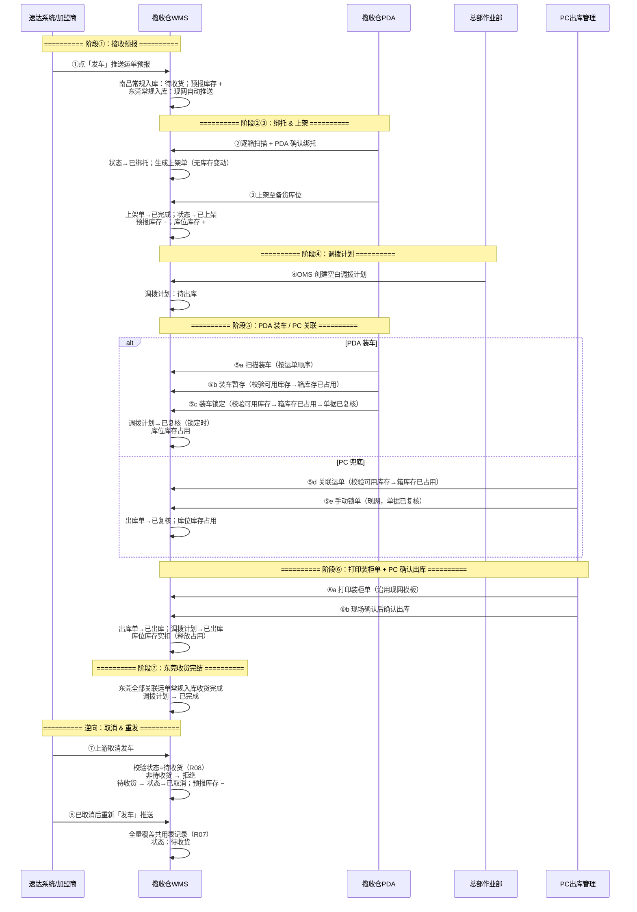
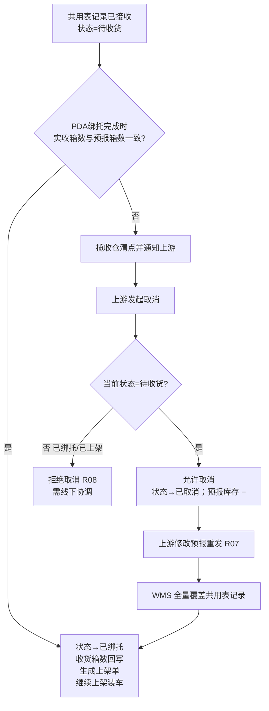

# 揽收仓-流程推演

> **覆盖场景**：正向揽收作业链路 / 上游取消与预报更新逆向链路  
> **不展开范围**：加盟商费用结算与财务对账、德速集货仓（东莞）操作人员侧作业、运输调度与在途跟踪（见 `context/01-业务背景与介绍.md` 本期范围）  
> **参考文档**：《03-01-加盟商揽收仓管理后台主PRD》V2.0、《03-02-加盟商揽收仓PDA主PRD》V1.5.1、《收货订单-入库单字段清单》、《上架单字段清单》、《context/02-需求会议记录》第二次会议（2026-09-05）  
> **规则优先级**：状态机、取消边界、单据模型以**主 PRD**为准；本文与主 PRD 冲突时以主 PRD 裁决；与第二次会议冲突时以会议记录为准  
> **发运收口口径**：PC 端**先打印装柜单**，现场确认后**再确认出库**（两步操作）  
> **版本**：V2.0 | 2026-09-05（第三次修订：建计划同步生成空出库单）

---

## 一、推演范围

本文件覆盖揽收仓 WMS **从接收上游预报到东莞关联运单收货完结** 的完整业务链路，关注多单据、多角色、跨系统的数据流转与库存变化，而非单一作业界面说明。

### 1.1 正向链路

```
接收预报数据 → 分货绑托 → 生成上架单 → PDA执行上架 → 创建调拨计划 → PDA装车（暂存/锁定）或 PC关联运单 → 打印装柜单 → PC确认出库 → 东莞关联运单收货完结
```


| 阶段       | 业务动作                            | 主要产出                                | 规则来源                                |
| -------- | ------------------------------- | ----------------------------------- | ----------------------------------- |
| ① 接收预报   | 加盟商在速达系统点「发车」，运单数据推送至 WMS       | 南昌**常规入库**（待收货）+ **预报库存**；东莞**常规入库**由现网自动推送                 | `context/01` §三 F01、§五 流程要点 1       |
| ② 分货绑托   | PDA 逐箱扫描（`入库管理→分货`）；进入时弹窗设**作业托数 N**（**1~99，默认 5**）；按 **M** 判大小票；小票可混托（≤**P**），混托绑托须每票扫齐；大票托满点「托满」绑托；支持**多 PDA 并行**（各管自己的 N 托，单台完成才能提交，**全部绑完才能上架**）；**全仓可用**（不限加盟揽收仓） | **独托**：全部箱绑托完成→**已绑托**并生成上架单；**小票混托**：托满绑托即生成**一张**含多运单的上架单；**无库存变动** | PDA 主 PRD §十二、R33；`context/02` 第二次会议 §二 |
| ③ 托盘上架   | PDA 基于**上架单**执行上架至**备货库位**（一托一上架；一托多运单整托一起上）；**加盟揽收仓不测量可上架**；**非加盟揽收仓须测量完成后才能上架**     | 上架单（已完成）+ 共用表记录→**已上架** + **库位库存** | PDA 主 PRD §5.3、`context/02` 第二次会议 §三 |
| ④ 创建调拨计划 | OMS 创建空白调拨单（空单）；选调出仓（揽收仓）+ 调入仓（**本期仅东莞**）                | 调拨计划单                               | `context/01` §三 F04、Q03；`context/02` 第二次会议 §四 |
| ⑤ PDA 装车 / PC 关联运单 | **PDA**：扫描关联调拨单（`出库管理→装车`），按**运单顺序**装车、**不可拆票**；「**装车暂存**」保存部分装车进度（**不锁单据**）；「**装车锁定**」确认完成并锁定单据（提示须 PC 解锁才能继续）。**PC 兜底**：「**关联运单**」仅建立运单与出库单关联（**不变更出库单/调拨单状态**）。**三类操作提交前均须校验可用库存，不足不可提交；保存后将关联箱库存更新为已占用**  | 箱库存→**已占用**；装车锁定/PC 手动锁单后：出库单（**已复核**）；调拨计划→**已复核**；库位库存**占用**；**不生**调拨入库单 | `context/02` 第二次会议 §四 |
| ⑥ 打印装柜单 + PC 确认出库 | **装车锁定/手动锁单后**：PC 出库管理**先打印装柜单**（沿用现网模板），现场确认无误后**再点「确认出库」**（沿用现网）  | 装柜单（已打印）；出库单→**已出库**；调拨计划→**已出库**；**库位库存实扣**（释放占用） | 主 PRD §3.4.3、§5.3；`context/02` 第二次会议 §一、§四 |
| ⑦ 东莞收货完结 | 东莞对该计划**全部关联运单**常规入库均收货完成 | 调拨计划→**已完成** | 主 PRD §3.4.4、R19 |


**库存变化摘要（正向）**：


| 阶段       | 库存类型        | 变化        | 说明                          |
| -------- | ----------- | --------- | --------------------------- |
| ① 接收预报   | 预报库存        | **+**     | 按收货订单**预报箱数**计入，表示「在途待收」     |
| ② 分货绑托   | —           | **无**     | 回写托号等并**生成上架单**；**不做库存化** |
| ③ 托盘上架   | 预报库存 / 库位库存 | **− / +** | 上架单完成后按**件数**扣减预报库存、增加揽收仓库位库存   |
| ⑤ 装车暂存 / 关联运单 / 装车锁定 | 箱库存 / 库位库存        | **占用**     | 提交前校验**可用库存**；保存后关联**箱库存→已占用**；库位库存可用量减少、占用量增加。**装车暂存/关联运单不锁单据**；**装车锁定/PC 手动锁单**另锁单据→已复核      |
| ⑥ PC 确认出库 | 库位库存        | **实扣**     | 确认出库释放占用并扣减总量      |


> **两类库存口径**：**预报库存**（待收预期）与 **库位库存**（上架入账、可装车）。分货绑托不产生库存变动；上架单完成时结转。**装车暂存 / 关联运单 / 装车锁定**保存时：先校验**可用库存**，通过后关联**箱库存→已占用**并占用库位库存；**装车暂存/关联运单不锁单据**，**装车锁定/PC 手动锁单**锁单据至已复核；**PC 确认出库实扣**（释放占用并出库）。

### 1.2 逆向链路

```
接收预报数据 → 上游取消预报 → 上游修改预报数据重新下发 → 更新预报数据
```


| 阶段         | 业务动作                      | 主要影响                              | 规则来源                   |
| ---------- | ------------------------- | --------------------------------- | ---------------------- |
| ① 预报已接收    | WMS 已落库，状态=待收货，揽收仓可开始 PDA 绑托 | 共用表记录处于可执行态                        | 主 PRD §5.1 |
| ② 上游取消 | 速达侧发起取消发车 | WMS 校验**状态=待收货**（R08）；否则拒绝；通过则状态→**已取消**、预报库存 − | R08、S02 |
| ③ 上游修改重发 | 原单已取消后再次「发车」推送 | **全量覆盖**共用表记录；状态回待收货；预报库存按新预报重建（R07） | R07、S02 |
| ④ WMS 更新预报 | WMS 接收并刷新明细 | 揽收仓按最新预报继续/重新绑托 | R07 |


> ⚠️ **取消边界（R08）**：**仅待收货**可取消，取消后状态=**已取消**；**已绑托 / 已上架**均拒绝（加盟商与 WMS 均不可）。全局枚举虽含收货中 / 已收货（现网自营/集货仓路径），**加盟揽收仓路径不进入该两态**（主 PRD §5.1）。

### 1.3 本期不推演

- 加盟商下单、贴标、标签打印（速达客户端范围）；**目的仓权限控制**（速达操作端按角色限制可选目的仓，当前加盟商仅能选东莞）仅记会议结论，不展开页面设计
- 东莞操作人员侧**页面交互**细节（到货清点、卸车等 UI；本需求只定义对接契约与**东莞全部关联运单常规入库收货完成→调拨已完成**回写）
- 费用结算、财务对账、应收/收款（WMS 仅提供货量统计）
- **空单调拨取消**（后期迭代；状态枚举已预留）
- **少件处理**、**全仓调拨及费用计算**、**多 PDA 交叉分货**（`context/02` 第二次会议 §六）

---

## 二、涉及角色


| 角色             | 职责                                              | 参与节点                 |
| -------------- | ----------------------------------------------- | -------------------- |
| 加盟商 / 速达客户端操作员 | 录入运单、贴标、点「发车」推送预报；异常时取消并重新编辑下发                  | ① 接收预报；逆向 ②③         |
| 揽收仓操作人员        | PDA **分货**、上架、**装车**（`出库管理→装车`；含装车暂存/装车锁定） | ② 分货绑托；③ 上架；⑤ 装车 |
| 总部作业部          | OMS 创建空白调拨计划；PC **关联运单**（兜底）、手动锁单、**打印装柜单**、确认出库，查看调拨执行状态                          | ④ 创建调拨计划；⑤ PC 关联/锁单；⑥ 打印装柜单 + 确认出库；监控 ⑤⑦        |
| WMS 系统         | 接收/存储预报、绑托后**生成上架单**、驱动 PDA 作业、记录库存、生成调拨与出库、东莞收货完结回写 | 全链路                  |
| 速达系统（外部）       | 运单数据源、发车推送、取消与重发                                | ①；逆向 ②③              |


> ⚠️ **角色边界**：本需求不展开东莞操作人员侧页面；但**东莞对该计划全部关联运单常规入库收货完成→调拨计划已完成**为必须实现的系统回写（主 PRD S05 / §3.4.4）。东莞常规入库由加盟商发车时**现网自动推送**，不由空单调拨装车生成调拨入库单。

---

## 三、涉及单据与职责

> **单据口径（主 PRD §3.1）**：**收货订单 ══ 入库单**，共用同一数据表、**同一记录**（主键=**收货单号**）；菜单分「收货订单」「入库管理」两视图，不是上下游两张单。一运单一条记录，PDA 绑托在同一记录上推进状态；**绑托完成后系统生成上架单**（默认一运单一张；**小票混托**多运单可共一张），PDA 基于上架单执行上架并联动共用表→已上架。

| 单据/记录     | 层级  | 核心职责                                                  | 上游         | 下游                      | 库存/往来影响                         |
| --------- | --- | ----------------------------------------------------- | ---------- | ----------------------- | ------------------------------- |
| **收货订单 / 入库单** | 预报+执行共用层 | 承载速达推送预报；PDA 绑托在同一记录推进状态。**加盟路径**：待收货 → 已绑托 → 已上架；或 待收货 → 已取消。不进收货中、已收货 | 速达系统（发车推送） | **上架单**（绑托后系统生成） | **预报库存 +**（按**预报箱数**）；取消/重发联动调整；绑托无库存变动；上架单完成时 预报−/库位+ |
| **上架单** | 执行层 | **绑托完成时系统自动生成**（默认一运单一张；**小票混托**一托一张含多运单）；将已组托货物上架至**备货库位**（Q10 人工选择）；**加盟揽收仓不测量可上架**；**非加盟揽收仓须测量完成后才能上架**；**不改变共用表单据层级，承载 PDA 上架作业记录** | 绑托结果（收货订单→已绑托） | 调拨计划单（可被装车引用）           | 上架单→已完成时联动共用表：**预报库存 −**、**库位库存 +**    |
| **调拨计划单** | 计划层 | 调拨类型：上游推送计划运单=**计划调拨**；OMS空白单=**空单调拨**（**页面不展示**）。空单须选择调出/调入仓库（**本期调入仓仅东莞**）；一计划多运单，明细按运单回写 | OMS（空单调拨）/ 上游推送（计划调拨） | 出库单 | 计划层不直接扣库存；**装车暂存/关联运单/装车锁定**保存时箱库存占用；**装车锁定/手动锁单**后单据→已复核；**PC 确认出库**后库位库存实扣 |
| **出库单**   | 结果层 | **装车锁定**或 PC **手动锁单**后→**已复核**；PC 确认→**已出库**；关联调拨计划与实装运单；PC「**关联运单**」仅建关联、**不变更出库单/调拨单状态**，但保存时占用箱库存                  | 调拨计划单      | — | **装车暂存/关联运单/装车锁定**保存时箱库存→已占用、库位库存占用；**PC 确认出库**时实扣    |


> **往来影响说明**：本期 WMS **不涉及**应收、应付、收款等财务往来（`context/01` §三 明确不做「与加盟商的费用结算、财务对账」）。系统仅沉淀货量统计数据供前端/manual 结算使用。

---

## 四、主流程时序图




**关键里程碑**：

- 🏁 **M1 预报就绪**：共用表记录落库（状态=待收货），预报库存已计入，PDA 可开始绑托
- 🏁 **M1.5 待上架就绪**：绑托完成，**上架单**已生成（待上架），PDA 可执行上架
- 🏁 **M2 备货完成**：上架单完成，共用表→已上架，库位库存可查
- 🏁 **M3 装车占用**：装车暂存/关联运单/装车锁定保存后，箱库存已占用
- 🏁 **M3.5 装车锁定**：PDA 装车锁定或 PC 手动锁单，出库单/调拨计划**已复核**
- 🏁 **M4 发运闭环**：**先打印装柜单**，现场确认后 PC 确认出库，出库单/调拨计划→已出库，库位库存已扣减
- 🏁 **M5 调拨完结**：东莞对该计划全部关联运单常规入库均收货完成，调拨计划→已完成

---

## 五、单据联动规则表

> **调拨下推分类型**（主 PRD §3.4.1、§6.6）：`调拨类型=计划调拨` → 沿用现网；`调拨类型=空单调拨` → PDA **装车锁定**/PC 手动锁单→已复核，**先打印装柜单再** PC 确认出库后已出库并扣库存。**不生**调拨入库单。


| 上游动作            | 触发条件                      | 下游单据/记录         | 继承/传递数据                  | 后置影响                                               | 调拨类型 / 待确认            |
| --------------- | ------------------------- | --------------- | ------------------------ | -------------------------------------------------- | ----------------------- |
| 速达「发车」推送        | 加盟商完成贴标并点发车；接口推送成功；运单号无未取消有效单        | 共用表记录（收货订单/入库单视图） | 见《收货订单-入库单字段清单》§一、§二、§七 TMS 映射  | 生成**收货单号**；状态→待收货；**预报库存 +**；PDA 可绑托                      | — / 报文格式与失败重试（TQ03） |
| PDA 确认绑托（按托，部分） | 箱号匹配预报；尚有未绑托箱 | 箱明细**托号** | 托号回写至明细 | 头部**状态**仍为**待收货**；不回写收货箱数；不生成上架单 | — |
| PDA 确认绑托（整单完成） | 箱号匹配预报；运单全部箱绑托完成        | 同一共用表记录 + 明细托号 + **上架单**（待上架） | 托号、箱号、收货箱数、收货人、收货时间、**收货仓库**、绑托完成时间；上架单带出**作业单号**、**运单号**、**托号**、**初始库位**、**件数**（=收货箱数）、**作业类型**=收货上架 | 状态→**已绑托**；**全部箱绑托完成时**回写收货箱数/收货仓库/收货人/收货时间；**同事务生成上架单**（一运单一张）；**无库存变动**；大小票组托见主 PRD §12.2 | — |
| PDA 上架完成 | 上架单**状态=待上架**；对应收货订单=已绑托；已选**备货库位**；**加盟揽收仓**或（**非加盟**且运单**测量已完成**） | 上架单（已完成）+ 同一共用表记录 | **备货库位**、**件数**；上架完成时间 | 上架单→**已完成**；共用表状态→**已上架**；**预报库存 −**、**库位库存 +**（备货库位）；**备货库位人工选择**（Q10） | — |
| OMS 创建空白调拨计划 | 按需触发（Q03） | 调拨计划单 + 出库单（**待出库**、明细空） | **调出仓库、调入仓库**（必填，Q14；**调出≠调入**，Q19/R29） | 调拨计划状态 → 待出库；明细空；**同步生成 1 张空出库单**（1 计划 : 1 出库单） | **空单调拨** |
| 上游推送调拨计划 | 上游创建转货记录 | 调拨计划单 | 计划运单清单 | **计划调拨**：创建时或全部收货后**同批**生成出库单+调入仓入库单；计划变更同步下游（现网） | **计划调拨** |
| PDA 装车扫描 | 调拨计划单为待出库；货物在库位库存中 | 调拨计划单明细 | 运单号、客户代码、箱数、重量、体积 | **空单调拨**：不允许拆票装车（Q15）；须**按运单顺序**装车，先扫完一票所有托再扫下一票；扫箱号带出对应托（Q12）；混托扫一箱带出整托所有运单 | **空单调拨** |
| PDA 装车暂存 | 部分运单/托已扫描；关联箱**可用库存**充足 | 调拨计划单明细 + 出库单明细（草稿） | 已扫运单/托清单 | **不锁单据**；将运单**关联至空出库单**并回写调拨明细（出库单**仍为待出库**）；校验可用库存通过后保存；关联**箱库存→已占用**、库位库存占用；可继续扫描 | **空单调拨** |
| PDA 装车锁定 | 装车扫描完成（或暂存后确认锁定）；关联箱**可用库存**充足 | 出库单（**已复核**） | 调拨计划单号、实装运单清单 | 更新运单/调拨明细；校验可用库存通过后保存；**箱库存→已占用**；出库单/调拨→**已复核**；锁定后须 **PC 解锁**才能继续装车；**不生**调拨入库单 | **空单调拨** |
| PC 关联运单 | PDA 无法扫描等兜底场景；关联箱**可用库存**充足 | 出库单明细关联 | 运单号 | **仅**建立运单与出库单关联；**不变更出库单/调拨单状态**；校验可用库存通过后保存；**箱库存→已占用** | **空单调拨** |
| PC 手动锁单 | 关联运单完成（或 PDA 锁定后解锁续装） | 出库单（**已复核**） | — | 沿用现网锁单；出库单→**已复核**（单据锁定） | **空单调拨** |
| PC 打印装柜单 | 出库单=**已复核**（已装车锁定或手动锁单） | 装柜单 | 实装运单/托明细 | **仅打印**，不变更单据状态与库存；沿用现网模板 | **空单调拨** |
| PC 确认出库 | 装柜单已打印；出库单=**已复核** | 出库单（**已出库**）+ 调拨计划（**已出库**） | — | 库位库存**实扣**（释放占用） | **空单调拨** |
| 东莞收货完成（系统） | 已出库；该计划下**全部关联运单**东莞常规入库均已收货 | 调拨计划单（已完成） | — | 调拨计划 → **已完成**；绑托/上架不挡完结 | 空单调拨 |
| 上游取消 | 上游发起取消（R08）；**状态须=待收货** | 同一共用表记录（状态变更） | — | 非待收货：**拒绝**；待收货：状态→**已取消**、预报库存 − | — |
| 上游修改重发 | 原单状态=已取消后重新发车（R07） | 同一共用表记录（更新） | 最新箱数/件数、运单明细 | **全量覆盖**头部与明细；回写字段重置；状态→待收货；预报库存按新预报箱数重建 | — |


---

## 六、关键异常分支

### 6.1 预报件数 ≠ 收货件数（有单无货 / 多单少货 / 少单多货）

**规则来源**：Q02、R09 — 差异不改预报；须**状态=待收货**时走取消重发（R08）



| 子场景 | 处理方式 | 库存影响 |
| :--- | :--- | :--- |
| 预报 N 票，实到 N−1 票（有单无货） | 通知上游 → **待收货**时取消（R08）→ 全量重发（R07） | **已绑托/已上架不可取消**；须在 **PDA 确认绑托前**协调 |
| 预报件数 > 实收件数 | 同上 | 绑托完成前**收货箱数未回写**；已绑托后不可取消 |
| 预报件数 < 实收件数（多货无单） | 绑托扫描时无预报箱号应被拦截 | 不进入已绑托；头部收货箱数不回写 |

> ✅ **统一原则**：件数差异不由 WMS 自行改预报；由上游在**待收货**时取消后全量重发（R07/R08）。**收货箱数仅在 PDA 确认绑托完成、状态→已绑托时回写**，取值=已绑托箱数；待收货阶段头部收货箱数保持空/0。

### 6.2 上游取消被拦截（非待收货）

**规则来源**：R08（主 PRD §5.1）

| 当前状态 | 是否允许取消 | 处理方式 |
| :--- | :--- | :--- |
| **待收货** | ✅ 允许 | 状态→**已取消**；预报库存 − |
| **已绑托** | ❌ **不允许** | WMS 拒绝取消请求；需线下协调 |
| **已上架** | ❌ **不允许** | 同上；库位库存已产生 |
| **已取消** | — | 已终态；可重新发车回待收货（R07） |

> 注：全局枚举含**收货中 / 已收货**（现网自营/集货仓路径）；**加盟揽收仓路径不进入该两态**，故上表不以「收货中」作为取消判定条件。

### 6.3 装车扫描校验（拆票 / 漏装）

**规则来源**：Q15；（Q14 装车侧目的仓校验 **本期不做**，见 PDA 主 PRD Out of Scope / R23）

| 异常/约束 | 规则 | 处理方式 |
| :--- | :--- | :--- |
| **拆票装车** | **不允许**（Q15） | 装车扫描时，同一运单须**整票**关联至本次调拨；须**按运单顺序**装车，先完成一票所有托再扫下一票 |
| **装车暂存** | 部分装车保存进度 | **不锁单据**；提交前校验**可用库存**；保存后**箱库存→已占用**；可继续 PDA 扫描或 PC 关联 |
| **装车锁定** | 确认本批装车完成 | 提交前校验**可用库存**；保存后**箱库存→已占用**；出库单/调拨→**已复核**；继续装车须 **PC 端解锁** |
| **PC 关联运单** | PDA 故障兜底 | 提交前校验**可用库存**；保存后**箱库存→已占用**；仅建运单与出库单关联，**不变更单据状态**；须再 **手动锁单**（现网） |
| **可用库存不足** | 装车暂存/关联运单/装车锁定提交时 | **拒绝提交**；提示可用库存不足 |
| **错装（目的仓≠调入仓库）** | Q14 装车侧 / R23 | **本期不做**；后续迭代再拦截 |
| **漏装** | 库位库存未全部扫入本次装车 | **装车**前须完成扫描；未扫货物保留在库位库存，**本期不展开**确认出库后逆向调拨或补装流程 |

> ✅ **扫描原则（本期）**：调拨单创建须指定调出/调入仓库（Q14 计划侧）；装车扫描锁定「整票装、不拆票」（Q15）。**目的仓与调入仓扫描校验后续迭代**。


### 6.4 调拨计划与库存不匹配


| 异常         | 影响   | 处理方式                      |
| ---------- | ---- | ------------------------- |
| OMS 建空白调拨时库位无货 | 无法装车 | 揽收仓反馈总部；待货上架后再装（Q03 按需触发） |


> 集货仓侧收货、差异处理等**页面交互**不在本需求范围；**调入仓收货完成→调拨已完成**系统回写必须实现（主 PRD S05）。

---

### 6.5 绑托与上架单


| 异常/约束 | 规则 | 处理方式 |
| :--- | :--- | :--- |
| **绑托未生成上架单** | 正常路径须绑托同事务生成 | 运维/系统按绑托结果补生成上架单 |
| **大票多托** | 一运单一张上架单 | **件数**=该运单全部已绑托箱数；PDA 按托逐托确认至上架单完成 |
| **小票混托** | 一托一张上架单、含多运单 | 托满绑托时同事务生成；PDA 按托上架时**整托全部运单**一并完成 |
| **未上架装车** | 装车扫库位库存中已上架货 | 上架单待上架或收货订单=已绑托时，装车扫描拦截 |
| **未测量上架（非加盟）** | 非加盟揽收仓须测量完成 | 运单测量未完成时，PDA 上架拦截；**加盟揽收仓不测量可上架** |

---

## 七、待确认问题


| 问题编号 | 问题 | 影响文件 | 建议确认对象 |
| :--- | :--- | :--- | :--- |
| TQ03 | 东莞常规入库由发车现网推送的接口契约、失败重试与幂等规则 | 速达/接口 PRD | 产品 + WMS/接口负责人 |


**本期已确认（原待确认项）**：


| 编号  | 问题                | 确认结论                   |
| --- | ----------------- | ---------------------- |
| Q09 | 是否允许多次收货合并一张入库单   | **不允许**；**一运单对应一入库单（共用表一条记录）**，不将多运单合并为一条  |
| Q10 | 库位分配规则            | **人工选择**；PDA 上架时操作员指定**备货库位**  |
| Q11 | 调拨空单是否预填计划装车运单/托盘 | **否**；实装由 PDA 现场扫描或 PC 关联运单决定 |
| Q12 | 有托盘时装车扫描方式 | **扫任一箱号即关联整托** |
| Q13 | 上游取消预报时的状态校验 | **仅待收货**可取消→**已取消**（R08）；**已绑托 / 已上架**拒绝；加盟路径不进收货中/已收货 |
| Q14 | 创建调拨单是否须指定调出/调入仓库 | **是**；调出仓库、调入仓库为**必填**；**装车扫描目的仓与调入仓一致校验本期不做**（R23） |
| Q15 | 是否允许拆票装车 | **不允许**；装车扫描时同一运单须整票关联至本次调拨 |
| Q16 | 收货订单重发更新策略 | **全量覆盖**（R07）；取消后重发以最新预报整体替换；状态回待收货 |
| Q17 | 装柜单打印与确认出库 | **先打印装柜单**（沿用现网模板），现场确认后**再点确认出库**；两步操作，打印不触发库存扣减 |
| Q18 | 大票多托上限 | **无上限** |
| Q19 | 分货作业托数 N | **1~99**，默认 **5**；支持多 PDA 并行（各管自己的 N 托） |
| Q20 | 上架测量前置 | **加盟揽收仓不测量可上架**；**非加盟揽收仓须测量完成后才能上架** |
| Q21 | PDA 装车暂存/锁定 | **装车暂存**不锁单据、**装车锁定**锁单据；两类操作提交前均校验**可用库存**；保存后**箱库存→已占用** |
| Q22 | PC 关联运单 | **仅**建立运单与出库单关联，**不变更单据状态**；提交前校验**可用库存**；保存后**箱库存→已占用**；锁单沿用现网手动操作 |
| Q25 | 装车库存占用时点 | **装车暂存 / 关联运单 / 装车锁定**保存时即占用箱库存；非仅装车锁定后占用 |
| Q24 | 空单调拨范围 | **本期仅揽收仓调拨**；调入仓**仅东莞**；全仓调拨及费用后续讨论 |


---

## 自检


| 检查项                             | 结论                                                      |
| ------------------------------- | ------------------------------------------------------- |
| 1. 是否没有提前生成主 PRD、字段清单、Demo PRD？ | ✅ 本文仅为流程推演，未输出 PRD / 字段清单 / 用例数据 / Demo PRD             |
| 2. 正向链路和逆向链路是否都闭环？ | ✅ 正向完整；逆向：待收货可取消→已取消 → 全量重发（R07）；已绑托/已上架不可取消（R08） |
| 3. 库存影响和应收影响是否说清楚？              | ✅ 库存：预报 + → 绑托无变动 → 上架单完成库位 + → **装车暂存/关联/锁定**保存时箱库存占用（须先有可用库存）→ PC 确认出库实扣；应收：本期不做财务往来   |
| 4. 上架单生成时点是否与 PDA 主 PRD 一致？ | ✅ 绑托完成同事务生成上架单（一运单一张）；PDA 基于上架单执行上架；**加盟/非加盟测量规则**见 Q20 |
| 5. 第二次会议（2026-09-05）要点是否已吸收？ | ✅ 装车暂存/锁定、PC 关联运单、备货库位、**先打印装柜单再确认出库**等已写入本文；细节以 `context/02` 为准 |


