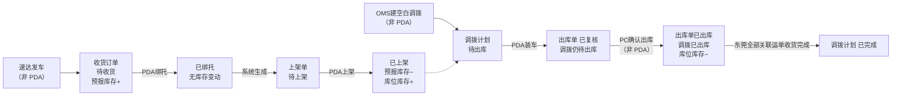
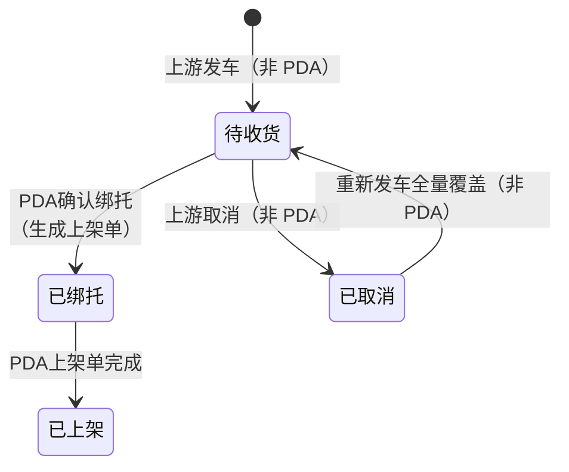
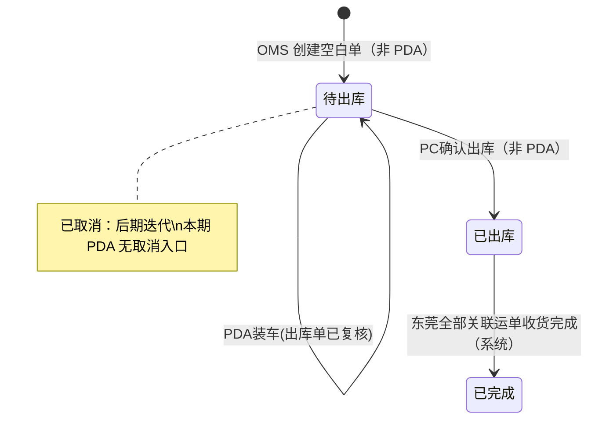
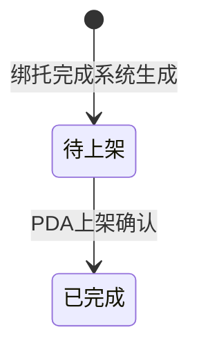

# 加盟商揽收仓PDA主PRD

> **版本**：V1.4.0 | 2026-09-02（分货：小票混托全箱校验、多托同分落托规则、扫描落托确认、后台 P 上限；符号 M/P/N 拆分；上架仅备货库位）
> **读者**：研发工程师、测试工程师、产品复核
> **文档范围**：仅描述加盟揽收仓 **PDA 端** 相对现网的**修改、优化、新增**。收货分货绑托、托盘上架、空单调拨装车为本文核心；管理后台能力见《03-01-加盟商揽收仓管理后台主PRD》。
> **字段命名依据**：`02-00-字段清单.md` 索引的《收货订单-入库单字段清单》《调拨计划单字段清单》《上架单字段清单》；本文只引用字段名，不重复定义字段本体。
> **确认来源**：`context/01-业务背景与介绍.md`、`context/02-需求会议记录.md`、`01-业务流程推演.md`、`03-01-加盟商揽收仓管理后台主PRD.md` V1.8

---

## 一、业务背景

加盟揽收仓（南昌、赣州）是 WMS 的前置执行节点：货物在到达德速集货仓之前，须在揽收仓完成收货、分货组托、备货上架与装车发运。当前揽收仓作业依赖纸质送货单与人工核对，收货无预报对照、分货易混放、装车无扫描校验、库存无系统记录，中心仓无法提前准备收货。

PDA 是加盟揽收仓一线作业的**唯一执行终端**。操作人员通过 PDA 逐箱扫描，在同一操作中完成收货确认与分货绑托；**绑托完成后系统自动生成上架单**（一运单一张），操作员基于上架单执行托盘上架至备货库位并产生库位库存；OMS 创建空单调拨计划后，PDA 扫描装车并点「装车」，生成/追加调出仓出库单（**已复核**）；库位库存扣减与调拨计划 **已出库** 由 PC **确认出库**触发（见后台主 PRD §3.4）。

没有 PDA 数字化作业：
- 揽收仓无法对照速达预报逐箱收货，漏收错收难追溯
- 分货绑托无托号与箱号留痕，多票混放、大票多托难以管理
- 上架库位靠人工记忆，装车计划与账实不一致
- 装车无扫描校验，拆票错装漏装事后才发现
- 装车结果无法关联出库单，调拨与出库脱节

---

## 二、功能范围

**In Scope**：

- PDA **分货**（收货分货绑托）：菜单 `PDA → 入库管理 → 分货`；**独立新页面**，**不沿用**现网 `PDA → 入库管理 → 绑托`；逐箱扫描箱号；在同一操作中完成收货确认、按**大小票策略**与**作业托数**组托、自动生成**托号**；支持大票多托、小票混托；**无系统满托容量**，由操作员自行判断托满后**确认绑托**；**全部箱绑托完成**时一次性回写 **收货箱数**、**收货人**、**收货时间**、**收货仓库**、**绑托完成时间**并**同事务生成上架单**（一运单一张）；**不回写**收货重量/收货体积；**不产生库存变动**（详见 §十二）
- PDA **上架单执行上架**：绑托完成后系统生成**上架单**；PDA 按**作业单号**或**运单号**/**托号**进入待上架任务；将已绑托货物上架至揽收仓备货库位；**目标库位由操作员人工选择**（Q10）；上架确认后回写上架单**件数**、**目标库位**，并联动收货订单**上架完成时间**；**预报库存 −**、**库位库存 +**
- PDA **待上架任务列表**：展示本仓待执行的上架单；列表列**沿用现网**（**作业单号**、**运单号**、**托号**、**件数**、**初始库位**）；加盟路径**初始库位**值为空，**仍展示该列**
- PDA **装车**（**空单调拨**路径）：菜单 `PDA → 出库管理 → 装车`；关联**调拨计划单**；扫描库位库存中已上架货物；**扫箱号带出对应托、关联整托**（Q12）；维护司机/车牌/电话；**不允许拆票装车**（Q15）；点「装车」→ 生成/追加出库单（**已复核**）；**不扣**库位库存；**不生**调入仓调拨入库单（详见 §十三）
- PDA 作业对共用表记录（收货订单/入库单）的状态推进：加盟路径 **待收货 → 已绑托 → 已上架**；**不存在「部分绑托」状态**——运单尚有未绑托箱时头部仍为**待收货**，**全部箱绑托完成**后方→**已绑托**并生成上架单
- PDA 装车对**调拨计划单**：装车阶段保持 **待出库**；调拨 **已出库** 由 PC 确认出库触发（非 PDA）

**Out of Scope**：

- 管理后台功能：收货订单列表/筛选、OMS 创建空白调拨、调拨计划 Tab 查看等（见后台主 PRD）
- 速达「发车」推送、上游取消与重发接口（WMS 接收层；PDA 只消费结果状态）
- **计划调拨** PDA 路径：下架 → 复核 → 装柜（现网，本文不展开）
- 加盟商下单、贴标、标签打印（速达客户端）
- 集货仓操作人员侧作业（到货清点、卸车、收货完成等页面交互）
- 空单调拨取消（后期迭代；本期 PDA 无取消入口）
- 打印装车清单（Q17：**不打印**）
- **PDA 库存查询**（本期不做；预报/库位库存口径见 §6.3，无独立查询菜单）
- PDA 硬件选型、离线扫描、盘点、费用结算、运力调度
- 管理后台手工新建收货订单、修改预报字段

---

## 三、单据定位

### 3.1 收货订单在 WMS 链路中的位置

| 项目 | 内容 |
| :--- | :--- |
| 单据层级 | 预报 + 执行共用层。收货订单 ══ 入库单，共用同一数据表，主键=**收货单号** |
| 核心职责 | 承载速达发车预报，作为 PDA 收货绑托的**唯一依据**；无预报（状态≠待收货）则 PDA 不可绑托 |
| 单据来源 | 速达「发车」推送自动生成；PDA **不提供**手工新建 |
| PDA 职责边界 | 仅推进状态与回写执行字段；**不修改预报类字段**（**预报箱数**、**预报仓库**等） |
| 加盟路径状态 | 待收货 → 已绑托 → 已上架；或 待收货 → 已取消（取消由上游触发，PDA 不操作） |
| 上下游 | 上游：速达发车推送；下游：**上架单**（绑托后系统生成）→ 可被空单调拨装车引用 |

### 3.2 上架单在 PDA 链路中的位置

| 项目 | 内容 |
| :--- | :--- |
| 单据层级 | 执行层。承载 PDA 上架作业记录；**不改变**收货订单/入库单共用表层级 |
| 核心职责 | 将已组托货物从**初始库位**移至**目标库位**（揽收仓备货库位）；上架完成时驱动库存结转 |
| 单据来源 | **绑托完成时系统自动生成**；PDA **不提供**手工新建 |
| 生成规则 | **一运单一张上架单**（对应一入库单共用表记录）；绑托确认、收货订单→已绑托时同事务生成 |
| 继承字段 | 系统带出并存储：**运单号**、**托号**、**件数**（=**收货箱数**）；**作业类型**=收货上架；**初始库位**为空 |
| PDA 职责 | 选择**目标库位**并确认上架；回写上架单**件数**、**目标库位**；联动收货订单→已上架 |
| 上下游 | 上游：收货订单绑托结果；下游：库位库存（可被空单调拨装车引用） |

### 3.3 调拨计划单在 PDA 链路中的位置

| 项目 | 内容 |
| :--- | :--- |
| 单据层级 | 计划层。不直接扣库存 |
| PDA 适用范围 | 仅 **空单调拨**（调出仓库类型=加盟揽收仓）；**计划调拨**沿用现网 PDA 复核/装柜，不在本文 |
| 创建方 | **OMS 创建空白调拨**（R16）；PDA **只执行装车** |
| PDA 职责 | 扫描实装、维护司机/车牌/电话、回写明细（**运单号**、**客户代码**、**箱数**、**重量**、**体积**）；点「装车」生成/追加出库单（**已复核**） |
| 下游 | 调出仓出库单（**已复核** → PC 确认 **已出库**）；东莞常规入库由发车现网推送 |

### 3.4 系统链路图（PDA 视角）



### 3.5 实体关系

| 关系 | 说明 |
| :--- | :--- |
| 收货订单 : 速达发车 | 按**运单号** 1:1；未取消不可二次发车 |
| 收货订单 : 上架单 | **1:1**；绑托完成时系统生成；一运单一张 |
| 收货订单 : 箱明细 | 1:N，明细按箱号；绑托时关联**托号** |
| 空单调拨 : 出库单 | PDA 装车后 1:1 生成/追加；**已复核** |
| 空单调拨 : 东莞常规入库 | **无下推**；发车现网推送 |
| 空单调拨 : 收货订单 | **无下推**；装车扫**库位库存**中已上架货，不预填计划运单 |

---

## 四、业务场景

| 场景ID | 场景 | 类型 | 说明 |
| :--- | :--- | :--- | :--- |
| S01 | 完整正向链路：绑托→上架→装车→PC确认出库 | **主流程** | 预报就绪后 PDA 绑托→上架→装车→出库单已复核→PC 确认出库；库位库存扣减 |
| S12 | 全部绑托完成生成上架单 | **主流程** | 该运单**全部箱号**绑托完成、收货订单→**已绑托**时，系统同事务生成上架单（一运单一张） |
| S02 | 大票绑托 | **主流程** | 大票逐箱扫描；**同托同票、不可混托**；同票可多托；操作员自行确认托满后绑托 |
| S03 | 小票混托 / 大票多托 | **主流程** | 小票**同票同托**，多票可混一托（≤**P**）；混托**确认绑托**须每票扫齐全部箱；大票可拆多托（Q18） |
| S04 | 基于上架单执行上架 | **主流程** | PDA 打开待上架**上架单**；人工选择**目标库位**并确认；上架单→已完成；收货订单→已上架；**预报库存 −**、**库位库存 +** |
| S05 | 空单调拨装车 | **主流程** | 扫描已上架货关联**调拨计划单**；整票装、不拆票；点「装车」→出库单**已复核**；调拨仍**待出库** |
| S13 | 同一调拨多次装车 | **主流程** | 出库单**已复核**前可多次装车追加运单；PC 确认出库后不可再装 |
| S07 | 预报与实收不一致 | **异常** | 绑托前发现差异：通知上游，须在**待收货**走取消重发；PDA 不自行改**预报箱数** |
| S08 | 无预报箱号扫描 | **异常** | 多货无单：扫描拦截，不可进入已绑托 |
| S09 | 装车拆票 / 目的仓不一致 | **异常** | 同一**运单号**须整票关联本次调拨（Q15）；货物目的仓须与**调入仓库**一致（Q14） |
| S10 | 库存不足 / 未上架货装车 | **异常** | 仅可扫库位库存中已上架货；无库存则拦截 |
| S11 | 已绑托/已上架后上游取消 | **异常** | 取消由上游发起；WMS 拒绝（R08）；PDA 无取消入口 |

---

## 五、状态机

状态变更只能通过 PDA 动作按钮触发，禁止在表单中直接修改**状态**字段。

### 5.1 收货订单（加盟揽收仓路径）

全局枚举沿用：待收货 / 收货中 / 已收货 / 已绑托 / 已上架 / 已取消。  
**加盟揽收仓 PDA 路径不进入收货中、已收货**。

#### 5.1.1 状态定义

| 状态 | 含义 | 是否终态 |
| :--- | :--- | :---: |
| 待收货 | 已收预报，PDA 可绑托扫描；**尚有未绑托箱时仍为本态**（不存在「部分绑托」状态） | 否 |
| 已绑托 | 该运单**全部箱号**绑托完成；**无库存变动** | 否 |
| 已上架 | PDA 上架完成；预报已结转库位库存 | **是** |
| 已取消 | 待收货时上游取消成功 | 否（取消后重发可回待收货） |

#### 5.1.2 状态机图



#### 5.1.3 状态流转表

| 当前状态 | 动作 | 前置条件 | 结果状态 | 后置影响 | 失败处理 |
| :--- | :--- | :--- | :--- | :--- | :--- |
| 待收货 | PDA 按托确认绑托 | 箱号匹配预报；该运单**尚有未绑托箱号** | **待收货** | 回写该托**托号**及箱明细**托号**；**不回写**头部**收货箱数**/**收货仓库**/**收货人**/**收货时间**；**不生成上架单**；**无库存变动** | — |
| 待收货 | PDA 确认绑托（整单完成） | 箱号匹配预报；该运单**全部箱号**已绑托 | 已绑托 | 回写**托号**、**绑托完成时间**、**收货箱数**、**收货人**、**收货时间**、**收货仓库**；**不回写**收货重量/收货体积；**无库存变动**；**同事务生成上架单**（待上架，一运单一张） | 无预报箱号：拦截；件数差异：提示走取消重发 |
| 已绑托 | PDA 上架完成（基于上架单） | 上架单**状态=待上架**；已选**目标库位** | 已上架 | 上架单→已完成；回写上架单**件数**、**目标库位**；收货订单回写**上架完成时间**；**预报库存 −**、**库位库存 +** | 未选库位：不可提交 |
| 已绑托 / 已上架 | 上游取消 | — | 不变 | 无 | WMS 拒绝（R08）；PDA 无入口 |

#### 5.1.4 动作能力矩阵（收货订单 · PDA）

| 动作 | 待收货 | 已绑托 | 已上架 | 已取消 |
| :--- | :---: | :---: | :---: | :---: |
| 查看详情 | ✅ | ✅ | ✅ | ✅（只读） |
| 逐箱扫描绑托 | ✅ | ❌ | ❌ | ❌ |
| 确认绑托 | ✅ | ❌ | ❌ | ❌ |
| 查看待上架单 | ❌ | ✅ | ❌ | ❌ |
| 执行上架（基于上架单） | ❌ | ✅ | ❌ | ❌ |
| 修改预报字段 | ❌ | ❌ | ❌ | ❌ |
| 取消 | ❌ | ❌ | ❌ | ❌ |

> **分货页扫描口径**（§12.3）：**分货扫描**不校验**状态**与**仓库**过滤。**不存在「部分绑托」状态**——按托确认后若尚有未绑托箱，头部仍为**待收货**；**全部箱绑托完成**时→**已绑托**并生成上架单（R33/R43）。

### 5.2 调拨计划单（空单调拨 · PDA）

状态枚举：**待出库 / 已出库 / 已完成**；**已取消**预留，**本期 PDA 无取消入口**。

#### 5.2.1 状态定义

| 状态 | 含义 | 是否终态 |
| :--- | :--- | :---: |
| 待出库 | 空单已建，PDA 可装车扫描；出库单未确认出库前可多次装车 | 否 |
| 已出库 | PC 确认出库完成（非 PDA 触发） | 否 |
| 已完成 | 东莞对该计划全部关联运单常规入库均已收货完成 | **是** |
| 已取消 | 待出库取消（预留） | **是** |

#### 5.2.2 状态机图



#### 5.2.3 状态流转表

| 当前状态 | 动作 | 前置条件 | 结果状态 | 后置影响 | 失败处理 |
| :--- | :--- | :--- | :--- | :--- | :--- |
| 待出库 | PDA 装车扫描 | 调拨计划可见；货物在库位库存 | 待出库 | 累计扫描明细；扫箱号带出对应托、关联整托 | 未上架/无库存：拦截 |
| 待出库 | PDA 删除扫描 | 待出库；已有该运单扫描明细 | 待出库 | 从本次实装清单**移除整票运单行**；不拆票（删票不删部分箱） | — |
| 待出库 | PDA 装车 | 已完成必要扫描；维护司机/车牌/电话；目的仓与**调入仓库**一致 | **待出库** | 回写明细；生成/追加出库单→**已复核**；**不扣**库位库存 | 拆票/错装：拦截 |
| 待出库 | PDA 装车（追加） | 该计划已有出库单=**已复核** | **待出库** | 在原出库单下追加运单明细 | 出库单已出库则拦截 |
| 已出库 | 东莞收货完成 | 系统回写（非 PDA） | 已完成 | 调拨只读 | — |

#### 5.2.4 动作能力矩阵（调拨计划单 · PDA）

| 动作 | 待出库 | 已出库 | 已完成 | 已取消 |
| :--- | :---: | :---: | :---: | :---: |
| 查看调拨计划 | ✅ | ✅ | ✅（只读） | ✅（只读） |
| 装车扫描 | ✅ | ❌ | ❌ | ❌ |
| 删除扫描 | ✅（已有实装明细） | ❌ | ❌ | ❌ |
| 装车 | ✅（已扫描） | ❌ | ❌ | ❌ |
| 取消 | ❌ | ❌ | ❌ | ❌ |
| 修改调出/调入仓库 | ❌ | ❌ | ❌ | ❌ |

### 5.3 上架单（PDA 执行）

#### 5.3.1 状态定义

| 状态 | 含义 | 是否终态 |
| :--- | :--- | :---: |
| 待上架 | 绑托完成后系统生成，待 PDA 执行 | 否 |
| 已完成 | PDA 上架确认完成 | **是** |

#### 5.3.2 状态机图



#### 5.3.3 状态流转表

| 当前状态 | 动作 | 前置条件 | 结果状态 | 后置影响 | 失败处理 |
| :--- | :--- | :--- | :--- | :--- | :--- |
| （无单） | 系统生成 | 收货订单 PDA 确认绑托成功 | 待上架 | 生成**作业单号**（`TK`+年月日+5 位流水号，沿用现网）；带出**运单号**、**托号**、**件数**（=**收货箱数**）；**初始库位**为空；**作业类型**=收货上架；**无库存变动** | 绑托失败则不生成 |
| 待上架 | PDA 上架确认 | 已选**目标库位**（揽收仓备货库位） | 已完成 | 回写**目标库位**、**件数**；联动收货订单→已上架、**上架完成时间**；**预报库存 −**、**库位库存 +** | 未选库位：不可提交 |
| 待上架 / 已完成 | 手工新建 / 取消 | — | 不变 | 无 | PDA 无入口 |

#### 5.3.4 动作能力矩阵（上架单 · PDA）

| 动作 | 待上架 | 已完成 |
| :--- | :---: | :---: |
| 查看详情 | ✅ | ✅（只读） |
| 选择目标库位 | ✅ | ❌ |
| 上架确认 | ✅ | ❌ |
| 手工新建 | ❌ | ❌ |
| 取消 | ❌ | ❌ |

---

## 六、核心业务规则

### 6.1 PDA 绑托规则

| 规则ID | 规则 |
| :--- | :--- |
| R01 | **一运单对应一入库单（共用表一条记录）**；不将多运单合并为一条（Q09） |
| R02 | 扫描须箱号匹配预报、箱未绑托；**作业托数=1 / >1** 两种分货方式均**不校验**收货订单**状态**、**预报仓库**/**收货仓库**数据范围（§12.3） |
| R03 | **收货箱数**、**收货仓库**在运单**全部箱号绑托完成**、状态→已绑托时一次性回写；取值=该运单已绑托箱数 |
| R04 | **收货人**、**收货时间**= PDA 提交绑托的操作人、操作时间 |
| R05 | **收货重量**、**收货体积不回写** |
| R06 | 绑托阶段**不产生库存变动**（预报库存不变、库位库存不增） |
| R07 | **大小票组托**见 §12.2；大票**同托同票**；小票**同票同托、多票可混托**（受 **P** 上限）；大票多托**无上限**（Q18） |
| R39 | **小票组托**：**同票同托**；**多票可混一托**，同一混托格内小票运单数 **≤ P**（后台配置，见 §12.2） |
| R40 | **无系统满托容量配置**；是否物理托满由操作员判断；**确认绑托**前须满足 §12.2 提交校验 |
| R45 | **小票混托确认绑托**：格内存在小票混托时，**每一票小票**的已扫箱数须 **= 该票预报箱数**，否则拦截提交 |
| R46 | **扫描落托反馈**：每次扫描成功后弹窗展示**目标作业格/托号**；用户按**扫描键**（或页面【确认】）关闭后继续；**语音播报**为增强项（设备支持则启用，见 §12.4） |
| R47 | **多托同分（N>1）落托**：小票**首箱**优先落入**已有小票且未达 P 票上限**的混托格，无可用格则占**最小空闲格**；大票**首箱**占**最小空闲格**（新托）；续扫仍**同票同托** |
| R08 | 预报与实收不一致：PDA **不修改预报**；须在待收货协调上游取消后全量重发 |
| R33 | 运单**全部箱绑托完成**时，系统**同事务自动生成上架单**；**一运单一张**；不手工创建 |
| R34 | 上架单继承绑托结果：**运单号**、**件数**（=**收货箱数**）、**作业类型**=收货上架；**初始库位**生成时**为空** |
| R37 | **小票判定**：单运单**预报箱数** ≤ **M** 即为小票，否则为大票；**M** 为库内**必填**配置项（**须配置后方可分货**；不设系统默认值） |
| R38 | **大票组托**：**同托同票**，一托仅允许一票货；同一运单可拆多托 |
| R41 | **作业托数**：进入分货页设置并行作业格数 **N**（默认 **1**，范围 **1–10**）；**N=1** 为单托单分，**N>1** 为多托同分；**未退出应用前**保持该托数；托满由操作员**确认绑托**，系统不自动满托、不自动绑托 |
| R42 | **N=1·单托单分**：展示 **1** 个作业格；逐箱扫描累计已扫箱数与箱明细；小票允许多票混扫同一格（≤**P**）；大票同格仅一票，须**确认绑托**后方可开始该票下一托 |
| R44 | **N>1·多托同分**：展示 **N** 个作业格；落托规则见 **R47**；已出现运单续扫落入原格；**N** 格均有未绑托货时须先**确认绑托**释放一格；大票同票多托绑托后占用新释放格续扫 |
| R43 | **不存在「部分绑托」状态**。按托确认后若运单**尚有未绑托箱号**，头部**状态**仍为**待收货**；**全部箱绑托完成**时→**已绑托**，一次性回写 R03 字段并触发 R33 生成上架单 |

### 6.2 PDA 上架单与上架规则

| 规则ID | 规则 |
| :--- | :--- |
| R09 | 仅存在**状态=待上架**的上架单可执行 PDA 上架；对应收货订单须为**已绑托** |
| R10 | **目标库位人工选择**（Q10）；须为揽收仓备货库位；写入上架单**目标库位** |
| R11 | 上架确认：上架单→已完成；回写**件数**、**目标库位**；联动收货订单**上架完成时间**；**预报库存 −**、**库位库存 +**（按上架**件数**） |
| R12 | 收货订单→**已上架**后，对应库位库存为 PDA 装车可引用来源 |
| R35 | PDA 可通过**作业单号**、**运单号**或**托号**检索待上架任务；入口含 `入库管理→上架` 与 `移库作业→上架 TAB`（后者受移库作业权限控制），**均查询同一上架单** |
| R36 | 大票多托场景：**一运单仍只生成一张上架单**；**件数**=该运单全部已绑托箱数；PDA 上架时按托逐托确认至该单完成 |

### 6.3 库存规则

| 规则ID | 规则 |
| :--- | :--- |
| R13 | 上游发车：**预报库存 +预报箱数**（非 PDA 触发） |
| R14 | PDA 按托绑托：**库存不变**；**仅全部箱绑托完成时**同事务**生成上架单**（R33） |
| R15 | PDA 上架（上架单完成）：**预报库存 −**、**库位库存 +**；**目标库位仅允许备货库位**（§11.3 #3） |
| R16 | **PC 确认出库**时库位库存 −（PDA 装车不扣库存） |
| R18 | 不使用「收货即暂存」；库位库存仅在上架后产生 |

### 6.4 PDA 装车与回写规则

| 规则ID | 规则 |
| :--- | :--- |
| R19 | PDA 仅执行**空单调拨**装车；**计划调拨**走现网复核/装柜，不在本文 |
| R20 | 装车扫描对象=**库位库存**中**已上架**货物；未上架不可装车 |
| R21 | **扫箱号带出对应托**，关联整托装车（Q12） |
| R22 | **不允许拆票装车**（Q15）；同一**运单号**须整票关联本次**调拨计划单** |
| R23 | 扫描校验货物目的仓与**调入仓库**一致，不一致实时拦截（Q14） |
| R24 | **不打印装车清单**（Q17） |
| R25 | PDA 点「装车」：回写明细及司机/车牌/电话；生成/追加出库单→**已复核**；调拨计划仍为**待出库**；**不生**调入仓调拨入库单 |
| R27 | 东莞常规入库由发车现网推送；调拨完结=东莞对该计划**全部关联运单**常规入库收货完成（非 PDA） |
| R28 | 空单**不预填运单/托盘**（Q11）；实装完全由 PDA 现场扫描决定 |
| R29 | **调出仓库**与**调入仓库**不能相同（创建时后台校验；PDA 只读展示） |
| R30 | 同一调拨 1:1 出库单；**已复核**前可多次装车追加运单；确认出库后不可再装 |

### 6.5 字段与界面规则

| 规则ID | 规则 |
| :--- | :--- |
| R30 | PDA 界面统一展示**运单号**（接口字段名仍为订单号） |
| R31 | PDA **不可编辑**预报类字段；**状态**不可下拉修改 |
| R32 | 已出库 / 已完成调拨计划在 PDA **只读** |

---

## 七、权限与菜单设计

沿用现网账号、角色与数据权限，不新建权限引擎。

### 7.1 加盟揽收仓 PDA 菜单与权限

| 菜单路径 | 页面名称 | 权限 | 数据范围 | 对应动作（状态机） |
| :--- | :--- | :--- | :--- | :--- |
| `PDA → 入库管理 → 分货` | **分货** | PDA，入库管理 → 分货 | 不按状态/仓库过滤可扫范围（§12.3）；列表/统计类查询仍可按仓过滤 | §5.1.4、§十二：设置作业托数、逐箱扫描、确认绑托 |
| `PDA → 入库管理 → 上架` | 上架 | PDA，入库管理 → 上架 | **上架单**：本仓待上架/已完成 | §5.3.4、§11：**按仓库类型**走现网上架或加盟上架规则 |
| `PDA → 库内作业 → 移库作业 → 上架 TAB` | 上架（入口 2） | **移库作业**权限 | 与上一行**同一上架单** | 同 §5.3.4（§11.2） |
| `PDA → 出库管理 → 装车` | 装车 | PDA，出库管理 → 装车 | **调拨计划**：**调出仓库**或**调入仓库**命中本仓；仅**空单调拨**待出库 | §5.2.4：装车扫描、删除扫描、装车 |

> **分货 vs 现网绑托**：加盟揽收仓走 **`入库管理 → 分货`** 独立新页；**不进入、不改造**现网 `入库管理 → 绑托`（自营/集货仓路径仍用现网绑托页）。
>
> **上架 vs 现网上架**：菜单路径同为 **`入库管理 → 上架`**；系统按操作员当前仓库的 **仓库类型** 判定走现网规则或加盟规则（§11.0），**不新建上架菜单**。

### 7.2 角色与职责

| 角色 | 数据可见范围（PDA） | PDA 操作 |
| :--- | :--- | :--- |
| 加盟揽收仓操作员 | 见 §7.1 各菜单数据范围 | 分货、上架、装车扫描、删除扫描、装车 |
| 总部作业部 | 同上（可用仓库命中即可） | 本文 PDA 作业以揽收仓操作员为主；总部一般不执行 PDA 分货/装车 |
| 集货仓操作员 | 调入方调拨计划在后台可见；PDA 装车不在集货仓执行 | 无加盟揽收仓 PDA 装车权限 |

> **职责边界**：OMS 创建空白调拨；PDA **仅执行**装车，不创建调拨计划、不确认出库。
>
> **页面与动作命名**：菜单/顶栏展示「**分货**」；底部主按钮与状态机动作名仍为「**确认绑托**」（§5.1.4），不改为「确认分货」。

---

## 八、边界与异常处理

### 8.1 库存不足

| 场景 | 处理方式 |
| :--- | :--- |
| 装车扫描时库位无该箱/托 | 实时拦截，提示货物未上架或不在库 |
| OMS 建空白调拨时库位无货 | PDA 无法完成装车；揽收仓反馈总部，待上架后再装（Q03） |
| 发车前未扫完库内已计划货物 | 未扫货物保留在库位库存；**本期不展开**确认出库后补装或逆向调拨 |

### 8.2 重复出库 / 超量出库

| 场景 | 处理方式 |
| :--- | :--- |
| 同一运单重复扫入本次调拨 | 幂等处理或提示已关联，不重复扣减 |
| 拆票装车（只装部分箱） | **不允许**（Q15）；须整票**运单号**一次关联 |
| 扫描箱数超过库位库存 | 拦截，提示超量 |
| 出库单已出库后再次装车 | 拦截；PDA 无装车入口 |
| 并发双人同时装车同一调拨 | 同一出库单已复核状态下追加或幂等处理 |

### 8.3 其他边界

| 场景 | 处理方式 |
| :--- | :--- |
| 绑托与上游取消并发 | 已到已绑托则取消失败；仍为待收货则取消成功，PDA 绑托应重新拉取状态 |
| 已绑托后发现少货 | 不可取消、不可改预报；线下协调 |
| 无预报扫描（多货无单） | 绑托扫描拦截 |
| 目的仓与调入仓不一致 | 装车扫描实时拦截 |
| 已绑托未生成上架单 | 按绑托结果补生成上架单（运维/系统修复；正常路径须绑托同事务生成） |
| 预报推送失败 | 非 PDA 范围；无预报则 PDA 不可绑托 |

---

## 九、验收标准

| 验收编号 | 场景 | 前置条件 | 操作 | 预期结果 |
| :--- | :--- | :--- | :--- | :--- |
| V01 | S01 完整链路 | 待收货预报就绪；已上架库位有货；空单待出库 | 绑托→上架单上架→装车扫描→装车→PC确认出库 | 生成上架单；收货订单→已上架；装车后出库单**已复核**、调拨仍待出库；确认出库后库位库存扣减 |
| V02 | S02 大票绑托 | 大票预报就绪 | 作业托数=1 逐箱扫描并确认绑托 | 同托仅该票；可多托；状态→已绑托；**生成上架单**；库存不变 |
| V19 | S12 生成上架单 | 运单全部箱绑托完成 | 查上架单列表 | 一运单一张；**作业单号**（TK+年月日+5 位）已生成；**运单号**、**托号**、**件数**正确；**作业类型**=收货上架；列表列沿用现网含**初始库位**（值为空）；状态=待上架 |
| V03 | S03 小票混托 | 多小票预报就绪 | 同托混扫多票小票并绑托 | 绑托成功；各票**收货箱数**正确；同票不跨托 |
| V30 | 大小票判定 | 运单预报箱数分别为 N、N+1 | 扫描分货 | ≤N 走小票规则；>N 走大票规则 |
| V31 | 作业托数=1 | 默认进入分货 | 扫满一托→确认绑托→再扫下一托 | 未绑托前不可并行第二托；小票可混扫同一格 |
| V32 | 作业托数>1 | 设置 N=2，两票小票 | 各扫首箱 | 各占一格，不自动混托；N 格占满须绑托释放 |
| V33 | 未绑完仍为待收货 | 大票仅绑一托 | 确认绑托后查头部状态 | **状态**仍为**待收货**；**不生成上架单**；全部绑托完成后→已绑托并生成上架单 |
| V04 | S04 上架单上架 | 上架单待上架 | 选择**目标库位**并确认 | 上架单→已完成；收货订单→已上架；**上架完成时间**回写；预报−、库位+ |
| V05 | S05 装车 | 已上架；空单待出库 | 扫箱装车（扫箱号带出对应托）→装车 | 出库单**已复核**；调拨仍**待出库**；不打印清单 |
| V06 | 删除扫描 | 待出库已扫入运单 | 左滑删除该运单行 | 从本次实装清单移除；调拨单仍为待出库 |
| V07 | S07 件数差异 | 待收货，实收≠**预报箱数** | 尝试确认绑托或继续作业 | 提示走上游取消重发；PDA 不改预报 |
| V08 | S08 多货无单 | 箱号无预报 | 扫描该箱 | 拦截，不进已绑托 |
| V09 | S09 拆票拦截 | 一票多箱仅扫部分 | 尝试装车 | 拦截，提示须整票装车 |
| V10 | S09 错装拦截 | 货物目的仓≠**调入仓库** | 扫描 | 实时拦截 |
| V11 | S10 未上架装车 | 上架单待上架 / 已绑托未上架 | 装车扫描 | 拦截，提示须先完成上架单 |
| V12 | S11 已绑托取消 | 已绑托 | 上游发起取消 | WMS 拒绝；PDA 状态不变 |
| V13 | 绑托库存 | 待收货→已绑托 | 查库存 | 预报不变、库位不增 |
| V14 | 上架库存 | 已绑托→已上架 | 查库存 | 预报−、库位+ |
| V15 | 确认出库库存 | PC确认出库成功 | 查库位库存 | 实装量扣减（PDA 装车时不扣减） |
| V16 | 东莞对接 | PC确认出库后 | 查东莞 | 不生调拨入库；东莞常规入库由发车现网推送 |
| V17 | 出库单已出库 | 调拨已出库 | PDA 再次装车 | 拦截或无入口 |
| V18 | 权限 | 加盟揽收仓操作员账号 | 打开 PDA | 可绑托/执行上架单/装车；不可新建空单或手工新建上架单 |

---

## 十、修订记录

| 日期 | 变更摘要 |
| :--- | :--- |
| 2026-08-31 | V1.0 初版：加盟揽收仓 PDA 绑托、上架、空单调拨装车；对齐后台主 PRD V1.6 与流程推演 V1.3 |
| 2026-09-01 | V1.1 补充上架单：绑托完成自动生成上架单（一运单一张）；PDA 基于上架单执行上架；新增 §5.3 上架单状态机 |
| 2026-09-01 | V1.2 新增 §十一：对照现网 PDA 上架页面做增量优化评估；明确沿用现网页面+加盟仓规则分支；**作业单号**=TK+年月日+5 位流水号；**初始库位**为空 |
| 2026-09-01 | V1.2.1 更正 §11.3：上架库存结转**预报库存−/库位库存+**沿用现网，非加盟增量 |
| 2026-09-01 | V1.2.2 更正 §11：移库作业→上架 TAB 为页面入口，与入库管理→上架查询同一上架单；可见性由移库作业权限控制 |
| 2026-09-01 | V1.2.3 更正待上架列表：**初始库位**列沿用现网展示（加盟路径值为空），列表列配置不变 |
| 2026-09-01 | V1.2.4 更正生成上架单：**作业类型**统一=收货上架（沿用现网枚举） |
| 2026-09-01 | V1.2.5 §11.0 增补**现网上架与加盟上架区分**；§11.6 增补验收 V34 |
| 2026-09-01 | V1.2.6 新增 §7.1 菜单表、§十二 分货独立新页、§十三 装车菜单；明确不沿用现网绑托页 |
| 2026-09-01 | V1.2.7 §十二 增补**大小票策略**（N 库内配置）、**分货双模式**（单托单分/多托同分）；明确**无满托系统配置**、托满由操作员确认绑托；R02/R03/R33 与按托绑托口径对齐 |
| 2026-09-01 | V1.2.8 §十二 **作业托数统一分货模式**：**N=1** 单托单分、**N>1** 多托同分；增补 R42/R44 格子分配与大小票交叉校验；定稿按托绑托未完成时头部仍为**待收货**（R43） |
| 2026-09-02 | V1.4.0 分货增强：M/P/N 符号拆分；小票混托须每票扫齐方可绑托；N>1 小票首箱入混托格/大票首箱新托；扫描落托确认弹窗（+可选语音）；后台 P；上架仅备货库位 |
| 2026-09-02 | V1.3.0 需求重确认：PDA「装车」；生成/追加出库单**已复核**；库位库存改由 PC 确认出库扣减；不生调拨入库单；扫箱号带出对应托 |
| 2026-09-02 | V1.2.9 S-03：§5.2.3/§5.2.4 回写**删除扫描**；S-04：PDA 库存查询 Out of Scope；S-05/S-06：明确**不存在部分绑托状态**；**全部箱绑托完成**→已绑托并生成上架单 |

---

## 十一、PDA 上架（相对现网优化）

> **对照来源**：现网 `WMS_V1.0 260314.md` §需求描述-PDA → **上架**、**移库作业**（路径 `PDA→入库管理→上架`；`PDA→库内作业→移库作业→上架 TAB`）。
> 本章**只写加盟揽收仓相对现网的增量**；分货见 §十二，装车见 §十三，本章不重复。

### 11.0 现网上架与加盟上架如何区分

PDA **上架**菜单路径不变，共用同一套「上架单」数据模型；**不新开菜单**。研发、测试、现场支持须以**操作员当前登录仓库的仓库类型**作为唯一路由开关，**禁止**用菜单名、作业单号前缀等旁路判断。

| 区分维度 | 现网上架（历史既有，自营/集货仓等） | 加盟揽收仓上架（本文增量） |
| :--- | :--- | :--- |
| **判定条件** | 当前仓库 **仓库类型 ≠ 加盟揽收仓** | 当前仓库 **仓库类型 = 加盟揽收仓** |
| **菜单/入口** | `PDA→入库管理→上架`；`移库作业→上架 TAB` | **相同**（R35） |
| **页面实现** | 现网上架作业页逻辑**保持不变** | 同页面内 **规则分支**（§11.3）；Demo 原型可用独立路由模拟加盟路径 |
| **上架单生成时机** | 入库单全部绑托且头部状态→**已收货**后生成收货上架作业 | 收货订单**全部箱绑托完成**、状态→**已绑托**时**同事务**生成（§11.3 #1） |
| **收货状态链路** | 待收货 → 收货中 → 已收货 → … → 已上架 | **待收货 → 已绑托 → 已上架**（不经收货中/已收货，§5.1） |
| **作业入口** | 扫描箱号 **或** 待上架任务列表点击进入 | **相同入口**（§11.4 方式 A/B） |
| **每次作业粒度** | 按托确认上架 | **相同**（R36：按托逐托确认至整单完成） |
| **目标库位** | 可关联出库单选备货区，否则存储区；可扫描库位带出 | **仅人工选备货库位**（R10）；**不关联出库单**、不做存储区上架（§11.3 #3） |
| **初始库位** | 展示设备号+分货口或「人工收货」 | **为空**；作业页**不展示**（待上架列表列保留，§11.2） |
| **历史库位提醒** | 选库位与运单历史上架库位不一致时弹窗确认 | **沿用现网**（§11.3 #5） |
| **库存结转** | 上架完成：预报库存−、库位库存+ | **相同**（R15，非加盟增量） |

**研发路由伪代码**（示意）：

```
进入 PDA→入库管理→上架
  IF 当前仓库.仓库类型 == 加盟揽收仓
    → 加载加盟上架规则集（§11.3、§11.4）
  ELSE
    → 走现网上架逻辑（不改）
```

**与「历史库位」概念区分**：

| 术语 | 含义 | 是否独立功能 |
| :--- | :--- | :--- |
| **现网上架** | 历史已上线的自营/集货仓等上架能力 | 是，仓库类型≠加盟时走此路径 |
| **加盟上架** | 揽收仓增量上架能力 | 是，仓库类型=加盟时走此路径 |
| **历史上架库位** | 该运单过往已上架使用过的备货库位，用于跨库位不一致提醒 | **否**，为上架过程中的校验/提醒，非独立菜单或页面 |

**验收抽检**：同一 PDA 账号切换登录**加盟揽收仓**与**非加盟仓**，进入同一「上架」菜单，应分别命中上表两套行为（V34、§11.6）。

### 11.1 方案评估：沿用现网页面 vs 新开页面

| 维度 | 沿用现网「入库管理→上架」 | 新开独立上架页面 |
| :--- | :--- | :--- |
| 菜单与路径 | 操作员已熟悉；与自营/集货仓同一入口 | 需新菜单、新权限、新培训 |
| 交互骨架 | 扫描箱号→带出作业单→选库位→按托确认→明细 TAB；与现网一致 | 需重做整套 UI |
| 作业单模型 | 现网已有**作业单号**、**作业类型**、托/箱进度展示 | 与现网双轨维护 |
| 加盟差异 | 可用**仓库类型=加盟揽收仓**做规则分支，不改页面结构 | 隔离彻底但成本高 |
| 本期装车 | 装车走**空单调拨**独立流程，与现网上架页无耦合 | 仍需另做装车入口 |

**结论**：**沿用现网上架作业页骨架**；入口为 `PDA→入库管理→上架` 与 `PDA→库内作业→移库作业→上架 TAB`（**同一上架单查询**，见 §11.2）；按仓库类型=加盟揽收仓做规则分支；**不新开独立上架菜单/页面**。

### 11.2 沿用现网（不改交互骨架）

| 现网能力 | 加盟揽收仓 |
| :--- | :--- |
| 菜单路径 `PDA→入库管理→上架` | ✅ 沿用 |
| `PDA→库内作业→移库作业→上架 TAB` 跳入上架作业页 | ✅ 沿用（**页面入口**；与上一行查询**同一上架单**） |
| 移库作业 TAB 可见性 | ✅ 沿用现网：**移库作业**菜单/按钮权限控制；与仓库类型无关 |
| 点击【上架】进入上架作业页 | ✅ 沿用 |
| 扫描箱号进入/校验（箱号存在、已绑托、不可重复上架） | ✅ 沿用 |
| 扫描后带出**运单号**、**作业单号**、**作业类型**、已上架/未上架**箱数**与**托数** | ✅ 沿用 |
| 点击已上架/未上架箱/托数→**上架明细**子页（全部/已上架/未上架 TAB，展示托号、箱号、库位） | ✅ 沿用（R36 按托逐托确认） |
| 点击【上架】后，**当前托号下全部货箱**变为已上架；全部完成后单据完结 | ✅ 沿用 |
| **作业单号**编码 `TK`+年月日+5 位流水号 | ✅ 沿用 |
| **作业类型**=收货上架 | ✅ 沿用 |
| 上架库存结转：**预报库存− / 库位库存+** | ✅ 沿用，**无调整**（R15） |
| 待上架列表列（含**作业单号**、**运单号**、**托号**、**件数**、**初始库位**） | ✅ 沿用现网，**不改列、不隐藏初始库位**（加盟路径该列值为空） |

### 11.3 加盟揽收仓增量（需在现网页面上调整）

| # | 现网规则 | 加盟揽收仓增量 | 实现方式 |
| :--- | :--- | :--- | :--- |
| 1 | 入库单全部绑托且状态=**已收货**后生成**收货上架**作业 | 收货订单**全部箱绑托完成**、状态→**已绑托**时**同事务**生成上架单（一运单一张；不进收货中/已收货） | 仓库类型分支 + 生成时机调整 |
| 2 | **初始库位**展示设备号+分货口或「人工收货」 | **初始库位为空**（无设备/分货口）；上架作业页**不展示**初始库位；**待上架列表仍展示该列**（沿用现网，见 §11.2） | 作业页字段隐藏；列表不改列；值置空 |
| 3 | 目标库位：关联出库单时仅可选备货区，否则存储区；支持扫描库位带出 | **仅人工选择揽收仓备货库位**（库位类型=备货；**不可选存储区**）；不关联出库单 | 库位选择器过滤 + 去掉出库单联动 |
| 4 | 库容模式超载二次确认（标准/高峰托数） | **待确认**是否对加盟揽收仓启用（现网 §上架-4） | 若未配置库容则跳过 |
| 5 | 跨库位不一致提醒（历史库位 xxx） | 大票多托允许多托；若同运单多托上架到不同备货库位，**沿用现网不一致提醒** | 沿用现网提醒文案与确认交互 |
| 6 | 入库单→已上架 | 上架单→**已完成**；联动收货订单→**已上架** | 状态回写双写 |

### 11.4 加盟路径上架交互（优化后）

> **路由**：进入本节前，须先按 §11.0 判定当前仓库走加盟规则集或现网逻辑；以下交互为**加盟揽收仓路径**展开。

```
PDA 上架入口（二选一；均查询/进入同一上架单，上架作业页共用）
  ├─ 入口 1：PDA→入库管理→上架（上架菜单权限）
  └─ 入口 2：PDA→库内作业→移库作业→上架 TAB（移库作业权限）

进入后（两入口合一）
  ├─ 方式 A：扫描箱号（沿用现网）
  │     → 校验：箱号存在、已绑托、未重复上架
  │     → 带出：运单号、作业单号(TK…)、作业类型=收货上架、托/箱进度
  └─ 方式 B：待上架任务列表
        → 展示：沿用现网列（作业单号、运单号、托号、件数、初始库位；加盟路径初始库位为空）
        → 点击进入上架作业页

上架作业页（沿用现网骨架）
  ├─ 选择目标库位（必填；仅备货库位可选）
  ├─ 点击【上架】→ 当前托下全部箱→已上架；更新托明细上架状态
  ├─ 全部托完成后 → 上架单=已完成；收货订单=已上架；预报库存−、库位库存+
  └─ 顶部进入上架明细（全部/已上架/未上架 TAB）
```

### 11.5 本期不纳入上架页的范围

- 移库作业**派发**逻辑（待派发/已派发、作业人指派等；现网移库作业页中非上架 TAB 能力）
- 出库单关联库位带出、扫描库位带出（现网 §上架-3.1/3.2 出库单分支）
- 存储区上架、库位推荐策略（现网「暂无」能力不扩展）
- 管理后台上架单维护页面

### 11.6 验收补充（上架页）

| 验收编号 | 场景 | 前置条件 | 操作 | 预期结果 |
| :--- | :--- | :--- | :--- | :--- |
| V20 | 沿用现网入口 | 加盟揽收仓账号 | 打开 `入库管理→上架` | 进入上架作业页，查询上架单 |
| V26 | 移库 TAB 入口 | 账号含移库作业权限 | 打开 `库内作业→移库作业→上架 TAB` | 进入**同一**上架作业页/上架单列表；无权限则 TAB 不可见 |
| V21 | 扫描进入 | 已绑托；上架单待上架 | 扫描任一箱号 | 带出运单号、TK 作业单号、作业类型=收货上架、托/箱进度 |
| V22 | 初始库位 | 上架单已生成 | 查看作业页头部 | **初始库位**为空或不展示 |
| V23 | 库位选择 | 待上架 | 打开库位选择 | 仅可选备货库位；无出库单联动 |
| V24 | 按托上架 | 大票多托 | 逐托选库位并点上架 | 托明细状态更新；全部托完成后上架单=已完成、收货订单=已上架 |
| V25 | 明细 TAB | 多托作业中 | 打开上架明细 | 展示全部/已上架/未上架托号、箱号、库位（沿用现网） |
| V34 | 上架路径区分 | 同一账号分别登录加盟仓与非加盟仓 | 进入 `入库管理→上架` | 加盟仓走 §11.3/§11.4 规则分支；非加盟仓走现网上架逻辑不变 |

---

## 十二、PDA 分货（加盟揽收仓独立新页）

> **菜单路径**：`PDA → 入库管理 → 分货`  
> **与现网关系**：**不沿用**现网 `PDA → 入库管理 → 绑托` 页面及交互；为加盟揽收仓**独立新页**。业务动作与状态回写对齐 §5.1、§6.1。

### 12.1 页面定位

| 项目 | 内容 |
| :--- | :--- |
| 页面名称 | 分货（顶栏/菜单）；动作名仍为**确认绑托** |
| 核心职责 | 逐箱扫描，按大小票策略与作业托数组托；操作员确认托满后绑托；运单全部箱绑托完成后生成上架单 |
| 状态推进 | 收货订单：**待收货 → 已绑托**（§5.1.3）；以运单维度，须该运单全部箱号绑托完成 |

### 12.2 大小票策略与组托规则（基本策略）

**符号约定**：**M**=小票阈值；**P**=小票混托票数上限（后台配置）；**N**=作业托数（§12.3）。PDA 按运单**预报箱数**与 **M** 实时判定大小票。

| 类型 | 判定 | 组托规则 |
| :--- | :--- | :--- |
| **小票** | 单运单**预报箱数** ≤ **M** | **同票同托**；**多票可混一托**，同一混托格内小票运单数 **≤ P** |
| **大票** | 单运单**预报箱数** > **M** | **同托同票**；同一运单可拆**多托**（Q18 无上限） |

**后台配置项**（管理后台维护，见《03-01》§3.6）：

| 参数 | 含义 | 维护 |
| :--- | :--- | :--- |
| **M** | 小票阈值（件）：预报箱数 ≤ M 为小票 | 库内**必填**；**须配置后方可分货** |
| **P** | 小票混托票数上限：同一未绑托混托格内最多容纳的小票运单数 | 管理后台**必填**；按加盟揽收仓维度配置 |

**确认绑托提交校验**（R40/R45）：

| 场景 | 校验 |
| :--- | :--- |
| 格内仅大票 | 允许**部分箱**确认绑托（大票多托）；该票全部箱绑完前头部仍为**待收货** |
| 格内含小票（含混托） | **每一票小票**的已扫箱数须 **= 该票预报箱数**，否则拦截「小票须扫齐全部箱方可绑托」 |
| 小票混托 | 在上一行基础上，格内小票运单数须 **≤ P** |

**按托绑托与头部状态**（R43）：运单**全部箱号**绑托完成 → 头部→**已绑托**；一次性回写**收货箱数**等（R03）并**生成上架单**（R33）。

**扫描分配原则（呈现层）**：

- 小票：该运单已在某未绑托格中有箱 → 后续箱**必须**落入同一格
- 大票：目标格已有其他运单 → 拦截（不可混托）
- 混托格已达 **P** 票上限 → 拦截，须先**确认绑托**或扫入其他格

### 12.3 作业托数与分货方式（均为逐箱扫描）

进入分货页设置**作业托数 N**（默认 **1**，范围 **1–10**，R41）；**N** 写入终端本地会话，**退出应用前**保持（不写入服务端）。**N** 决定分货方式，**无须**单独切换「单托单分 / 多托同分」。

| N | 分货方式 | 作业方式 |
| :--- | :--- | :--- |
| **1** | **单托单分** | 展示 **1** 个作业格；逐箱扫描；小票允许多票混扫同一格（≤**P**）；大票同格仅一票 |
| **>1** | **多托同分** | 展示 **N** 个作业格并行；**首箱落托**见 **R47**；续扫**同票同托** |

**格子分配（N>1，R47）**：

1. 运单已在某未绑托格中有箱 → 后续箱**必须**落入该格
2. **小票首箱** → 优先落入**已有小票且未达 P 票上限**的混托格；无可用混托格则占**最小空闲格**开新混托
3. **大票首箱** → 占**最小空闲格**（新托）；该格不得含其他运单
4. **N** 格均有未绑托货 → 须先对任一格**确认绑托**释放后再扫新运单首箱
5. 大票同票多托：按托**确认绑托**后，续扫占用新释放格或当前空格

**通用补充（相对现网绑托放宽）**：

- 扫描**不校验**收货订单**状态**、**预报仓库**/**收货仓库**数据范围（R02）
- 仍校验：箱号存在、匹配预报、箱未绑托、§12.2 大小票组托规则
- **无自动满托/自动绑托**；由操作员判断托满后对当前/选中格执行**确认绑托**

### 12.4 交互骨架（加盟路径）

```
顶栏「分货」→ [作业托数弹窗] → 扫描箱号 → [落托确认弹窗] → 运单信息区 → N 个作业格（格内【托满】）
  → 扫描区【重置扫描】（有数据时）
```

- 扫描成功：弹出**落托确认**（R46），展示**目标作业格序号**、**托号**、本箱所属**运单号**；用户按**扫描键**或点【确认】关闭后继续；设备支持时可**语音播报**「进入 X 号托」（可选）
- 当前箱高亮，累加对应格的已扫件数
- **重置**：仅清空本页未提交的扫描缓存，不改服务端状态
- **确认绑托**：当前托至少扫入 1 箱；须通过 §12.2 提交校验（小票须扫齐全部箱）；提交该托绑托结果

### 12.5 本期不沿用现网绑托页的能力

以下现网 `绑托` 页能力**不纳入**加盟分货页：

| 现网绑托能力 | 加盟分货 |
| :--- | :--- |
| 过机顺序批量带出箱号 | ❌ 不纳入 |
| 长按剔除已扫箱号 | ❌ 不纳入 |
| 暂存 / 同步临时数据 | ❌ 不纳入 |
| 剩余≤5 箱二次确认 | ❌ 不纳入 |
| 系统满托容量 / 自动满托换托 | ❌ 不纳入；托满由人确认绑托 |
| 前置状态=收货中/已收货 | ❌ 作业托数 N=1 / N>1 均不校验状态（§12.3） |

### 12.6 验收补充（分货页）

| 验收编号 | 场景 | 操作 | 预期结果 |
| :--- | :--- | :--- | :--- |
| V27 | 分货入口 | 加盟揽收仓账号打开 `入库管理→分货` | 进入分货页，非现网绑托页；默认作业托数 N=1 |
| V28 | 确认绑托 | 当前格已扫≥1箱，点确认绑托 | 该托绑托成功；运单未全部完成时状态仍为待收货 |
| V30 | 大小票 | 预报箱数=M 与 M+1 两票分别扫描组托 | ≤M 走小票规则；>M 走大票规则 |
| V31 | 作业托数=1 | 大票多托：扫一托→绑托→再扫下一托 | 大票允许部分箱绑托；全部绑完前仍为待收货 |
| V32 | 作业托数>1 | 设置 N=2，两票小票各扫首箱 | 落入**同一混托格**（P≥2）；续扫同票同托 |
| V37 | 小票混托绑托 | 格内小票 A 扫齐、B 未扫齐 | 点托满 | 拦截「小票须扫齐全部箱方可绑托」 |
| V38 | 混托上限 P | P=2，格内已有 2 票小票 | 扫第 3 票小票首箱 | 拦截「混托票数已达上限」 |
| V39 | 落托确认 | 任意成功扫码 | 查看弹窗 | 展示目标格/托号；扫描键或确认可关闭 |
| V33 | 未绑完仍为待收货 | 大票仅绑一托后确认绑托 | 头部仍为**待收货**；无上架单；全部完成后→已绑托并生成上架单 |

---

## 十三、PDA 装车（空单调拨）

> **菜单路径**：`PDA → 出库管理 → 装车`  
> **适用范围**：仅**空单调拨**（调出仓库类型=加盟揽收仓）；**计划调拨**仍走现网复核/装柜（R19）。

### 13.1 页面流

```
装车计划列表（待出库空单）→ 进入装车作业页 → 扫描箱号装车 → 维护司机/车牌/电话 → 【装车】
```

- 装车扫描、装车动作见 §5.2.3、§5.2.4
- **不打印**装车清单（Q17 / R24）
- 调拨计划 **已出库 / 已完成**：装车页**只读**，无二次装车入口（R32）
- 出库单 **已复核** 且调拨仍 **待出库** 时，可再次进入装车追加运单

### 13.2 验收补充（装车入口）

| 验收编号 | 场景 | 操作 | 预期结果 |
| :--- | :--- | :--- | :--- |
| V29 | 装车入口 | 加盟揽收仓账号打开 `出库管理→装车` | 进入装车计划/装车作业，可扫描待出库空单 |
| V35 | 装车 | 已扫描≥1票 | 点装车 | 出库单**已复核**；调拨仍**待出库**；库位库存不变 |
| V36 | 多次装车 | 出库单已复核 | 再次进入装车追加运单 | 同一出库单追加明细；确认出库前可继续 |

---

## 自检

| 检查项 | 结论 |
| :--- | :--- |
| 1. 是否没有提前生成字段清单定稿、用例数据推演或 Demo PRD？ | ✅ 本文仅为 PDA 主 PRD；字段只引用《收货订单-入库单字段清单》《调拨计划单字段清单》索引，未输出定稿/用例/Demo |
| 2. 收货订单职责是否清晰，没有吞掉管理后台与上游职责？ | ✅ PDA 只推进绑托/上架/装车；预报接收、取消重发、OMS 建空白调拨归后台/上游 |
| 3. 状态机是否有入口、出口和终态？ | ✅ 收货订单：入口待收货，终态已上架；调拨：入口待出库，终态已完成；已取消为预留/上游终态 |
| 4. 主 PRD 中引用的字段名是否都来自字段清单？ | ✅ 收货订单/调拨字段来自 `02-00` 索引；上架单字段（**作业单号**、**作业类型**、**运单号**、**托号**、**初始库位**、**目标库位**、**件数**）来自《上架单字段清单》 |
