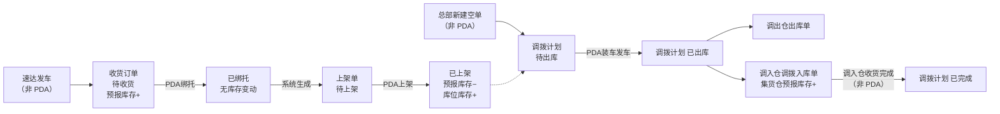
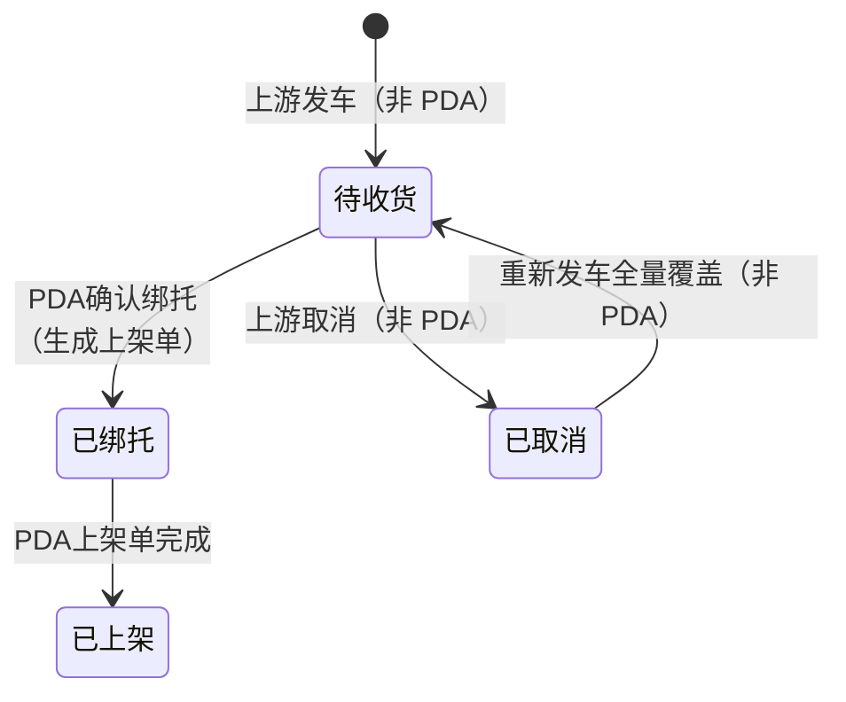
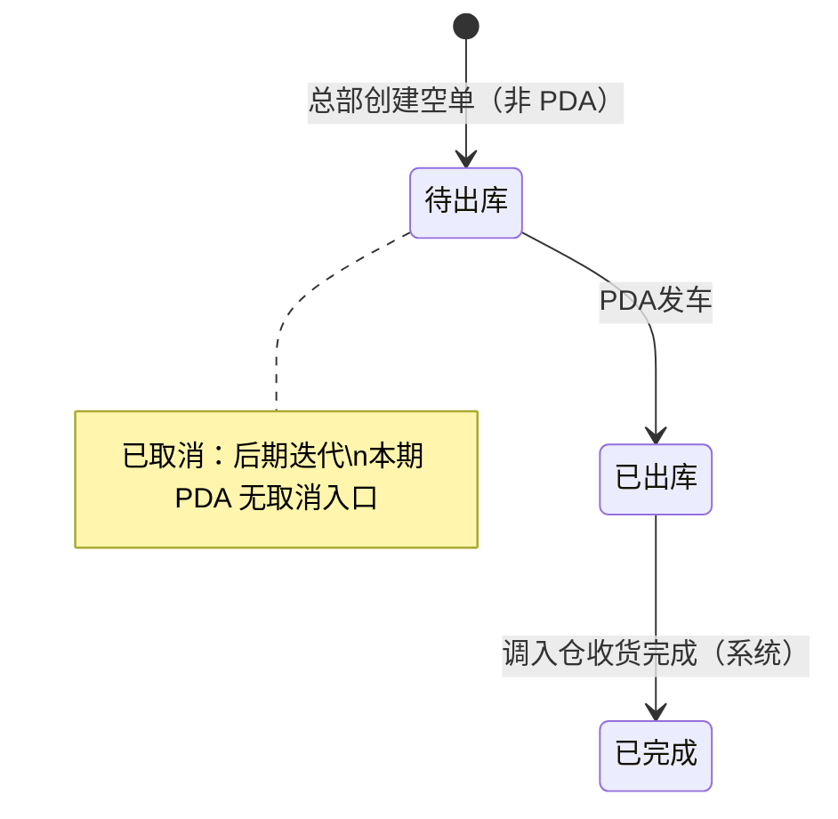
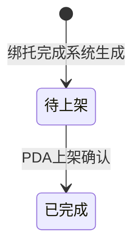

# 加盟商揽收仓PDA主PRD

> **版本**：V1.1 | 2026-09-01
> **读者**：研发工程师、测试工程师、产品复核
> **文档范围**：仅描述加盟揽收仓 **PDA 端** 相对现网的**修改、优化、新增**。收货分货绑托、托盘上架、空单调拨装车发车为本文核心；管理后台能力见《03-01-加盟商揽收仓管理后台主PRD》。
> **字段命名依据**：`02-00-字段清单.md` 索引的《收货订单-入库单字段清单》《调拨计划单字段清单》《上架单字段清单》；本文只引用字段名，不重复定义字段本体。
> **确认来源**：`context/01-业务背景与介绍.md`、`context/02-需求会议记录.md`、`01-业务流程推演.md`、`03-01-加盟商揽收仓管理后台主PRD.md` V1.6

---

## 一、业务背景

加盟揽收仓（南昌、赣州）是 WMS 的前置执行节点：货物在到达德速集货仓之前，须在揽收仓完成收货、分货组托、备货上架与装车发运。当前揽收仓作业依赖纸质送货单与人工核对，收货无预报对照、分货易混放、装车无扫描校验、库存无系统记录，中心仓无法提前准备收货。

PDA 是加盟揽收仓一线作业的**唯一执行终端**。操作人员通过 PDA 逐箱扫描，在同一操作中完成收货确认与分货绑托；**绑托完成后系统自动生成上架单**（一运单一张），操作员基于上架单执行托盘上架至备货库位并产生库位库存；总部创建空单调拨计划后，PDA 扫描装车并点「发车」确认发运，系统在同一事务内扣减库位库存、生成调出仓出库单与调入仓调拨入库单，并向集货仓计入预报库存。

没有 PDA 数字化作业：
- 揽收仓无法对照速达预报逐箱收货，漏收错收难追溯
- 分货绑托无托号与箱号留痕，多票混放、大票多托难以管理
- 上架库位靠人工记忆，装车计划与账实不一致
- 装车无扫描校验，拆票错装漏装事后才发现
- 发车结果无法自动下推集货仓，调拨与入库脱节

---

## 二、功能范围

**In Scope**：

- PDA **收货分货绑托**：逐箱扫描**运单号**对应箱号；在同一操作中完成收货确认、按运单分配托盘、自动生成**托号**；支持一票一托、多票共托（小票最多 5 票）、大票多托（**无上限**，Q18）；**绑托完成时一次性回写** **收货箱数**、**收货人**、**收货时间**、**收货仓库**、**绑托完成时间**；**不回写**收货重量/收货体积；**不产生库存变动**；**同步自动生成上架单**（一运单一张）
- PDA **上架单执行上架**：绑托完成后系统生成**上架单**；PDA 按**作业单号**或**运单号**/**托号**进入待上架任务；将已绑托货物上架至揽收仓备货库位；**目标库位由操作员人工选择**（Q10）；上架确认后回写上架单**件数**、**目标库位**，并联动收货订单**上架完成时间**；**预报库存 −**、**库位库存 +**
- PDA **待上架任务列表**：展示本仓待执行的上架单（**作业单号**、**运单号**、**托号**、**件数**、**初始库位**）
- PDA **装车扫描与发车**（**空单调拨**路径）：关联**调拨计划单**；扫描库位库存中已上架货物；**有托扫任一箱号即关联整托**（Q12）；**不允许拆票发车**（Q15）；点「发车」确认后发运；**库位库存 −**；同批生成调出仓出库单与调入仓调拨入库单；集货仓**预报库存 +预报箱数**
- PDA **库存查询**：按托盘/**运单号**/目的仓查看**预报库存**与**库位库存**，支撑装车计划与日常核对
- PDA 作业对共用表记录（收货订单/入库单）的状态推进：加盟路径 **待收货 → 已绑托 → 已上架**；不进入收货中、已收货
- PDA 装车对**调拨计划单**的状态推进：**待出库 → 已出库**（发车确认触发）

**Out of Scope**：

- 管理后台功能：收货订单列表/筛选、总部新建空单调拨、调拨计划 Tab 查看等（见后台主 PRD）
- 速达「发车」推送、上游取消与重发接口（WMS 接收层；PDA 只消费结果状态）
- **计划调拨** PDA 路径：下架 → 复核 → 装柜（现网，本文不展开）
- 加盟商下单、贴标、标签打印（速达客户端）
- 集货仓操作人员侧作业（到货清点、卸车、收货完成等页面交互）
- 空单调拨取消（后期迭代；本期 PDA 无取消入口）
- 打印装车清单（Q17：**不打印**）
- PDA 硬件选型、离线扫描、盘点、费用结算、运力调度
- 管理后台手工新建收货订单、修改预报字段

---

## 三、单据定位

### 3.1 收货订单在 WMS 链路中的位置

| 项目 | 内容 |
| :--- | :--- |
| 单据层级 | 预报 + 执行共用层。收货订单 ══ 入库单，共用同一数据表，主键=**收货单号** |
| 核心职责 | 承载速达发车预报，作为 PDA 收货绑托的**唯一依据**；无预报（状态≠待收货）则 PDA 不可绑托 |
| 单据来源 | 速达「发车」推送自动生成；PDA **不提供**手工新建 |
| PDA 职责边界 | 仅推进状态与回写执行字段；**不修改预报类字段**（**预报箱数**、**预报仓库**等） |
| 加盟路径状态 | 待收货 → 已绑托 → 已上架；或 待收货 → 已取消（取消由上游触发，PDA 不操作） |
| 上下游 | 上游：速达发车推送；下游：**上架单**（绑托后系统生成）→ 可被空单调拨装车引用 |

### 3.2 上架单在 PDA 链路中的位置

| 项目 | 内容 |
| :--- | :--- |
| 单据层级 | 执行层。承载 PDA 上架作业记录；**不改变**收货订单/入库单共用表层级 |
| 核心职责 | 将已组托货物从**初始库位**移至**目标库位**（揽收仓备货库位）；上架完成时驱动库存结转 |
| 单据来源 | **绑托完成时系统自动生成**；PDA **不提供**手工新建 |
| 生成规则 | **一运单一张上架单**（对应一入库单共用表记录）；绑托确认、收货订单→已绑托时同事务生成 |
| 继承字段 | 系统带出并存储：**运单号**、**托号**、**初始库位**、**件数**（=**收货箱数**）；**作业类型**=上架 |
| PDA 职责 | 选择**目标库位**并确认上架；回写上架单**件数**、**目标库位**；联动收货订单→已上架 |
| 上下游 | 上游：收货订单绑托结果；下游：库位库存（可被空单调拨装车引用） |

### 3.3 调拨计划单在 PDA 链路中的位置

| 项目 | 内容 |
| :--- | :--- |
| 单据层级 | 计划层。不直接扣库存 |
| PDA 适用范围 | 仅 **空单调拨**（调出仓库类型=加盟揽收仓）；**计划调拨**沿用现网 PDA 复核/装柜，不在本文 |
| 创建方 | 总部作业部在管理后台新建（空单，**调出仓库**、**调入仓库**必填，明细空）；PDA **只执行装车** |
| PDA 职责 | 扫描实装、回写明细（**运单号**、**客户代码**、**箱数**、**重量**、**体积**）；点「发车」触发下推 |
| 下游 | 发车后：调出仓出库单 + 按实装**运单号**各一张调入仓调拨入库单 |

### 3.4 系统链路图（PDA 视角）

### 3.5 实体关系

| 关系 | 说明 |
| :--- | :--- |
| 收货订单 : 速达发车 | 按**运单号** 1:1；未取消不可二次发车 |
| 收货订单 : 上架单 | **1:1**；绑托完成时系统生成；一运单一张 |
| 收货订单 : 箱明细 | 1:N，明细按箱号；绑托时关联**托号** |
| 空单调拨 : 出库单 | PDA 发车后 1:1 生成 |
| 空单调拨 : 调入仓入库单 | 1:N，按实装**运单号**各一张 |
| 空单调拨 : 收货订单 | **无下推**；装车扫**库位库存**中已上架货，不预填计划运单 |

---

## 四、业务场景

| 场景ID | 场景 | 类型 | 说明 |
| :--- | :--- | :--- | :--- |
| S01 | 完整正向链路：绑托→生成上架单→上架→装车发车 | **主流程** | 预报就绪后 PDA 绑托→系统生成上架单→PDA 执行上架产生库位库存→扫描关联空单→发车；生成出库单与调入仓入库单，库位库存扣减 |
| S12 | 绑托完成生成上架单 | **主流程** | PDA 确认绑托后，系统同事务生成上架单（**作业单号**、**运单号**、**托号**、**件数**、**初始库位**）；收货订单→已绑托 |
| S02 | 一票一托绑托 | **主流程** | 大票逐箱扫描，分配独立**托号**，绑托完成回写**收货箱数**等 |
| S03 | 多票共托 / 大票多托 | **主流程** | 小票最多 5 票共一托；大票可拆多托，**无上限**（Q18） |
| S04 | 基于上架单执行上架 | **主流程** | PDA 打开待上架**上架单**；人工选择**目标库位**并确认；上架单→已完成；收货订单→已上架；**预报库存 −**、**库位库存 +** |
| S05 | 空单调拨装车发车 | **主流程** | 扫描已上架货关联**调拨计划单**；整票装、不拆票；点「发车」→已出库并下推下游 |
| S06 | PDA 库存查询 | **主流程** | 按托盘/**运单号**/目的仓查预报库存与库位库存 |
| S07 | 预报与实收不一致 | **异常** | 绑托前发现差异：通知上游，须在**待收货**走取消重发；PDA 不自行改**预报箱数** |
| S08 | 无预报箱号扫描 | **异常** | 多货无单：扫描拦截，不可进入已绑托 |
| S09 | 装车拆票 / 目的仓不一致 | **异常** | 同一**运单号**须整票关联本次调拨（Q15）；货物目的仓须与**调入仓库**一致（Q14） |
| S10 | 库存不足 / 未上架货装车 | **异常** | 仅可扫库位库存中已上架货；无库存则拦截 |
| S11 | 已绑托/已上架后上游取消 | **异常** | 取消由上游发起；WMS 拒绝（R08）；PDA 无取消入口 |

---

## 五、状态机

状态变更只能通过 PDA 动作按钮触发，禁止在表单中直接修改**状态**字段。

### 5.1 收货订单（加盟揽收仓路径）

全局枚举沿用：待收货 / 收货中 / 已收货 / 已绑托 / 已上架 / 已取消。  
**加盟揽收仓 PDA 路径不进入收货中、已收货**。

#### 5.1.1 状态定义

| 状态 | 含义 | 是否终态 |
| :--- | :--- | :---: |
| 待收货 | 已收预报，PDA 可开始绑托扫描 | 否 |
| 已绑托 | PDA 确认绑托完成；**无库存变动** | 否 |
| 已上架 | PDA 上架完成；预报已结转库位库存 | **是** |
| 已取消 | 待收货时上游取消成功 | 否（取消后重发可回待收货） |

#### 5.1.2 状态机图

#### 5.1.3 状态流转表

| 当前状态 | 动作 | 前置条件 | 结果状态 | 后置影响 | 失败处理 |
| :--- | :--- | :--- | :--- | :--- | :--- |
| 待收货 | PDA 确认绑托 | 箱号匹配预报；**运单号**有效 | 已绑托 | 回写**托号**、**绑托完成时间**、**收货箱数**、**收货人**、**收货时间**、**收货仓库**；**不回写**收货重量/收货体积；**无库存变动**；**生成上架单**（待上架） | 无预报箱号：拦截；件数差异：提示走取消重发 |
| 已绑托 | PDA 上架完成（基于上架单） | 上架单**状态=待上架**；已选**目标库位** | 已上架 | 上架单→已完成；回写上架单**件数**、**目标库位**；收货订单回写**上架完成时间**；**预报库存 −**、**库位库存 +** | 未选库位：不可提交 |
| 已绑托 / 已上架 | 上游取消 | — | 不变 | 无 | WMS 拒绝（R08）；PDA 无入口 |

#### 5.1.4 动作能力矩阵（收货订单 · PDA）

| 动作 | 待收货 | 已绑托 | 已上架 | 已取消 |
| :--- | :---: | :---: | :---: | :---: |
| 查看详情 | ✅ | ✅ | ✅ | ✅（只读） |
| 逐箱扫描绑托 | ✅ | ❌ | ❌ | ❌ |
| 确认绑托 | ✅ | ❌ | ❌ | ❌ |
| 查看待上架单 | ❌ | ✅ | ❌ | ❌ |
| 执行上架（基于上架单） | ❌ | ✅ | ❌ | ❌ |
| 修改预报字段 | ❌ | ❌ | ❌ | ❌ |
| 取消 | ❌ | ❌ | ❌ | ❌ |

### 5.2 调拨计划单（空单调拨 · PDA）

状态枚举：**待出库 / 已出库 / 已完成**；**已取消**预留，**本期 PDA 无取消入口**。

#### 5.2.1 状态定义

| 状态 | 含义 | 是否终态 |
| :--- | :--- | :---: |
| 待出库 | 空单已建，PDA 可装车扫描 | 否 |
| 已出库 | PDA 发车确认完成 | 否 |
| 已完成 | 调入仓该批调拨入库单均已收货完成 | **是** |
| 已取消 | 待出库取消（预留） | **是** |

#### 5.2.2 状态机图

#### 5.2.3 状态流转表

| 当前状态 | 动作 | 前置条件 | 结果状态 | 后置影响 | 失败处理 |
| :--- | :--- | :--- | :--- | :--- | :--- |
| 待出库 | PDA 装车扫描 | 调拨计划可见；货物在库位库存 | 待出库 | 累计扫描明细；有托扫一箱关联整托 | 未上架/无库存：拦截 |
| 待出库 | PDA 发车 | 已完成必要扫描；目的仓与**调入仓库**一致 | 已出库 | 回写明细**运单号**、**客户代码**、**箱数**、**重量**、**体积**；**库位库存 −**；生成出库单 + 调入仓入库单；集货仓**预报库存 +预报箱数** | 拆票/错装：拦截 |
| 已出库 | 调入仓收货完成 | 系统回写 | 已完成 | 调拨只读；绑托/上架不挡完结 | — |

#### 5.2.4 动作能力矩阵（调拨计划单 · PDA）

| 动作 | 待出库 | 已出库 | 已完成 | 已取消 |
| :--- | :---: | :---: | :---: | :---: |
| 查看调拨计划 | ✅ | ✅ | ✅（只读） | ✅（只读） |
| 装车扫描 | ✅ | ❌ | ❌ | ❌ |
| 发车确认 | ✅（已扫描） | ❌ | ❌ | ❌ |
| 取消 | ❌ | ❌ | ❌ | ❌ |
| 修改调出/调入仓库 | ❌ | ❌ | ❌ | ❌ |

### 5.3 上架单（PDA 执行）

#### 5.3.1 状态定义

| 状态 | 含义 | 是否终态 |
| :--- | :--- | :---: |
| 待上架 | 绑托完成后系统生成，待 PDA 执行 | 否 |
| 已完成 | PDA 上架确认完成 | **是** |

#### 5.3.2 状态机图

#### 5.3.3 状态流转表

| 当前状态 | 动作 | 前置条件 | 结果状态 | 后置影响 | 失败处理 |
| :--- | :--- | :--- | :--- | :--- | :--- |
| （无单） | 系统生成 | 收货订单 PDA 确认绑托成功 | 待上架 | 生成**作业单号**；带出**运单号**、**托号**、**初始库位**、**件数**（=**收货箱数**）；**作业类型**=上架；**无库存变动** | 绑托失败则不生成 |
| 待上架 | PDA 上架确认 | 已选**目标库位**（揽收仓备货库位） | 已完成 | 回写**目标库位**、**件数**；联动收货订单→已上架、**上架完成时间**；**预报库存 −**、**库位库存 +** | 未选库位：不可提交 |
| 待上架 / 已完成 | 手工新建 / 取消 | — | 不变 | 无 | PDA 无入口 |

#### 5.3.4 动作能力矩阵（上架单 · PDA）

| 动作 | 待上架 | 已完成 |
| :--- | :---: | :---: |
| 查看详情 | ✅ | ✅（只读） |
| 选择目标库位 | ✅ | ❌ |
| 上架确认 | ✅ | ❌ |
| 手工新建 | ❌ | ❌ |
| 取消 | ❌ | ❌ |

---

## 六、核心业务规则

### 6.1 PDA 绑托规则

| 规则ID | 规则 |
| :--- | :--- |
| R01 | **一运单对应一入库单（共用表一条记录）**；不将多运单合并为一条（Q09） |
| R02 | 仅**状态=待收货**且箱号匹配预报时允许扫描绑托 |
| R03 | **收货箱数**、**收货仓库**在 PDA **确认绑托完成**、状态→已绑托时一次性回写；取值=已绑托箱数 |
| R04 | **收货人**、**收货时间**= PDA 提交绑托的操作人、操作时间 |
| R05 | **收货重量**、**收货体积不回写** |
| R06 | 绑托阶段**不产生库存变动**（预报库存不变、库位库存不增） |
| R07 | 支持一票一托、多票共托（最多 5 票）、大票多托（**无上限**，Q18） |
| R08 | 预报与实收不一致：PDA **不修改预报**；须在待收货协调上游取消后全量重发 |
| R33 | PDA **确认绑托完成**时，系统**同事务自动生成上架单**；**一运单一张**；不手工创建 |
| R34 | 上架单继承绑托结果：**运单号**、**托号**、**初始库位**、**件数**（=**收货箱数**）；**作业类型**=上架 |

### 6.2 PDA 上架单与上架规则

| 规则ID | 规则 |
| :--- | :--- |
| R09 | 仅存在**状态=待上架**的上架单可执行 PDA 上架；对应收货订单须为**已绑托** |
| R10 | **目标库位人工选择**（Q10）；须为揽收仓备货库位；写入上架单**目标库位** |
| R11 | 上架确认：上架单→已完成；回写**件数**、**目标库位**；联动收货订单**上架完成时间**；**预报库存 −**、**库位库存 +**（按上架**件数**） |
| R12 | 收货订单→**已上架**后，对应库位库存为 PDA 装车可引用来源 |
| R35 | PDA 可通过**作业单号**、**运单号**或**托号**检索待上架任务 |
| R36 | 大票多托场景：**一运单仍只生成一张上架单**；**件数**=该运单全部已绑托箱数；PDA 上架时按托逐托确认至该单完成 |

### 6.3 库存规则

| 规则ID | 规则 |
| :--- | :--- |
| R13 | 上游发车：**预报库存 +预报箱数**（非 PDA 触发，PDA 查询可见） |
| R14 | PDA 绑托：**库存不变**；**生成上架单** |
| R15 | PDA 上架（上架单完成）：**预报库存 −**、**库位库存 +** |
| R16 | PDA 发车：**库位库存 −** |
| R17 | PDA 库存查询须区分**预报库存**（待收预期）与**库位库存**（已上架可装车） |
| R18 | 不使用「收货即暂存」；库位库存仅在上架后产生 |

### 6.4 PDA 装车与回写规则

| 规则ID | 规则 |
| :--- | :--- |
| R19 | PDA 仅执行**空单调拨**装车；**计划调拨**走现网复核/装柜，不在本文 |
| R20 | 装车扫描对象=**库位库存**中**已上架**货物；未上架不可装车 |
| R21 | **有托扫任一箱号即关联整托**（Q12） |
| R22 | **不允许拆票发车**（Q15）；同一**运单号**须整票关联本次**调拨计划单** |
| R23 | 扫描校验货物目的仓与**调入仓库**一致，不一致实时拦截（Q14） |
| R24 | **不打印装车清单**（Q17） |
| R25 | PDA 点「发车」同一事务内：调拨计划→**已出库**；回写明细**运单号**、**客户代码**、**箱数**、**重量**、**体积**；**库位库存 −**；生成 1 张调出仓出库单 + 按实装运单各 1 张调入仓调拨入库单 |
| R26 | 调入仓入库单生成时：实装**箱数**/**重量**/**体积**写入预报列（**预报箱数**/**预报重量**/**预报体积**）；集货仓**预报库存 +预报箱数** |
| R27 | 调入仓入库单命中**手动收货策略**（收货→绑托→上架）；**调入仓收货完成**即调拨→已完成，不等待绑托/上架 |
| R28 | 空单**不预填运单/托盘**（Q11）；实装完全由 PDA 现场扫描决定 |
| R29 | **调出仓库**与**调入仓库**不能相同（创建时后台校验；PDA 只读展示） |

### 6.5 字段与界面规则

| 规则ID | 规则 |
| :--- | :--- |
| R30 | PDA 界面统一展示**运单号**（接口字段名仍为订单号） |
| R31 | PDA **不可编辑**预报类字段；**状态**不可下拉修改 |
| R32 | 已出库 / 已完成调拨计划在 PDA **只读** |

---

## 七、权限设计

沿用现网账号、角色与数据权限，不新建权限引擎。

| 角色 | 数据可见范围（PDA） | PDA 操作 |
| :--- | :--- | :--- |
| 加盟揽收仓操作员 | **收货订单**：未收货按**预报仓库**、收货后按**收货仓库**过滤可见。**上架单**：本仓待上架/已完成任务。**调拨计划**：**调出仓库**或**调入仓库**命中本仓可见 | 绑托、上架单执行上架、装车扫描、发车、库存查询 |
| 总部作业部 | 同上（可用仓库命中即可） | 本文 PDA 作业以揽收仓操作员为主；总部一般不执行 PDA 绑托/装车 |
| 集货仓操作员 | 调入方调拨计划在后台可见；PDA 装车不在集货仓执行 | 无加盟揽收仓 PDA 装车权限 |

> **职责边界**：总部在管理后台**新建空单调拨**；PDA **仅执行**装车与发车，不创建调拨计划。

---

## 八、边界与异常处理

### 8.1 库存不足

| 场景 | 处理方式 |
| :--- | :--- |
| 装车扫描时库位无该箱/托 | 实时拦截，提示货物未上架或不在库 |
| 总部建空单时库位无货 | PDA 无法完成装车；揽收仓反馈总部，待上架后再装（Q03） |
| 发车前未扫完库内已计划货物 | 未扫货物保留在库位库存；**本期不展开**发车后补装或逆向调拨 |

### 8.2 重复出库 / 超量出库

| 场景 | 处理方式 |
| :--- | :--- |
| 同一运单重复扫入本次调拨 | 幂等处理或提示已关联，不重复扣减 |
| 拆票发车（只装部分箱） | **不允许**（Q15）；须整票**运单号**一次关联 |
| 扫描箱数超过库位库存 | 拦截，提示超量 |
| 已发车调拨再次点发车 | 状态已**已出库**，PDA 无二次发车入口 |
| 并发双人同时发车同一调拨 | 第一次成功后状态→已出库，第二次失败 |

### 8.3 其他边界

| 场景 | 处理方式 |
| :--- | :--- |
| 绑托与上游取消并发 | 已到已绑托则取消失败；仍为待收货则取消成功，PDA 绑托应重新拉取状态 |
| 已绑托后发现少货 | 不可取消、不可改预报；线下协调 |
| 无预报扫描（多货无单） | 绑托扫描拦截 |
| 目的仓与调入仓不一致 | 装车扫描实时拦截 |
| 已绑托未生成上架单 | 按绑托结果补生成上架单（运维/系统修复；正常路径须绑托同事务生成） |
| 预报推送失败 | 非 PDA 范围；无预报则 PDA 不可绑托 |

---

## 九、验收标准

| 验收编号 | 场景 | 前置条件 | 操作 | 预期结果 |
| :--- | :--- | :--- | :--- | :--- |
| V01 | S01 完整链路 | 待收货预报就绪；已上架库位有货；空单待出库 | 绑托→上架单上架→装车扫描→发车 | 生成上架单；收货订单→已上架；调拨→已出库；库位库存扣减；出库单与调入仓入库单生成 |
| V02 | S02 一票一托 | 大票待收货 | PDA 逐箱扫描并确认绑托 | 状态→已绑托；**托号**、**收货箱数**等回写；**生成上架单**；库存不变 |
| V19 | S12 生成上架单 | 绑托确认成功 | 查上架单列表 | 一运单一张；**作业单号**已生成；**运单号**、**托号**、**件数**、**初始库位**正确；状态=待上架 |
| V03 | S03 多票共托 | 多小票待收货 | 最多 5 票共托绑托 | 绑托成功；各票**收货箱数**正确 |
| V04 | S04 上架单上架 | 上架单待上架 | 选择**目标库位**并确认 | 上架单→已完成；收货订单→已上架；**上架完成时间**回写；预报−、库位+ |
| V05 | S05 装车发车 | 已上架；空单待出库 | 扫箱装车（有托扫一箱关联整托）→发车 | 调拨→已出库；明细含**运单号**、**箱数**等；不打印清单 |
| V06 | S06 库存查询 | 各阶段均有数据 | 按托盘/**运单号**查询 | 预报库存与库位库存口径正确 |
| V07 | S07 件数差异 | 待收货，实收≠**预报箱数** | 尝试确认绑托或继续作业 | 提示走上游取消重发；PDA 不改预报 |
| V08 | S08 多货无单 | 箱号无预报 | 扫描该箱 | 拦截，不进已绑托 |
| V09 | S09 拆票拦截 | 一票多箱仅扫部分 | 尝试发车 | 拦截，提示须整票装车 |
| V10 | S09 错装拦截 | 货物目的仓≠**调入仓库** | 扫描 | 实时拦截 |
| V11 | S10 未上架装车 | 上架单待上架 / 已绑托未上架 | 装车扫描 | 拦截，提示须先完成上架单 |
| V12 | S11 已绑托取消 | 已绑托 | 上游发起取消 | WMS 拒绝；PDA 状态不变 |
| V13 | 绑托库存 | 待收货→已绑托 | 查库存 | 预报不变、库位不增 |
| V14 | 上架库存 | 已绑托→已上架 | 查库存 | 预报−、库位+ |
| V15 | 发车库存 | 发车成功 | 查库位库存 | 实装量扣减 |
| V16 | 集货仓对接 | 发车成功 | 查调入仓 | 每实装**运单号**一张调拨入库单；**预报箱数**写入预报列；集货仓预报库存+ |
| V17 | 重复发车 | 调拨已出库 | PDA 再次发车 | 无入口或失败 |
| V18 | 权限 | 加盟揽收仓操作员账号 | 打开 PDA | 可绑托/执行上架单/装车；不可新建空单或手工新建上架单 |

---

## 十、修订记录

| 日期 | 变更摘要 |
| :--- | :--- |
| 2026-08-31 | V1.0 初版：加盟揽收仓 PDA 绑托、上架、空单调拨装车发车；对齐后台主 PRD V1.6 与流程推演 V1.3 |
| 2026-09-01 | V1.1 补充上架单：绑托完成自动生成上架单（一运单一张）；PDA 基于上架单执行上架；新增 §5.3 上架单状态机 |

---

## 自检

| 检查项 | 结论 |
| :--- | :--- |
| 1. 是否没有提前生成字段清单定稿、用例数据推演或 Demo PRD？ | ✅ 本文仅为 PDA 主 PRD；字段只引用《收货订单-入库单字段清单》《调拨计划单字段清单》索引，未输出定稿/用例/Demo |
| 2. 收货订单职责是否清晰，没有吞掉管理后台与上游职责？ | ✅ PDA 只推进绑托/上架/装车；预报接收、取消重发、总部建空单归后台/上游 |
| 3. 状态机是否有入口、出口和终态？ | ✅ 收货订单：入口待收货，终态已上架；调拨：入口待出库，终态已完成；已取消为预留/上游终态 |
| 4. 主 PRD 中引用的字段名是否都来自字段清单？ | ✅ 收货订单/调拨字段来自 `02-00` 索引；上架单字段（**作业单号**、**作业类型**、**运单号**、**托号**、**初始库位**、**目标库位**、**件数**）来自《上架单字段清单》 |
