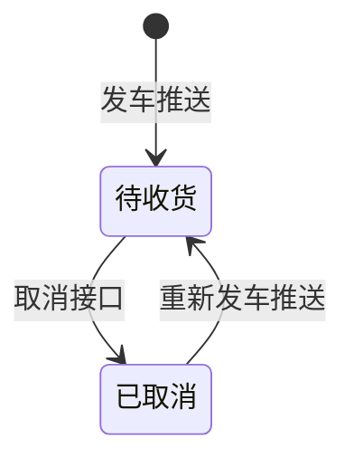

# 速达优化主PRD

> **版本**：V1.5 | 2026-09-02
> **读者**：研发工程师、测试工程师、产品复核
> **文档范围**：相对现网，本文**只写速达侧需新增/调整的对接点**——**速达后台**配置加盟商揽收仓、发车推数据、取消发车调接口。WMS 只接收推送；加盟商揽收仓绑定关系**不在 WMS 后台维护**。
> **字段命名依据**：`02-01-收货订单-入库单字段清单.md` §七 TMS 映射

---

## 一、业务背景

加盟商在速达客户端点「发车」后，WMS 才能收到预报并开始收货。本期速达侧需补齐：**批量发车推数据**、**批量取消调接口**（亦支持单笔）。WMS 按接口落收货订单，不手工建单。

---

## 二、功能范围

**In Scope（本期速达要改的）**：

- **速达后台配置**：按**加盟商代码**绑定揽收仓，先配后用
- 发车：按配置带出**预报仓库**后推送运单预报至 WMS（**支持批量**）
- 取消发车：调用 WMS 取消接口（**支持批量**）
- 已取消后再次发车：同运单号重新推送（WMS 全量覆盖）

**Out of Scope**：

- WMS 后台维护加盟商揽收仓配置（归速达后台）
- 加盟商客户端自行选揽收仓（由速达按配置控制）
- PDA 绑托、上架、装车（WMS 侧，另文）
- 报文格式细节、重试幂等（接口 PRD / TQ03）

---

## 三、对接说明

### 3.0 速达后台配置——加盟商揽收仓

**目的**：不同加盟商只能发到指定揽收仓（如南昌、赣州），不能随意选仓。

**配置位置**：**速达管理后台**（非 WMS 后台、非加盟商客户端自行配置）。

**配置内容**：

| 配置项 | 说明 |
| :--- | :--- |
| **加盟商代码** | 标识加盟商主体 |
| **揽收仓** | 绑定一个揽收仓，发车时写入推送报文的 **预报仓库** |

**规则**：

- 一个**加盟商代码**只绑定一个揽收仓（如 A、B、C → 南昌）
- 未配置的**加盟商代码**，速达客户端**不允许发车**
- 加盟商发车时，**预报仓库**由速达按配置自动带出，客户端**不可改选**其他揽收仓
- 配置变更**不追溯**已推送的运单；只影响后续新发车

**示例**：

| 加盟商代码 | 揽收仓（预报仓库） |
| :--- | :--- |
| A | 南昌 |
| B | 南昌 |
| C | 南昌 |
| D | 赣州 |

### 3.1 发车——推送预报数据

**触发**：加盟商在速达客户端勾选一条或多条运单，点击「发车」（支持**批量发车**）。

**速达侧**：

1. 读取该**加盟商代码**在速达后台绑定的揽收仓
2. 将 **预报仓库** 写入每条报文（加盟商不可改）
3. **批量**调用 WMS 发车接口（接口由 WMS/接口方提供；单笔亦走同一接口，运单列表仅 1 条）

**批量规则（速达客户端）**：

- 可勾选多条运单一次性发车
- 同一批运单须属同一**加盟商代码**（**预报仓库**相同）
- 提交后展示逐票结果：成功 / 失败及原因

**推送字段**：沿用现网表格 7 必填项，映射见字段清单 §七。每条运单独立一条报文记录。头部含 **运单号**、**参考号**、**客户代码**、**预报箱数**、**预报重量**、**预报体积**、**预报仓库**、**预计到仓时间**、**目的国**、**目的仓库**、**业务类型**、**业务归属**、**运输类型** 等；明细按箱推送 **箱号**、**预报重量**、**预报尺寸**、**预报体积**。

**WMS 侧处理**（只接收，不维护加盟商揽收仓配置；**按运单号逐条校验、逐条落库**）：

| 条件 | 处理 |
| :--- | :--- |
| **运单号**无未取消有效单 | 生成**收货单号**；**状态**→待收货；**入库类型**=常规入库；**预报库存** +**预报箱数** |
| 同一**运单号**已有未取消单（待收货/已绑托/已上架） | 该票拒绝，不影响同批其他票 |
| 原单**状态**=已取消 | 见 **3.1.1** |
| 必填字段缺失 | 该票拒绝 |

**批量返回**：接口须返回每张**运单号**的处理结果（成功 / 失败 + 原因）；允许**部分成功**。

#### 3.1.1 已取消后再次发车

**场景**：加盟商先取消发车，在速达里改好预报后，对**同一运单号**再次点「发车」。

**WMS 处理**（不新建第二条单，沿用原**收货单号**）：

1. 用新推送的报文**整单替换**原记录（头部 + 收货明细全部换成最新一版）
2. **状态**改回待收货
3. **预报库存**按新推送的**预报箱数**重新计入（不是叠加旧数量）

**示例**：

| 步骤 | 操作 | WMS 结果 |
| :--- | :--- | :--- |
| 1 | 第一次发车，预报 10 箱 | 待收货；预报库存 +10 |
| 2 | 取消发车 | 已取消；预报库存 −10（归零） |
| 3 | 改预报为 8 箱后再次发车 | 还是同一条单、同一个收货单号；内容换成 8 箱；待收货；预报库存 +8 |

> 一运单只允许一条记录（Q09）。预报有误时不能直接在 WMS 改字段，必须走「取消 → 速达改单 → 再发车」。

### 3.2 取消发车——调用取消接口

**触发**：加盟商在速达客户端勾选一条或多条运单，点击「取消发车」（支持**批量取消**）。

**速达侧**：**批量**调用 WMS 取消接口，传入**运单号**列表（单笔亦走同一接口）。

**批量规则（速达客户端）**：

- 可勾选多条运单一次性取消
- 提交后展示逐票结果：成功 / 失败及原因

**WMS 侧处理**（**按运单号逐条校验**）：

| 当前**状态** | 处理 |
| :--- | :--- |
| 待收货 | **状态**→**已取消**；**预报库存** −对应**预报箱数** |
| 已绑托 / 已上架 | 该票拒绝 |
| 已取消 | 该票无效果，保持已取消 |

**批量返回**：接口须返回每张**运单号**的处理结果；允许**部分成功**（如 3 票中 2 票待收货取消成功、1 票已绑托拒绝）。

> 件数有差异时，速达侧须在**待收货**时先取消、改预报后再重新发车；WMS 不改预报。

---

## 四、状态流转（速达相关）

---

## 五、验收标准

| 验收编号 | 场景 | 操作 | 预期结果 |
| :--- | :--- | :--- | :--- |
| V01 | 发车 | 速达推送有效报文 | 待收货；**预报库存** +**预报箱数** |
| V02 | 重复发车 | 待收货未取消时再次推送 | 拒绝 |
| V03 | 取消 | 待收货时调取消接口 | 已取消；**预报库存** − |
| V04 | 不可取消 | 已绑托/已上架时调取消接口 | 拒绝 |
| V05 | 取消后重发 | 已取消；新预报 8 箱（原 10 箱）再次发车 | 沿用原收货单号；待收货；预报库存 +8（非 +10） |
| V06 | 速达后台配置 | 速达后台配置 A→南昌 | A 登录客户端可见/锁定南昌揽收仓 |
| V07 | 发车带出仓 | A 配置为南昌后点发车 | 推送报文 **预报仓库**=南昌；WMS 落单成功 |
| V08 | 未配置不可发 | 加盟商代码 X 无速达后台配置 | 速达客户端不允许发车（不调 WMS 接口） |
| V09 | 批量发车 | 勾选 3 票有效运单批量发车 | 3 票均落单待收货；接口返回 3 条成功 |
| V10 | 批量发车部分失败 | 3 票中 1 票已存在未取消单 | 2 票成功、1 票失败；失败票说明原因 |
| V11 | 批量取消 | 勾选 3 票待收货运单批量取消 | 3 票均→已取消；预报库存逐票扣减 |
| V12 | 批量取消部分失败 | 3 票中 1 票已绑托 | 2 票取消成功、1 票拒绝 |

---

## 修订记录

| 日期 | 变更摘要 |
| :--- | :--- |
| 2026-09-02 | V1.0 初版 |
| 2026-09-02 | V1.1 精简：只保留发车推送、取消接口两项增量 |
| 2026-09-02 | V1.2 补充 §3.1.1：已取消后再次发车的业务含义与示例 |
| 2026-09-02 | V1.3 新增 §3.0：后台按加盟商代码配置揽收仓；发车校验预报仓库 |
| 2026-09-02 | V1.4 修正：加盟商揽收仓配置归**速达后台**，WMS 只接收推送 |
| 2026-09-02 | V1.5 发车、取消发车支持**批量操作**；接口按运单号逐条返回结果 |
