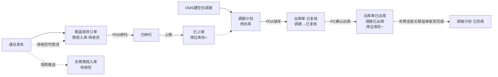

# 加盟商揽收仓 · 研发与测试交接说明

> **基准版本**：管理后台主 PRD **V1.8.2**、PDA 主 PRD **V1.4.4**（2026-09-03）  
> **读者**：研发工程师、测试工程师、产品复核  
> **说明**：本文按「背景 → 流程 → 改动 → 原型」组织交接信息；**规则权威源**见 [03-01-加盟商揽收仓管理后台主PRD.md](./03-01-加盟商揽收仓管理后台主PRD.md)、[03-02-加盟商揽收仓PDA主PRD.md](./03-02-加盟商揽收仓PDA主PRD.md)。

---

## 1. 需求背景

加盟商在南昌、赣州设立加盟揽收仓后，现网 WMS 缺少三类能力：接收速达「发车」预报、按空白调拨计划执行装车出库、把实装结果与东莞仓收货闭环。

本迭代在现网之上做增量，不重写集货仓、自营揽收仓：

- 新增仓库类型 **加盟揽收仓**，与 **自营揽收仓**、**集货仓** 拆开
- 加盟揽收仓收货订单由上游发车生成（**仅落南昌常规入库**）；东莞**常规入库**由现网逻辑在发车时自动推送，**不生调拨入库单**
- 调出仓为加盟揽收仓时走 **空单调拨**；计划调拨保持现网，本文不展开
- 空单调拨：**OMS 创建空白计划** → PDA **装车**生成/追加出库单（**已复核**）→ PC **确认出库**（**已出库**、库位库存 −）→ 东莞对该计划下**全部关联运单**常规入库收货完成 → 调拨 **已完成**

没有这些增量：加盟仓仍靠纸质交接，装车与出库脱节，总部无法按仓类型区分两套调拨。

---

## 2. 业务流程

**链路要点**：

| 阶段      | 关键结果                                     |
| ------- | ---------------------------------------- |
| 发车      | 南昌收货订单待收货 + 预报库存；东莞常规入库现网推送              |
| 绑托 / 上架 | 绑托无库存变动；上架后预报 − / 库位 +                   |
| 建计划     | 空单调拨待出库，明细空，不预生成出库单                      |
| PDA 装车  | 出库单已复核，占用库位库存                            |
| PC 确认出库 | 出库单 / 调拨已出库，库位库存实扣                       |
| 调入仓收货   | 不生调拨入库单；**调入仓库对应的常规入库单全部收货后，调拨计划 → 已完成** |

---

## 3. 改动逻辑

以下按**有原型标注的页面**汇总当前改动逻辑；未列页面（调拨计划列表/详情、分货参数配置等）沿用现网或见主 PRD。

### 3.1 管理后台 · 收货订单列表

**前端菜单**：订单管理 → 收货订单

- 收货订单**仅由上游速达发车推送生成**，后台无手工新增、无取消/改预报/直改状态。
- 按**运单号 1:1**落单，初始**待收货**，**预报库存 + 预报箱数**。
- 重复发车拒绝；已取消单可重新发车，全量覆盖回待收货。
- **加盟路径**：待收货 → 已绑托 → 已上架；绑托回写收货箱数/收货人/收货时间/收货仓库，**不回写**收货重量/体积。
- 列表 UI、筛选项、数据权限**沿用现网**。

### 3.2 管理后台 · 调拨计划新增弹窗

**前端菜单**：订单管理 → 调拨计划 → 新增

- **Modal** 仅选调出/调入两仓；保存后类型=**空单调拨**（落库区分，**页面不展示**）。
- 仅**总部作业部**可新增；调出仓须为**加盟揽收仓**；**调出 ≠ 调入**（R29）；创建后两仓锁定。
- 建计划**不预生成**出库单；明细由 PDA 装车扫描回写。
- 不生调入仓调拨入库单（R18/R26）；东莞常规入库由加盟商发车时现网自动推送；**调入仓库对应的常规入库单全部收货后，更新调拨计划为已完成**。

**空单调拨·出库下推规则**：

| 阶段      | 系统行为                               |
| ------- | ---------------------------------- |
| OMS 建计划 | 调拨计划待出库、明细空；不下推                    |
| PDA 装车  | 生成/追加出库单→**已复核**；回写实装明细；**占用**库位库存 |
| PC 确认出库 | 出库单→**已出库**；库位实扣；调拨→**已出库**        |
| 调入仓入库   | 不生调拨入库单；东莞常规入库现网推送                 |
| 调拨完结    | **调入仓库对应的常规入库单全部收货后，更新调拨计划为已完成**   |

### 3.3 PDA · 分货

**前端菜单**：PDA → 入库管理 → 分货

- 进入页先选**作业托数 N**（1–10，不可跳过）；**M/P 未配置**则阻断（R48）。
- **M** 小票阈值、**P** 混托上限由后台配置；预报 ≤ M 为小票，> M 为大票。
- **小票**：同票同托；多票可混一托（≤ P）；须扫齐全部箱方可绑托；混托托满生成**一张**含多运单的上架单。
- **大票**：不可混托；可拆多托；全部箱绑完→已绑托并生成上架单。
- 绑托阶段**无库存变动**；不存在「部分绑托」状态。
- 扫描自动校验；不校验收货订单状态；绑托收敛至各格「托满」+ 落托确认弹窗。

### 3.4 PDA · 上架

**前端菜单**：PDA → 入库管理 → 上架（或 库内作业 → 移库作业 → 上架 TAB）

- 双入口查询同一上架单。
- 入口：扫箱或待上架列表进入作业页；列表展示作业单号、运单、托号件数；**不展示**初始库位、状态 Tag。
- 作业页**仅展示当前焦点托**；目标库位仅可选**备货库位**；确认上架按托提交。
- 上架完成：收货订单→**已上架**；**预报库存 − / 库位库存 +**。
- 小票混托须先在分货页绑托生成上架单；混托确认上架时**整托全部运单**一并完成。

### 3.5 PDA · 装车

**前端菜单**：PDA → 出库管理 → 装车

- 展示出库单**未出库**的空单调拨（`待出库` / `已复核` 可追加）；列表/头信息展示 `已扫：N票 / M托`；**不展示**状态 Tag、合计箱数。
- 扫箱号**带出整托**；混托一扫多票；同一运单多托须扫齐后再扫下一票（R31）。
- 每扫一次校验**当前托下全部箱**可用库存；卡片「**移除**」按整托删除（R50）；会话保持；新扫置顶。
- 点「装车」→ 司机信息弹窗（司机/电话/车牌必填）→ 提交；成功后**调拨计划与出库单均为已复核**并占用库存。
- 已出库 / 已完成：整页只读。
- **不生**调入仓调拨入库单；PC 确认出库后实扣库位库存。

**扫描校验（摘要）**：

| 规则        | 失败反馈              |
| --------- | ----------------- |
| 货物须已上架且在库 | `货物未上架或不在库`       |
| 托下任一箱被占用  | `箱号{箱号}已被{占用方}占用` |
| 重复扫同一托    | `该运单已关联`          |
| 多托未扫齐扫下一票 | `请先扫齐当前运单全部托`     |

---

## 4. 原型链接

  
[https://tiana-1720.github.io/wms-inbound-demo/](https://tiana-1720.github.io/wms-inbound-demo/)

---

## 修订记录

| 日期         | 变更摘要                                                                                        |
| ---------- | ------------------------------------------------------------------------------------------- |
| 2026-08-31 | 初版：管理后台增量范围、变化摘要、资料入口与测试要点                                                                  |
| 2026-09-02 | V1.2 分货增强：M/P/N 符号；小票混托全箱校验；多托同分落托；落托确认弹窗；上架仅备货库位                                           |
| 2026-09-03 | V2.0 扩展至全套件：纳入 PDA 三页、分货参数配置、上架单定稿                                                          |
| 2026-09-03 | V2.1–V2.7 装车/上架原型与标注迭代；R23 目的仓校验本期不做                                                        |
| 2026-09-03 | **V3.0 结构调整**：§1 需求背景、§2 业务流程（主 PRD 链路图）、§3 改动逻辑（原型标注汇总）、§4 原型链接；原测试用例/R 号速查等移出本文，以主 PRD 为准 |

