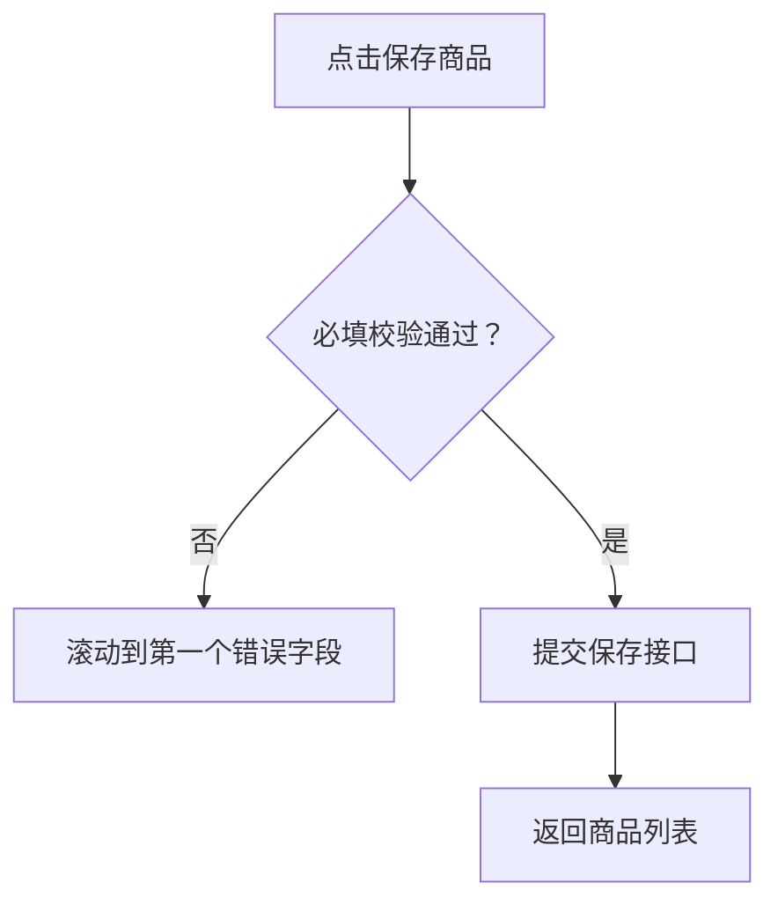

# Annotation Authoring

## Source Separation

Keep these documents separate:

- Business PRD: source-of-truth business requirements.
- Page annotation Markdown: developer-facing page instructions derived from PRD and UI.

Never write generated annotation ids into the business PRD unless the user explicitly asks.

## Current-Only Default

Maintain one current set of annotation Markdown files for the current prototype. Update blocks in place and let the runtime display only this current set. Do not create a changelog, version folder, or historical annotation copies unless the user explicitly asks for restoration or audit history. Requirement PRDs retain the business change history.

Every annotation block must include a readable `来源` line that names the current PRD file or section it summarizes. Keep the matching `sourceRefs` in `annotation.config.json` for validation and coverage.

## Annotation Directory

Select the annotation directory before writing files:

1. User-specified directory wins.
2. Existing annotation directory wins if the project already has one.
3. Otherwise create `annotations/` beside the main business PRD.
4. If there are multiple PRDs, use the PRD that contains the source requirements for the annotated page.
5. If no PRD is found, use project-root `annotations/` as a fallback and document the assumption.

When several PRD-local annotation directories feed one deployed runtime, keep those directories independent and create one `annotation.workspace.json` at their nearest practical common annotation parent. The workspace is a build manifest, not a new source-of-truth document.

Examples:

```txt
docs/prd.md
docs/annotations/

requirements/product-management/prd.md
requirements/product-management/annotations/

prd/product-list.md
prd/annotations/product-list.md
```

Use this selected directory for page Markdown, source mappings, and optional coverage output.

Recommended minimal structure:

```txt
annotations/
  coverage.md
  pages/
    product-list.md
    product-create.md
```

Create `changelog.md` or `versions/` only when the user explicitly needs recoverable snapshots, audit comparison, or release-by-release archives.

## Extraction Checklist

When reading PRDs, extract:

- Page purpose and business object.
- User roles and permissions.
- Field definitions, requiredness, editable conditions, validation, default values, uniqueness, computed values, and PRD-defined length, range, format, or precision.
- States, status colors, business-specific disabled states, and error states.
- Click behavior, navigation, modal/drawer behavior, and confirmation behavior.
- Table columns, sorting, filtering, pagination, batch actions, and row operations.
- Cross-page flow, save/cancel rules, dirty-form warnings, and return behavior.
- Exception flows: failed requests, permission loss, duplicate submissions, missing data.
- Integration notes: APIs, idempotency, import/export, audit logs, and downstream references.
- Visibility states: whether the target is initially visible or appears only after opening a modal, drawer, popover, accordion, tab panel, or route.

## Aggregation Rules

Default to the **page-global profile** (aligned with `outbound-order/pages/outbound-link-waybill.md`) unless the page is a multi-step PDA workflow that still needs zone-level badges.

### Page-global profile (default)

- One annotation badge `id=0` on the page root container (`data-anno='{page}-page'`).
- Merge all page rules, partitions, modals, and bottom actions into this single block.
- Do **not** create child badges `1`–`5` for header / filter / table / modal / footer when the whole page ships together.
- Use `### 页面分区` table (`分区 | 要点`) to summarize UI areas instead of a `子模块标注` corner-badge matrix.
- Put cross-cutting workflow context (for example `空单调拨·出库下推`) in an optional extra `###` section after `页面分区`.
- Reserve supplemental ids `A1`, `A2` only for Mock data, acceptance shortcuts, or rules that do not belong in the page-global block.

### Multi-badge profile (exception)

Use only when zones are implemented and reviewed independently, typically PDA scan / work / bottom areas:

- Keep `id=0` as a short overview with optional `子模块标注` pointer table.
- Add one badge per independent zone (`1`, `2`, `A1`, …).
- Avoid parent/child duplication: if a rule is already in `id=0`, do not repeat it in a child badge.

### Legacy module aggregation (lists / simple CRUD)

When neither profile above applies:

- Filter area: one badge for all inputs, reset, query, and default behavior.
- Table: one badge for columns, row operations, status display, sorting, and empty/error states.
- Tabs: one badge for all tab switching and tab-specific loading rules.
- Form section: one badge per coherent field group, not per field unless a field has complex standalone rules.
- Modal/drawer: one badge on modal header or container.

Avoid duplicate badges on a parent and child when the child logic is already fully covered by the parent annotation.

## Field-First Content Profile

Use this profile for form and query annotations unless the user explicitly asks for a more detailed implementation specification.

### Field groups

Use a compact table with only PRD-confirmed columns that matter to implementation:

| 字段 | 必填/可编辑 | 核心约束 |
| --- | --- | --- |
| 采购数量 | 必填；审核后只读 | 正整数，1-9,999,999 |
| 单价（含税） | 必填；审核后只读 | 大于等于0，最多2位小数 |

- Include `默认值` only when the PRD defines one.
- Include validation timing and error copy only when the PRD defines them or they materially change the handling path.
- Do not turn the table into a full component API: omit ordinary placeholder, visual style, keyboard, loading, and clearable behavior unless it changes business outcomes.
- Never fill a missing constraint from general frontend experience. Mark a source conflict or missing rule as supplemental `A*` only when it affects implementation or acceptance.

### Page-global rules

For the default page-global profile, write `### 改动逻辑` directly as a numbered list. Each item starts with a short **bold label**:

1. **{场景/背景}**：…
2. **前置条件**：入口、状态、权限、可见性。
3. **保存规则** / **提交边界**：校验口径、状态影响、库存/下游副作用。

Legacy blocks may still use hidden source sections (`页面模式`、`提交边界`、`结果处理`、`离开处理`、`交互规则`); the compiler maps them into popup `改动逻辑` only when `改动逻辑` is absent. Prefer authoring `改动逻辑` explicitly for new pages.

Do not repeat page-global rules in `页面分区` rows. Ordinary read-only pages and simple lists still use one `id=0` badge when they have incremental business rules.

### Component behavior

Treat established design-system behavior as implicit. Annotate a component only when its behavior carries business meaning, such as a status-gated action, a date range that changes query semantics, a confirmation that blocks a state transition, or a business-specific selector source.

## Markdown Block Shape

### Page-global profile (default)

```md
<!-- anno:start id=0 page=/order/Outbound/:id/link-waybill target=outbound-link-waybill-page -->
## 需求描述：【关联运单页】

> 来源：04-09-出库-关联运单.md；03-01 §5.3、R14/R20/R22/R50；02-04 出库单字段清单；04-08 §1.5.3

### 页面入口

- 出库列表 → 空单调拨行「更多」→ **关联运单**
- 路径 `/order/Outbound/{出库单号}/link-waybill`

### 改动逻辑

1. **PDA 无法扫描时的 PC 兜底**
2. **前置条件**：待出库或已复核状态可点击「关联运单」；**已出库**或**已锁单**后不显示此按钮。
3. **保存规则**：保存时校验可用库存（R14）——当前仓库须有所选运单的可用库存；**箱库存=已占用**或**查不到该仓库库存**，均视为不可用。保存后状态不变，仅建关联并将箱库存→已占用；须再到调拨详情手动锁单。

### 页面分区

| 分区 | 要点 |
| --- | --- |
| 出库单信息 | 两行只读：计划号+状态；柜号、司机、电话、车牌 |
| 选择运单 | 按钮打开弹窗；候选=已上架库存；支持运单号精确/多号搜索 |
| 运单明细 | 只读表：历史+待保存合并；空态「暂无关联运单」 |
| 底部操作 | 取消返回列表；确定提交关联 |

### 空单调拨·出库下推（本页）

| 阶段 | 系统行为 |
| --- | --- |
| **PC 关联运单** | 整票关联；状态不变；箱库存→已占用；须手动锁单 |

### 研发备注

- 挂载点：`[data-anno='outbound-link-waybill-page']`。
- 不展示：确认出库、打印装柜单、手动锁单（在列表或调拨详情）。
<!-- anno:end id=0 -->
```

Config shape for page-global pages: one annotation `id=0`, all `sourceRefs` on that block, `moduleName` = page title.

```json
{
  "sourceRequirements": [
    { "id": "REQ-OUTBOUND-LINK-001", "source": "../04-09-出库-关联运单.md#§2.1", "page": "/order/Outbound/:id/link-waybill" }
  ],
  "annotations": [
    {
      "id": "0",
      "page": "/order/Outbound/:id/link-waybill",
      "moduleName": "关联运单页",
      "target": { "selector": "[data-anno='outbound-link-waybill-page']" },
      "markdownFile": "pages/outbound-link-waybill.md",
      "blockId": "0",
      "sourceRefs": ["REQ-OUTBOUND-LINK-001"]
    }
  ]
}
```

### Legacy / field-group profile

Use when the target project already follows the older shape or the page is not a full-screen workflow:

```md
<!-- anno:start id=1 page=/products target=product-table -->
## 需求描述：【商品列表与行操作】

> 来源：商品管理PRD.md#商品查询

### 页面入口
- ...

### 业务定义
- ...

### 字段与状态
| 字段/状态 | 必填/可编辑 | 核心约束 |
| --- | --- | --- |
| ... | ... | ... |

### 研发备注
- ...
<!-- anno:end id=1 -->
```

### Popup rendering

Compiled popup shows, in order:

1. Title preamble and `来源`
2. `页面入口`（正文优先取块内 `### 页面入口`，否则回退 `annotation.config.json` 的 `pageEntry`）
3. `改动逻辑`（优先取块内 `### 改动逻辑`；无则回退 `业务定义`，再回退 `页面模式` / `交互规则`）
4. Other `###` sections such as `页面分区`、领域下推表、字段表

Hidden in popup (authoring-only): `页面模式`、`交互规则`、`研发备注`。`业务定义` 不直接展示，编译时并入 `改动逻辑`。

Declare stable source requirements in `annotation.config.json`, then map each annotation using `sourceRefs`:

```json
{
  "sourceRequirements": [
    { "id": "REQ-PRODUCT-001", "source": "../business-prd.md#商品查询", "page": "/products" }
  ],
  "annotations": [
    { "id": "1", "sourceRefs": ["REQ-PRODUCT-001"] }
  ]
}
```

The compiler must fail on duplicate annotation ids, missing Markdown blocks, unknown source references, and unmapped declared requirements. Use `--allow-unmapped` only when the user explicitly accepts incomplete coverage.

Keep PRD details that affect implementation. Do not compress them into vague prose.

## Mermaid Usage

Use Mermaid only when it improves developer understanding:

- Cross-page flows: `flowchart`.
- Status transitions: `stateDiagram-v2`.
- Role/process swimlane-like logic: use simple flowcharts with role labels.
- Data relationships: `erDiagram` only when the relationship is important for implementation.

Prefer tables and lists for field rules, validation, permissions, and exception messages.

Example:

````md

````

## Runtime Rendering Rules

Annotation Markdown is the authoring source of truth. Compile one module config or a multi-module workspace into `annotation.bundle.json`; the read-only runtime loads that bundle and renders the matching block in the popup.

Config mapping:

```json
{
  "id": "1",
  "page": "/products",
  "moduleName": "商品列表与行操作",
  "target": {
    "selector": "[data-anno='product-table']"
  },
  "markdownFile": "annotations/pages/product-list.md",
  "blockId": "1"
}
```

Parsing rules:

- Preferred block delimiter: `<!-- anno:start id=1 ... -->` to `<!-- anno:end id=1 -->`.
- Legacy fallback: `<!-- anno:id=1 ... -->` until the next `anno:id` or `anno:start` marker.
- `blockId` defaults to the annotation `id`.
- One Markdown file may contain many annotation blocks.
- Page popup content must render the extracted block, not the whole file.
- Markdown changes become visible after recompiling the bundle and refreshing or reloading the page.
- Module display ids may repeat across scopes. Runtime and aggregate-export identity is `scope:id`; never renumber an existing module merely because another module joins the workspace.
- Use `page: "*"` for a single static page. For a route-specific annotation, verify the configured page against the browser URL; the runtime supports both raw and decoded path matching.
- Hidden modules do not render badges until visible. Verify each modal, drawer, popover, accordion and tab-panel annotation in its revealed state.

## Supplemental Annotation Rules

Supplemental annotations are first-class fragments created in Markdown or by Codex:

- Assign ids `A1`, `A2`, `A3`.
- Store them in the same annotation Markdown system.
- Include target selector and page metadata in the HTML comment.
- Export together with auto-generated annotations.

## History Rules (Only When Explicitly Requested)

Create `changelog.md` inside the selected annotation directory only when the user explicitly asks for annotation history:

```md
## 2026-07-05

- Added `A2`: clarified barcode uniqueness behavior on product create form.
- Updated `3`: added low-stock orange status rule.
- Removed `A1`: obsolete import button note after UI removal.
```

Changelog records annotation changes, not every business PRD edit.

Each changelog entry should include:

- Date or timestamp.
- Annotation id.
- Change type: Added, Updated, Removed, Moved, Split, Merged.
- Short reason or source PRD reference when known.
- Affected page/module.

Use this shape for richer entries:

```md
## 2026-07-05 15:30

| 类型 | 标注 | 页面/模块 | 变更说明 |
| --- | --- | --- | --- |
| Updated | `3` | 商品列表与行操作 | 补充低库存橙色状态和停用二次确认规则 |
| Added | `A2` | 条码字段 | 新增条码唯一性校验的补充标注 |
```

## Snapshot Rules

Use `versions/<timestamp>/` only when a user asks for historical restore points or release archives.

Snapshot structure:

```txt
annotations/
  versions/
    2026-07-05_1530/
      index.md
      pages/
        product-list.md
        product-create.md
```

Snapshots should copy annotation Markdown outputs, not business PRDs or runtime files.
