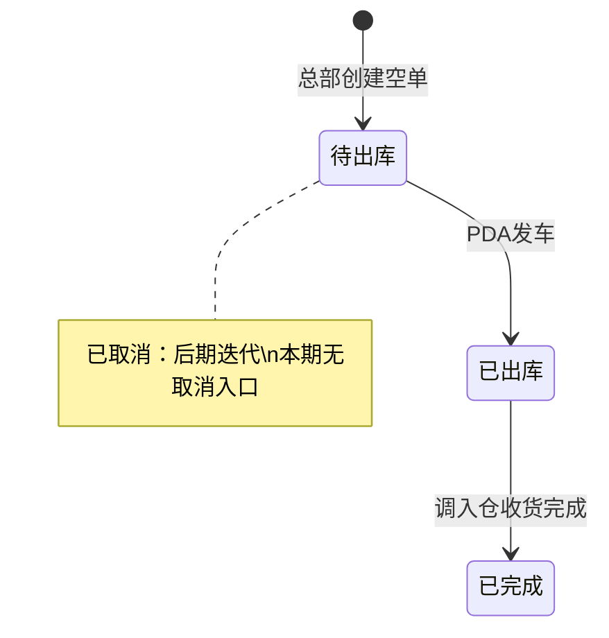

<!-- anno:start id=1 page=/order/TransferPlan target=transfer-plan-list-page -->
## 需求描述：【查询区、表格与分页】

> 来源：调拨计划_Demo_列表页.md §1.1、§1.3、§1.5、§1.6、§1.7；调拨计划单字段清单.md §一、§三、§四、§5.5（V1.6）；03-01-加盟商揽收仓管理后台主PRD.md §3.2、§七（V1.5）

### 业务定义

- 沿用现网菜单 **订单管理 → 调拨计划**；调拨计划需新增**类型**：现有通过上游推送的均为**计划调拨**；手工创建的为**空单调拨**；**页面不需展示该类型**（主 PRD §3.2；字段清单 §5.5）。
- 数据权限沿用现网：账号可用仓库命中**调出仓库或调入仓库**即可查看；列表/Tab 同时含计划调拨与空单调拨，**不提供按类型筛选或拆菜单**。
- **本期后台增量**（总部手工新增空单、PDA 装车发车）仅作用于**空单调拨**（调出仓类型=加盟揽收仓）；计划调拨的创建、编辑、下推、PDA 复核/装柜**沿用现网**，不在本标注展开。
- 默认排序按**创建时间升序**（字段清单 §5.5）。
- 调拨计划单号、列表数量列（汇总箱数/重量/体积）、明细运单号/箱数命名、查询区与表格布局等**沿用现网**。
- 明细字段**不进主列表**；运单号仅作筛选（按明细运单号反查所属计划单）。
- **取消**：后期迭代（主 PRD Out of Scope / R17 预留）；**本期列表无取消操作**；**已取消**仅通过 Tab 筛选预留态或历史数据。

### 交互规则

- 行勾选、行展开：**不支持**。
- 列宽拖拽：支持。固定列：**调拨计划单号**左固定，**操作**右固定。
- 分页：默认每页 **20**，可切换 20 / 50 / 100。
- 空值：无数据展示 `-`；汇总无明细为 `0`。
- **查看**：跳转 `/order/TransferPlan/{调拨计划单号}`；各状态均仅「查看」。
- 列表**不提供**：取消（后期迭代）、PDA 发车、调入仓收货完成（系统）、编辑页入口。

### 字段与状态

| 字段/状态 | 必填/可编辑 | 核心约束 |
| --- | --- | --- |
| 调拨计划单号（筛） | 可筛 | 精确匹配；placeholder：`调拨计划单号` |
| 运单号（筛） | 可筛 | 精确匹配；按明细运单号反查计划单 |
| 调出仓库（筛） | 可筛 | 多选；展示 `仓库代码(仓库名称)` |
| 调入仓库（筛） | 可筛 | 多选；规格同调出仓库 |
| 调拨计划单号（列） | 只读 | 链接色；沿用现网单号规则（`AT`+`YYMMDD`+5 位流水） |
| 调出/调入仓库（列） | 只读 | `仓库代码(仓库名称)` |
| 箱数 / 重量 / 体积（列） | 只读 | 沿用现网列表逻辑；对应**汇总箱数 / 汇总重量 / 汇总体积**；无明细为 `0` |
| 状态（列） | 只读 | Tag：待出库蓝、已出库橙、已完成绿、已取消灰 |
| 创建时间（列） | 只读 | `YYYY-MM-DD HH:mm:ss` |
| 最后修改时间（列） | 只读 | `YYYY-MM-DD HH:mm:ss` |
| 操作 | 只读 | **查看** |

> **调拨类型**（计划调拨 / 空单调拨）：后台区分；上游推送=计划调拨，手工新增=空单调拨；**列表不展示、不可筛**。

### 权限与异常

- **新增**：按角色权限控制（R16）；仅**总部作业部**展示工具条「新增」，**仅用于创建加盟揽收仓空单**。
- 列表空态：「暂无数据」。
- 加载失败：Toast「加载失败，请重试」。

### 研发备注

- 查询区、表格、分页**尚无独立 `data-anno`**，本块暂挂页面根 `[data-anno='transfer-plan-list-page']`。
- 列表列序、列宽：字段清单 §六 **待确认**。
- 「最后修改时间」列表是否展示：字段清单 §四 **待确认**（Demo §1.5 已列出）。
<!-- anno:end id=1 -->

<!-- anno:start id=2 page=/order/TransferPlan target=transfer-plan-status-tabs -->
## 需求描述：【状态 Tab 栏】

> 来源：调拨计划_Demo_列表页.md §1.2；03-01-加盟商揽收仓管理后台主PRD.md §5.2

### 业务定义

- Tab 与筛选项状态集合固定为**四态**：**待出库 / 已出库 / 已完成 / 已取消**，另加「全部」；默认选中「全部」。
- **不展示**现网 PDA 作业态 **已复核**、**已下架**（原 WMS 调拨计划曾含此二态；本期 Tab、状态 Tag 均不提供）。
- **本期无取消入口**；**已取消** Tab 用于筛选预留态、mock 或历史数据。

### 交互规则

- 每个 Tab 右侧计数：`Tab名 (N)`；超过 99 展示 `99+`；0 也展示。
- 切换 Tab 后列表刷新，页码重置为第 1 页，**不清空**查询区其他条件。
- **查询区不提供「状态」筛选项**；状态过滤仅通过 Tab。

### 研发备注

- 状态变更只能通过动作，禁止表单直改状态（主 PRD §五）。
- 计划调拨 PDA 复核/装柜沿用现网作业，但**复核进度不以「已复核/已下架」独立状态出现在管理后台 Tab**。
<!-- anno:end id=2 -->

<!-- anno:start id=3 page=/order/TransferPlan target=transfer-plan-toolbar -->
## 需求描述：【工具条 · 新增】

> 来源：调拨计划_Demo_列表页.md §1.4、§1.7；03-01-加盟商揽收仓管理后台主PRD.md §3.2、§5.2、§七、R16

### 业务定义

- 工具条「新增」：**打开新增弹窗**（Modal），手工创建**空单调拨**（调出仓须为加盟揽收仓）。

### 交互规则

- **位置**：查询区下方、列表表格上方；**「新增」靠左对齐**（Demo §1.4）。
- 无批量操作、无导出/打印装车清单（Out of Scope）。

### 权限与异常

- **按角色权限控制**（R16）：仅**总部作业部**展示「新增」；加盟揽收仓操作员、集货仓操作员**不展示**。
- 无权限用户直接访问 `/order/TransferPlan/new` 时，**重定向回列表**（无弹窗）。

### 研发备注

- 原型实现：`canCreateTransferPlan(role)`；右上角头像下拉可切换角色验证。
<!-- anno:end id=3 -->
