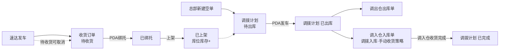
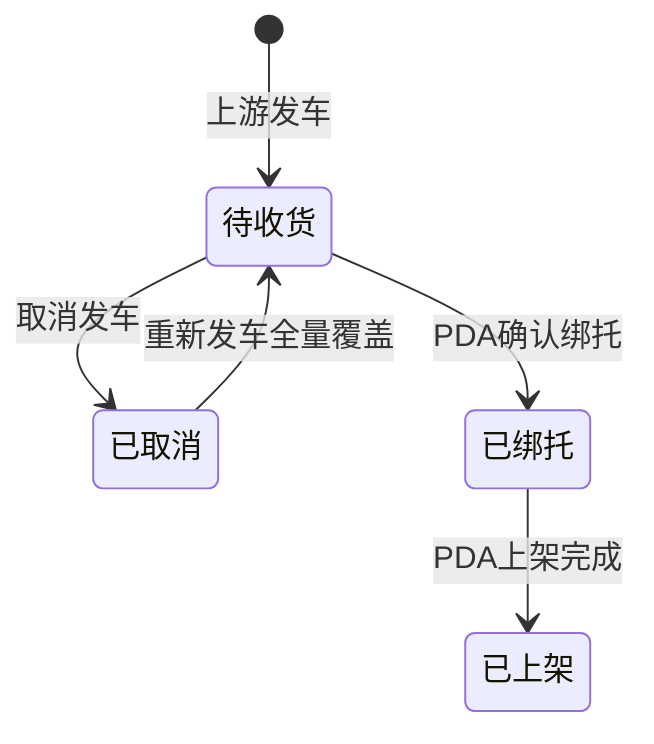
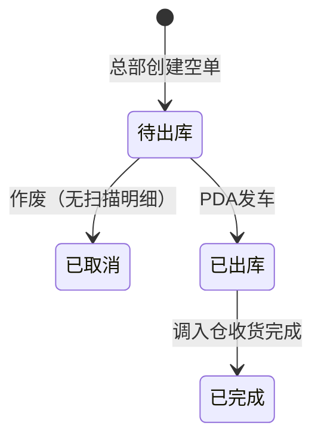

# 加盟商揽收仓管理后台主PRD

> **版本**：V1.1 | 2026-08-30
> **读者**：研发工程师、测试工程师、产品复核
> **文档范围**：仅描述相对已上线 WMS（下文称**现网**）的**修改、优化、新增**。集货仓、自营揽收仓的原有作业与单据能力不重复展开，只写与集货仓的**对接点**。
> **术语**：现网 = 当前已上线运行的 WMS，含集货仓与原揽收仓能力，相对本次加盟揽收仓增量而言。
> **覆盖单据**：收货订单、调拨计划单（管理后台，加盟揽收仓）
> **字段命名依据**：`02-字段清单/收货订单-入库单字段清单.md`、`02-字段清单/调拨计划单字段清单.md`（粗纲版）
> **确认来源**：迭代评审 D01–D18、D09；仓库类型拆分；空单调拨对接集货仓

---

## 一、业务背景

加盟商在南昌、赣州设立加盟揽收仓后，现网 WMS 缺少三类能力：接收速达「发车」预报、按空单执行调拨、发车后把实装结果交给集货仓继续收货。

本迭代在现网之上做增量，不重写集货仓、自营揽收仓：

- 新增仓库类型 **加盟揽收仓**，与 **自营揽收仓**、**集货仓** 拆开
- 加盟揽收仓收货订单由上游发车生成，差异不在 WMS 改预报
- 调出仓为加盟揽收仓时走 **空单调拨**；计划调拨保持现网，本文不展开
- 空单发车后必须对接集货仓：生成调入仓入库单，该单命中**手动收货策略**（按收货 → 绑托 → 上架执行入库）；**调入仓收货完成即调拨完结**，不等待绑托、上架

没有这些增量：加盟仓仍靠纸质交接，集货仓无法按实装运单收货，总部无法按仓类型区分两套调拨。

---

## 二、功能范围

**In Scope（修改 / 优化 / 新增）**：

- 仓库类型新增 **加盟揽收仓**；现网「揽收仓」更名为 **自营揽收仓**（历史档案一次性迁移）
- 调拨策略按**调出仓库类型**带出默认：加盟揽收仓 → 空单调拨；不做仓到仓路由硬校验
- 接收速达发车推送，按**运单号**生成收货订单，状态=待收货，按**预报箱数**计预报库存
- 收货订单列表/详情可查看全部状态（含加盟路径用到的待收货 / 已绑托 / 已上架 / 已取消）；**预报仓库**与**收货仓库**分列分筛
- 上游按运单号取消：仅待收货允许；已绑托、已上架拒绝。取消后状态=已取消，预报库存 −
- 同一**运单号**只能发车一次；未取消的重复发车拒绝；取消后重新发车则全量覆盖回待收货
- 总部手工新增空单调拨：必填**调出仓库**、**调入仓库**，**备注**选填，不预填运单/托盘
- 空单调拨状态复用现网四态：待出库 → 已出库 → 已完成 / 已取消
- 待出库且无扫描明细时允许取消 → 已取消
- 空单发车后对接集货仓：生成调出仓出库单 + 调入仓入库单（见 §三.4）
- 详情页操作日志：推送、取消、重发、创建调拨、作废、PDA 回写、发运、调入仓收货回写
- 界面统一展示 **运单号**（接口仍可叫订单号）

**Out of Scope**：

- 集货仓、自营揽收仓的原有收货、上架、出库计划、计划调拨、过机/到货扫描等（现网已有，本文不重写）
- 加盟商下单、贴标、发车界面（速达客户端）
- 速达报文开发（WMS 只接收）
- PDA 收货绑托、上架、装车的交互细节（另文；本文只定义回写与库存结果）
- 费用结算、运力调度、盘点、经营报表
- 管理后台手工新建收货订单
- 打印装车清单

---

## 三、单据定位

### 3.1 收货订单（加盟揽收仓增量）

| 项目   | 内容                                    |
| ---- | ------------------------------------- |
| 单据层级 | 预报层。与入库单共用表，主键**收货单号**                |
| 核心职责 | 承载速达发车预报，作为加盟仓 PDA 收货唯一依据；无预报不可收      |
| 单据来源 | 速达发车推送；不提供手工新增                        |
| 加盟路径 | 待收货 → 已绑托 → 已上架；或待收货 → 已取消。不经过收货中、已收货 |
| 菜单   | 订单管理 → 收货订单，可查看全部状态（与现网列表一致，不按状态藏单）   |

### 3.2 调拨计划单（空单调拨增量）

| 项目   | 内容                                           |
| ---- | -------------------------------------------- |
| 单据层级 | 计划层。不直接扣库存                                   |
| 核心职责 | 总部锁定**调出仓库**、**调入仓库**；实装由 PDA 回写；一计划多**运单号** |
| 单据来源 | 调出仓库类型=加盟揽收仓时，总部手工新增空单                       |
| 下游   | 发车后：调出仓出库单 + 调入仓入库单（对接集货仓）                   |

计划调拨（自营/集货仓现网）不在本文展开。同一张调拨计划单，规则由调出仓库类型决定。

### 3.3 系统链路图（加盟仓 + 对接集货仓）

### 3.4 与集货仓对接（必须实现）

本文不描述集货仓如何做收货入库页面，只定义空单调拨交给集货仓的契约。

| 对接点  | 规则                                                                           |
| ---- | ---------------------------------------------------------------------------- |
| 触发时机 | 加盟揽收仓 PDA 装车确认发车，调拨计划 **状态** → 已出库                                           |
| 调出仓  | 生成出库单：**调拨计划单号**、**归属仓库**=调出仓库，明细继承实装**运单号**、**客户代码**、**箱数**、**重量**、**体积**   |
| 调入仓  | 按实装运单各生成一张入库单；**入库类型=调拨入库**；**预报仓库**=**调入仓库**；**收货仓库**空，待集货仓收货回写；**收货单号**新生成 |
| 收货策略 | 调拨入库单**命中手动收货策略**，含义是：集货仓按**标准入库流程**执行，即 **收货 → 绑托 → 上架**。不是「只能走 PC 收货、不能过机」 |
| 拆单   | **一个实装运单号对应一张调入仓入库单**                                                        |
| 回写   | 调入仓该批入库单均**收货完成**后，调拨计划 **状态** → 已完成。绑托、上架继续按标准流程做，不挡住调拨完结                   |
| 可见性  | 沿用现网：账号可用仓库命中**调出仓库或调入仓库**即可查看该调拨单，故集货仓账号能看到作为调入方的空单                         |

### 3.5 实体关系

| 关系            | 说明                        |
| ------------- | ------------------------- |
| 收货订单 : 速达发车   | 按**运单号** 1:1。未取消不可二次发车    |
| 收货订单 : 收货明细   | 1:N，明细按**箱号**             |
| 空单调拨 : 出库单    | 发车后 1:1                   |
| 空单调拨 : 调入仓入库单 | 1:N，按实装运单拆                |
| 空单调拨 : 收货订单   | 无下推。空单不预填运单，装车扫库位库存中的已上架货 |

---

## 四、业务场景

| 场景ID | 场景          | 类型      | 说明                                     |
| ---- | ----------- | ------- | -------------------------------------- |
| S01  | 上游发车生成收货订单  | **主流程** | 按**运单号**落库待收货，预报库存 +**预报箱数**           |
| S02  | 待收货取消后重发    | **支线**  | 取消→已取消，预报库存 −；再发车全量覆盖回待收货（D15）         |
| S03  | 总部创建空单调拨    | **主流程** | 调出=加盟揽收仓，必填调出/调入仓库，明细为空，状态=待出库         |
| S04  | 空单发车对接集货仓   | **主流程** | 发车→已出库；出库单 + 调入仓调拨入库单（手动收货策略=收货→绑托→上架） |
| S05  | 调入仓收货即调拨完结  | **主流程** | 调入仓入库单收货完成后，调拨→已完成；绑托/上架不挡完结           |
| S06  | 已绑托/已上架不可取消 | **异常**  | 上游或 WMS 取消均拒绝                          |
| S07  | 预报与实收不一致    | **异常**  | 不改预报；须在待收货时走 S02。已绑托后只能线下处理            |
| S08  | 空单作废        | **支线**  | 待出库且无扫描明细 → 已取消                        |
| S09  | 重复发车        | **异常**  | 同一运单号未取消则拒绝，不用仓库号匹配                    |

---

## 五、状态机

状态变更只能通过动作，禁止表单直改**状态**。

### 5.1 收货订单（加盟揽收仓路径）

全局枚举沿用：待收货 / 收货中 / 已收货 / 已绑托 / 已上架 / 已取消。  
**加盟揽收仓不进入收货中、已收货**（那两条给自营/集货仓现网使用，本文不描述）。

| 状态  | 含义                | 是否终态          |
| --- | ----------------- | ------------- |
| 待收货 | 已收预报，未确认绑托        | 否             |
| 已绑托 | PDA 收货绑托完成（无库存变动） | 否             |
| 已上架 | 上架完成，预报库存已结转库位库存  | **是**         |
| 已取消 | 待收货时取消成功          | 否（取消后重发可回待收货） |

| 当前状态      | 动作       | 前置条件                   | 结果状态 | 后置影响                           | 失败处理       |
| --------- | -------- | ---------------------- | ---- | ------------------------------ | ---------- |
| （无单）      | 接收发车     | **运单号**无未取消的有效单；预报必填完整 | 待收货  | 生成**收货单号**；预报库存 +**预报箱数**      | 重复未取消运单：拒绝 |
| 待收货       | 上游取消     | 待收货                    | 已取消  | 预报库存 −                         | —          |
| 已取消       | 重新发车     | 原单已取消；新报文完整            | 待收货  | 按运单号全量覆盖头部与明细；预报库存按新**预报箱数**重建 | 必填缺失则保持已取消 |
| 待收货       | PDA 确认绑托 | 箱号匹配预报                 | 已绑托  | 回写**托号**、**绑托完成时间**、**收货箱数**、**收货人**、**收货时间**、**收货仓库**；**不回写**收货重量/收货体积；无库存变动 | 无预报不可收     |
| 已绑托       | PDA 上架完成 | —                      | 已上架  | **上架完成时间**；预报库存 −、库位库存 +       | —          |
| 已绑托 / 已上架 | 取消       | —                      | 不变   | 无                              | 拒绝         |

**管理后台动作**：查看、筛选（含**预报仓库**、**收货仓库**分列）。无手工新增、无改预报、无直改状态。取消由上游接口或现网 WMS 取消入口触发，后台按上表校验。

### 5.2 空单调拨（状态复用现网四态）

| 状态  | 含义                | 是否终态  |
| --- | ----------------- | ----- |
| 待出库 | 空单已建，待装车          | 否     |
| 已出库 | 已发车，已生成出库单与调入仓入库单 | 否     |
| 已完成 | 调入仓该批入库单均已收货      | **是** |
| 已取消 | 待出库空单作废           | **是** |

| 当前状态 | 动作          | 前置条件                     | 结果状态 | 后置影响                         | 失败处理             |
| ---- | ----------- | ------------------------ | ---- | ---------------------------- | ---------------- |
| （无单） | 新增          | **调出仓库**类型=加盟揽收仓；调出/调入必填 | 待出库  | 生成**调拨计划单号**；明细空；表单不展示状态     | 缺仓则不可保存          |
| 待出库  | 编辑备注        | —                        | 待出库  | 仅**备注**；两仓锁定                 | 已出库后无入口          |
| 待出库  | 作废          | 明细无运单                    | 已取消  | 只读                           | 已有扫描明细则拒绝        |
| 待出库  | PDA 发车      | 已扫实装                     | 已出库  | 回写明细；库位库存 −；出库单；调入仓入库单（§3.4） | 拆票/目的仓与调入仓不一致则拦截 |
| 已出库  | 调入仓收货完成（系统） | 该计划下调拨入库单均已收货            | 已完成  | 对接回写，只读；后续绑托/上架不改调拨状态        | —                |

---

## 六、核心业务规则

### 6.1 仓库类型与调拨策略

| 规则ID | 规则                                      |
| ---- | --------------------------------------- |
| R01  | 仓库类型：集货仓、自营揽收仓、加盟揽收仓。现网揽收仓迁为自营揽收仓       |
| R02  | 调出仓库=加盟揽收仓 → 空单调拨（本文）。其他类型走现网计划调拨，不在此展开 |
| R03  | 不做南昌只能调东莞的组合硬校验；方向靠选仓与作业，不靠路由表          |
| R04  | 空单创建后**调出仓库**、**调入仓库**锁定                |

### 6.2 收货订单接收与取消

| 规则ID | 规则                                |
| ---- | --------------------------------- |
| R05  | **收货单号**由系统生成，全局唯一；收货订单仅由速达发车生成，不手工编号 |
| R06  | 未取消的同一运单号禁止再次发车                   |
| R07  | 取消后重发：全量覆盖头部与收货明细，回写字段重置，状态回待收货   |
| R08  | 仅待收货可取消；已绑托、已上架不可取消（加盟商与 WMS 均不可） |
| R09  | 预报类字段快照只读。差异不改预报，须待收货时走取消重发       |
| R10  | **预报仓库**与**收货仓库**分字段、分筛选，不合并      |

### 6.3 加盟揽收仓库存

| 规则ID | 规则                |
| ---- | ----------------- |
| R11  | 发车：预报库存 +**预报箱数** |
| R12  | 绑托：库存不变           |
| R13  | 上架：预报库存 −，库位库存 +  |
| R14  | 装车发车：库位库存 −       |
| R15  | 不使用「收货即暂存」        |

### 6.4 空单调拨与集货仓对接

| 规则ID | 规则                                      |
| ---- | --------------------------------------- |
| R16  | 仅总部可新建空单；明细仅 PDA 回写                     |
| R17  | 待出库无明细可作废→已取消                           |
| R18  | 发车后按 §3.4 生成调入仓入库单；命中手动收货策略=按收货→绑托→上架执行 |
| R19  | 调入仓该批入库单均收货完成后调拨→已完成；不等待绑托、上架           |
| R20  | 不允许拆票发车；整票**运单号**一次关联                   |

### 6.5 字段锁定

| 规则ID | 规则                                       |
| ---- | ---------------------------------------- |
| R21  | 收货订单预报字段后台只读；**状态**不可下拉改                 |
| R22  | 空单调拨两仓创建后只读；待出库仅可改**备注**；已出库/已完成/已取消全部只读 |
| R23  | 界面列名用**运单号**                             |

---

## 七、权限设计

不新建权限引擎。账号、角色、菜单沿用现网。

| 角色       | 可见范围                                        | 加盟增量操作                      |
| -------- | ------------------------------------------- | --------------------------- |
| 总部作业部    | 可用仓库命中的收货订单、调拨单                             | 新增空单调拨；待出库改备注/作废            |
| 加盟揽收仓操作员 | 收货订单：未收货看**预报仓库**，收货后看**收货仓库**。调拨：调出或调入命中本仓 | 后台以查看为主；收货/装车在 PDA          |
| 集货仓操作员   | 调入仓库命中本仓的调拨单及对应调拨入库单                        | 对接单按标准流程收货→绑托→上架；作业细节不在本文展开 |

调拨数据权限**沿用现网**：调出仓库 **或** 调入仓库命中即可见。不改为「只按调出」。

---

## 八、边界与异常处理

| 场景            | 处理方式                       |
| ------------- | -------------------------- |
| 待收货时取消与绑托同时到达 | 已到已绑托则取消失败；仍为待收货则可取消。不可都成功 |
| 已绑托后发现少货      | 不可取消、不可改预报；线下协调            |
| 未取消重复发车       | 按运单号拒绝                     |
| 空单已扫箱后作废      | 拒绝                         |
| 调入仓入库单尚未收货    | 调拨保持已出库；全部收货完成后即已完成        |
| 并发重复发车        | 第一次成功后已出库，第二次无入口           |

---

## 九、验收标准

| 验收编号 | 场景  | 前置条件        | 操作              | 预期结果                           |
| ---- | --- | ----------- | --------------- | ------------------------------ |
| V01  | S01 | 运单号无有效未取消单  | 上游发车            | 待收货；预报库存 +预报箱数；列表可见            |
| V02  | S02 | 待收货         | 取消              | 已取消；预报库存 −                     |
| V03  | S02 | 已取消         | 再发车             | 同运单号覆盖回待收货                     |
| V04  | S09 | 待收货未取消      | 再次发车            | 拒绝                             |
| V05  | S03 | 调出仓类型=加盟揽收仓 | 总部新增并选两仓        | 待出库；明细空                        |
| V06  | S08 | 待出库无明细      | 作废              | 已取消                            |
| V07  | S08 | 待出库已有运单明细   | 作废              | 拒绝                             |
| V08  | S04 | 待出库已扫装      | PDA 发车          | 已出库；出库单；每运单一张调入仓调拨入库单，命中手动收货策略 |
| V09  | S05 | 已出库         | 集货仓将该批入库单做到收货完成 | 调拨→已完成；此时绑托/上架可以未做             |
| V10  | S06 | 已绑托或已上架     | 取消              | 拒绝                             |
| V11  | S07 | 待收货         | 后台改预报箱数         | 无编辑入口                          |
| V12  | 字段  | 任意收货订单      | 筛预报仓库、收货仓库      | 两套独立条件                         |
| V13  | 权限  | 账号可用仓含东莞    | 查看南昌→东莞空单       | 作为调入方可看见                       |
| V14  | 类型  | 现网原揽收仓档案    | 升级迁移            | 类型=自营揽收仓                       |
| V15  | 日志  | 完成发车或取消     | 打开详情            | 有对应操作日志                        |
| V16  | 命名  | 打开列表        | 查看运单列           | 显示运单号，不显示订单号                   |
| V17  | 库存  | 待收货→已绑托     | 查库存             | 预报不变、库位不增                      |
| V18  | 库存  | 已绑托→已上架     | 查库存             | 预报 −、库位 +                      |

---

## 十、修订记录

| 日期         | 变更摘要                                                |
| ---------- | --------------------------------------------------- |
| 2026-08-29 | V1.0 初版（后续评审废止其中与确认结论冲突的口径）                         |
| 2026-08-30 | V1.1 按确认项重写：只写加盟揽收仓增量；空单调拨对接集货仓；状态/库存/取消/运单号唯一等对齐评审 |
| 2026-08-30 | V1.1 更正：手动收货策略=按收货→绑托→上架执行入库；调拨已完成=调入仓收货即完成         |
| 2026-08-30 | V1.1 补全：§5.1 PDA 确认绑托回写字段（收货箱数、收货人、收货时间、收货仓库）         |

