# WMS

# 产品需求文档

# 需求概述

## 背景及现状

当前仓库依赖人工记忆、口头沟通为主，仓储管理整体混乱，缺乏标准化、系统化管控。日常作业中频繁出现以下问题：

1、货物存放无规则：经常找不到货、找货时间长、依赖老员工，影响出库效率；

2、拣货、复核、打包全靠人工核对，错货、漏发、多发、少发现象频发，导致客户投诉、退货增加、售后成本高；

3、缺乏过程追溯，出现问题后难以定位是哪个环节、哪个人、哪一时间出错，只能事后补救。

为彻底解决找货难、错发、多发、少发、库存不准等核心痛点，规范入库、上架、拣货、复核、出库全流程，提升订单准确率与作业效率，降低运营风险与成本，亟需建设一套标准化、可落地的仓库管理系统（WMS）。

## 名词定义

# 需求说明

## 需求流程图

### 流程图

## 需求原型

https://codesign.qq.com/s/649608809116286

## 需求功能列表

# 需求描述

## 登录

1、打开系统链接，进入如下登录页面

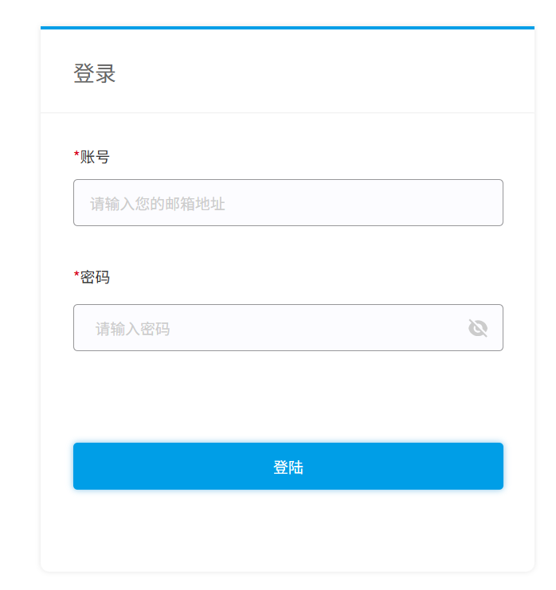

## 账号管理

### 界面示意图

路径：系统管理→账号管理

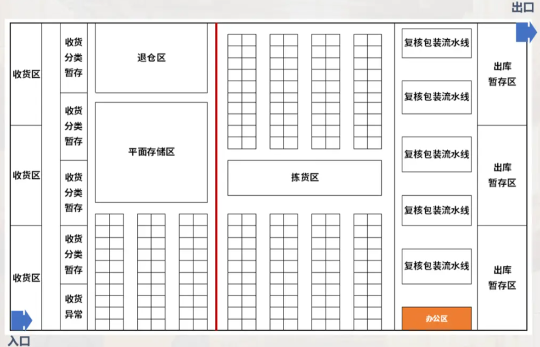

### 权限说明

菜单权限：WMS，系统管理→账号管理

按钮权限：新增、编辑、启用/禁用、修改密码

数据权限：暂无

创建账号时，需要勾选此账号可以看哪些哪些仓库的数据

### 查询条件

1、所有的下拉框都支持输入搜索，所有的输入框，都需要过滤首尾的空格

2、列表按创建时间降序排列

### 状态

### 新增用户

1. 点击新增账号按钮，打开弹窗如下

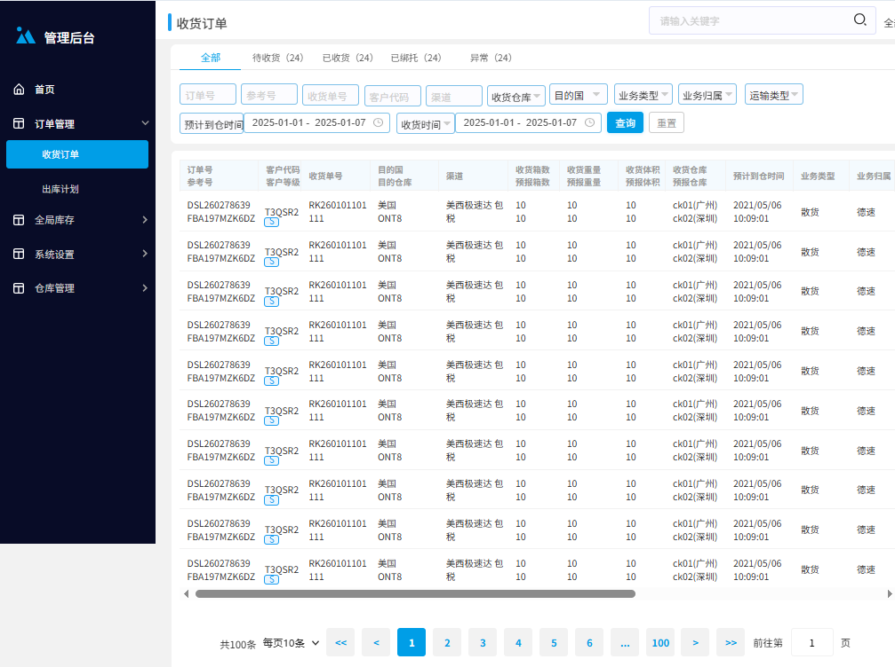

1. 新增校验：
1. ①唯一性校验：账号不能重复，错误提示“账号xxx已存在”
1. ②必填、合规性校验，表单错误提示“**字段必填！”“**字段格式错误！”

### 编辑账号

1. 点击编辑按钮，打开弹窗
1. 编辑页面及校验同新增，账号不可编辑

### 修改密码

1、点击修改密码按钮，打开弹窗如下

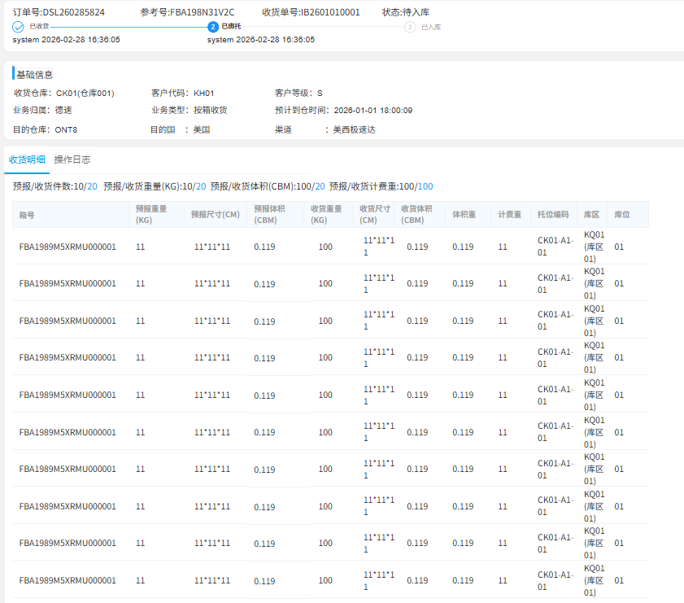

3、提交时需校验密码是否合规

### 启用/禁用

1. 点击禁用按钮，打开二次弹窗，提示“是否确定启用账号”
1. 点击启用按钮，打开二次弹窗，提示“是否确定禁用账号”

## 角色管理

### 界面示意图

路径：系统管理→角色管理

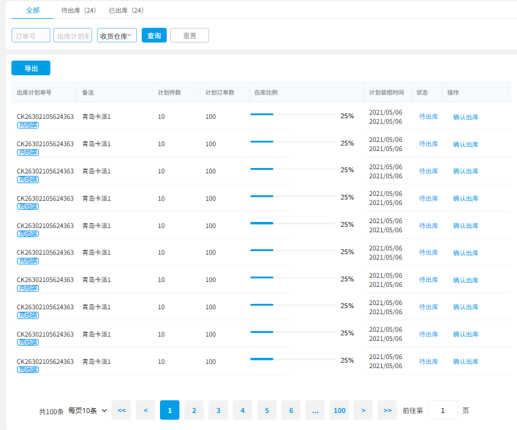

### 权限说明

菜单权限：WMS，系统管理→角色管理

按钮权限：新增、编辑、删除、详情

数据权限：暂无

### 查询条件

1. 所有的下拉框都支持输入搜索，所有的输入框，都需要过滤首尾的空格
1. 按创建时间倒序排列

### 新增角色

1. 点击新增角色按钮，打开新增角色页面如下
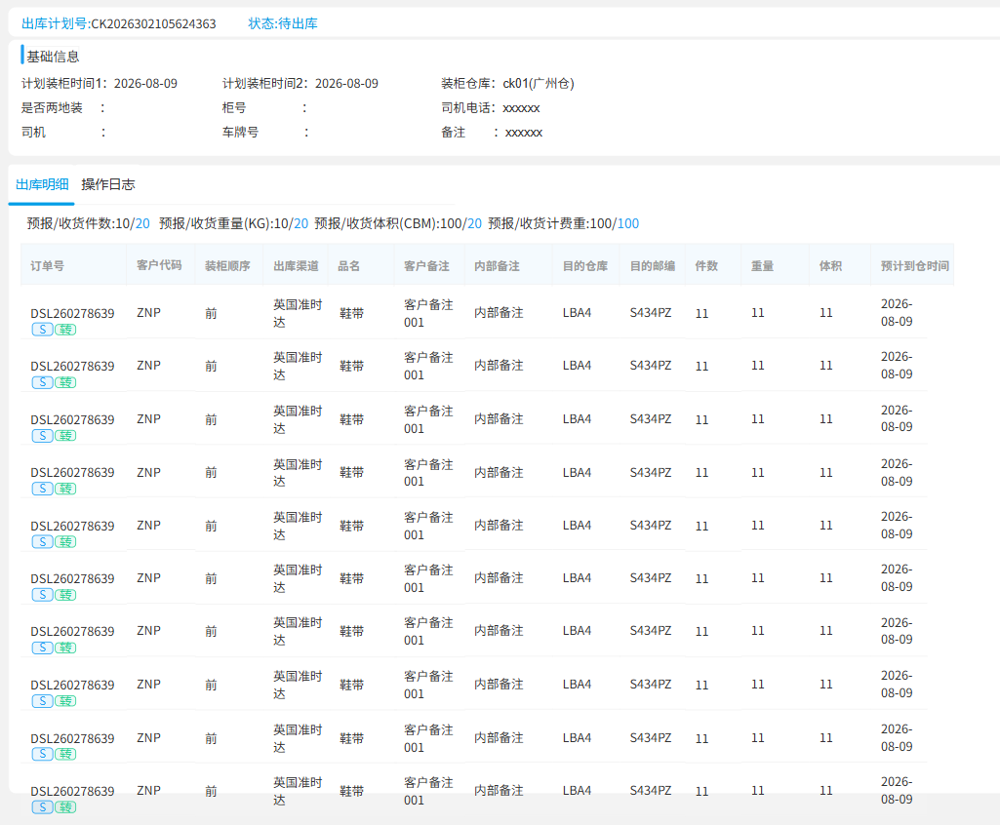

1. 新增校验：
1. ①唯一性校验：账号不能重复，错误提示“账号xxx已存在”
1. ②必填、合规性校验，表单错误提示“**字段必填！”“**字段格式错误！”
3、系统需初始化超级管理员角色，超级管理员不在页面显示，且默认拥有全部权限

### 编辑角色

1. 点击编辑按钮，打开编辑页面
1. 编辑页面及校验同新增

### 删除

1. 点击删除按钮，打开二次弹窗，提示“删除后不可恢复，是否确认删除”
1. 删除校验：角色已关联账号，不允许删除

### 详情

列表点击高亮的角色名称，打开详细页面

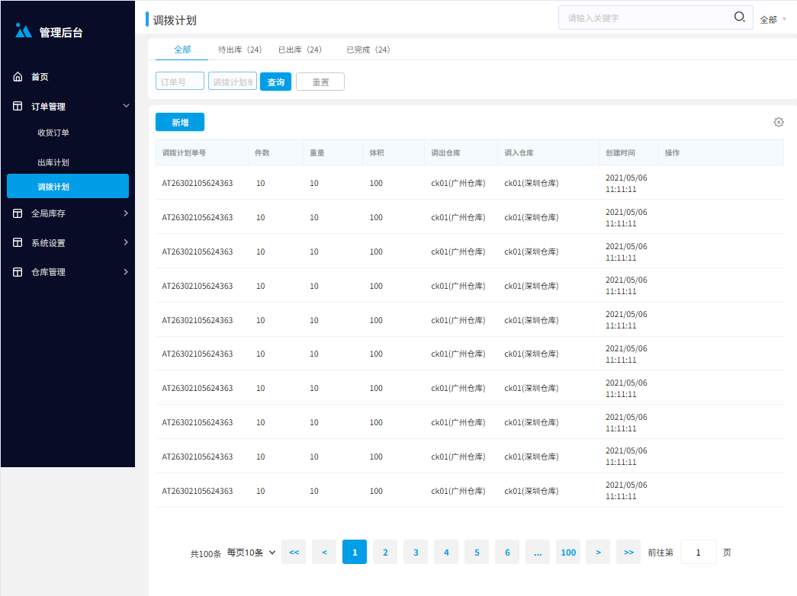

## 菜单管理

### 界面示意图

路径：系统管理→菜单管理

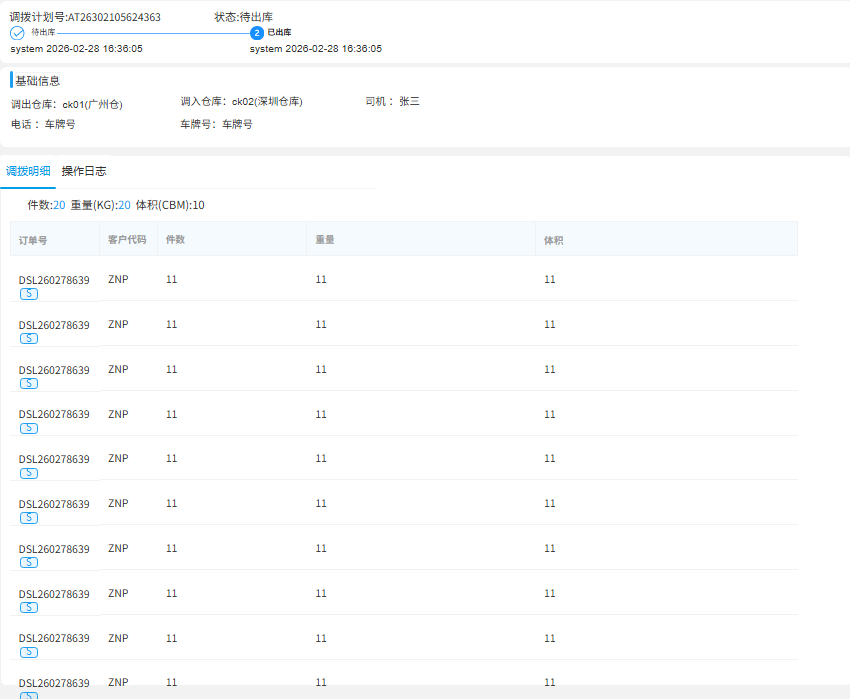

### 权限说明

菜单权限：WMS，系统管理→菜单管理

按钮权限：新增、编辑、启用、禁用

数据权限：暂无

### 查询条件

1. 所有的下拉框都支持输入搜索，所有的输入框，都需要过滤首尾的空格
1. 按排序从小到大排列，相同序号的按创建时间顺序排列

### 状态

### 新增菜单

1. 点击新增菜单按钮，打开新增角色页面如下
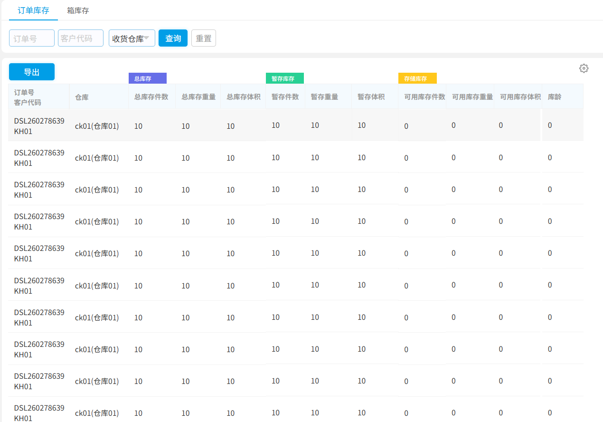

1. 新增校验：
1. ①唯一性校验：菜单名称&路由路径不能重复，错误提示“菜单名称xxx已存在”
1. ②必填、合规性校验，表单错误提示“**字段必填！”“**字段格式错误！”

### 编辑

1. 点击编辑按钮，打开编辑页面
1. 编辑页面及校验同新增

### 启用/禁用

1. 点击禁用按钮，打开二次弹窗，提示“是否确定启用菜单”
1. 点击启用按钮，打开二次弹窗，提示“是否确定禁用菜单”

## 仓库列表

### 界面示意图

路径：基础数据-仓库列表

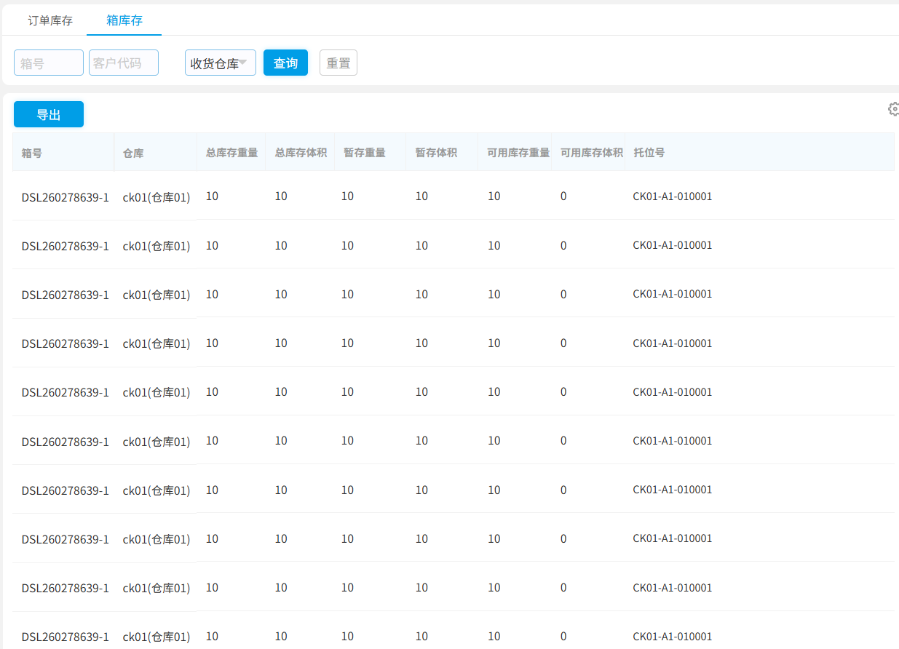

### 权限说明

菜单权限：WMS，基础数据→仓库列表

按钮权限：新增、编辑、启用、禁用

数据权限：暂无

### 查询条件

1. 所有的下拉框都支持输入搜索，所有的输入框，都需要过滤首尾的空格
1. 按创建时间倒序排列

### 状态

### 新增仓库

1. 页面点击【新增】按钮，打开新增弹窗如下
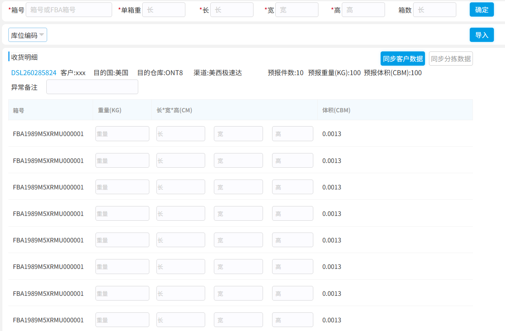

2、校验逻辑：

①唯一性校验：仓库编码&仓库名称不能重复，错误提示”仓库xx已存在！”仓库编码xx已存在！

②必填、合规性校验，表单错误提示“**字段必填！”“**字段格式错误！”：

1. 新增成功，状态=已启用

### 导入

1. 点击导入按钮，打开弹窗如下

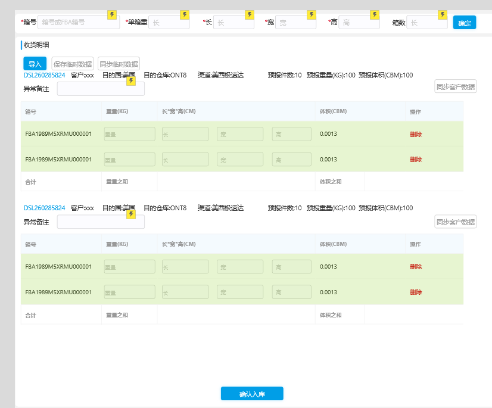

1. 导入校验：
1. ①最多可导入500条数据
1. ②必填校验同新增
1. ③需校验下拉选项是否存在、数据是否合规等
1. ④导入时部分校验通过、部分校验不通过，执行校验通过的，跳过校验不通过的，页面显示错误原因
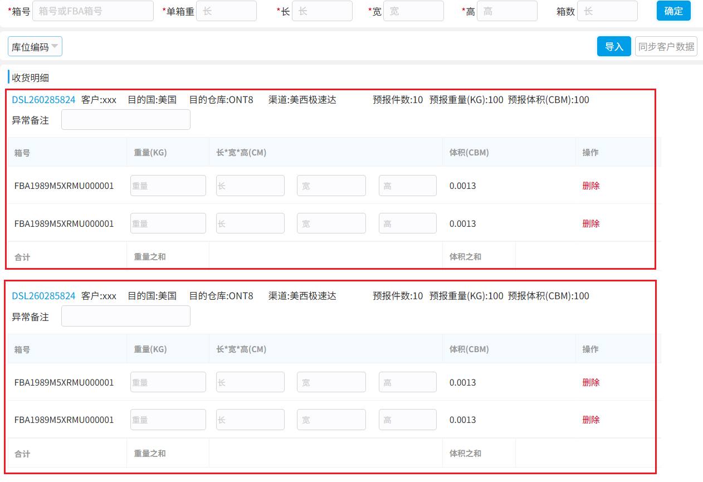

### 编辑

1、不允许批量操作，列表点击操作拦下的【编辑】，打开该条数据的编辑页面，其中【仓库编码】字段置灰禁止修改；

2、编辑校验同新增

### 启用/禁用

1. 点击禁用按钮，打开二次弹窗，提示“是否确定启用仓库”
1. 点击启用按钮，打开二次弹窗，提示“是否确定禁用仓库”

## 库区列表

### 界面示意图

路径：基础数据-库区列表

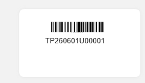

### 权限说明

菜单权限：WMS，基础数据→仓库列表

按钮权限：新增、编辑、删除

数据权限：需根据账号的可见仓库控制数据权限

### 查询条件

1. 所有的下拉框都支持输入搜索，所有的输入框，都需要过滤首尾的空格
1. 按创建时间倒序排列

### 新增库区

1. 页面点击【新增】按钮，打开新增弹窗如下

2、校验逻辑：

①唯一性校验：库区编码&库区名称在当前仓库内不能重复，错误提示”当前仓库内库区编码xx已存在！”当前仓库内库区名称xx已存在！

②必填、合规性校验，表单错误提示“**字段必填！”“**字段格式错误！”：

### 导入

1. 点击导入按钮，打开弹窗如下

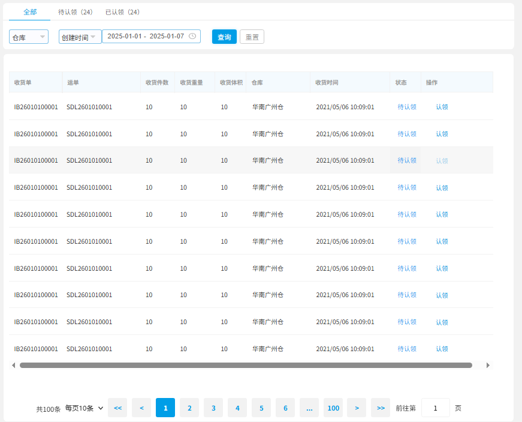

1. 导入校验：
1. ①最多可导入500条数据
1. ②必填校验同新增
1. ③需校验下拉选项是否存在（选择的某个仓库不存在需错，需用户先创建仓库）、数据是否合规等
1. ④导入时部分校验通过、部分校验不通过，执行校验通过的，跳过校验不通过的，页面显示错误原因

### 编辑

1、不允许批量操作，列表点击操作拦下的【编辑】，打开该条数据的编辑页面，其中【所属仓库】【库区编码】字段置灰禁止修改；

2、编辑校验同新增

### 删除

1. 当前库区已有下级库位时不允许删除
1. 点击删除按钮，二次弹窗提醒“删除后无法恢复，是否确认删除”

## 库位列表

### 界面示意图

路径：基础数据-库位列表

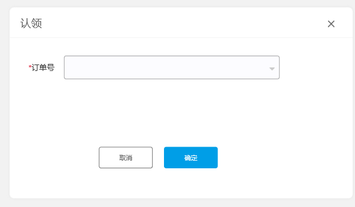

### 权限说明

菜单权限：WMS，基础数据→库区列表

按钮权限：新增、编辑、删除、打印

数据权限：需根据账号的可见仓库控制数据权限

### 查询条件

1. 所有的下拉框都支持输入搜索，所有的输入框，都需要过滤首尾的空格
1. 按创建时间倒序排列

### 新增库位

1. 页面点击【新增】按钮，打开新增弹窗如下
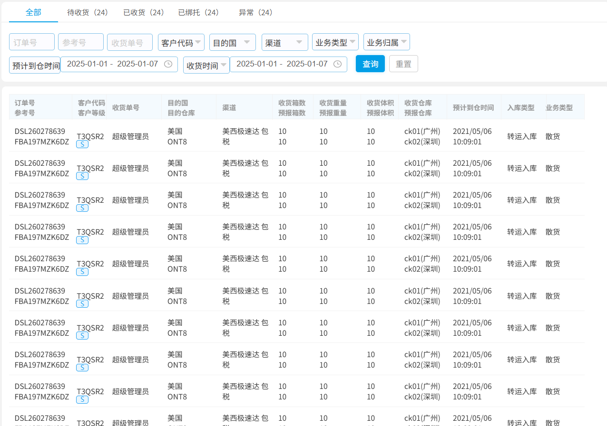

2、校验逻辑：

①唯一性校验：库区编码在当前仓库内不能重复，错误提示”当前仓库内库区编码xx已存在！

②必填、合规性校验，表单错误提示“**字段必填！”“**字段格式错误！”：

### 导入

1. 点击导入按钮，打开弹窗如下

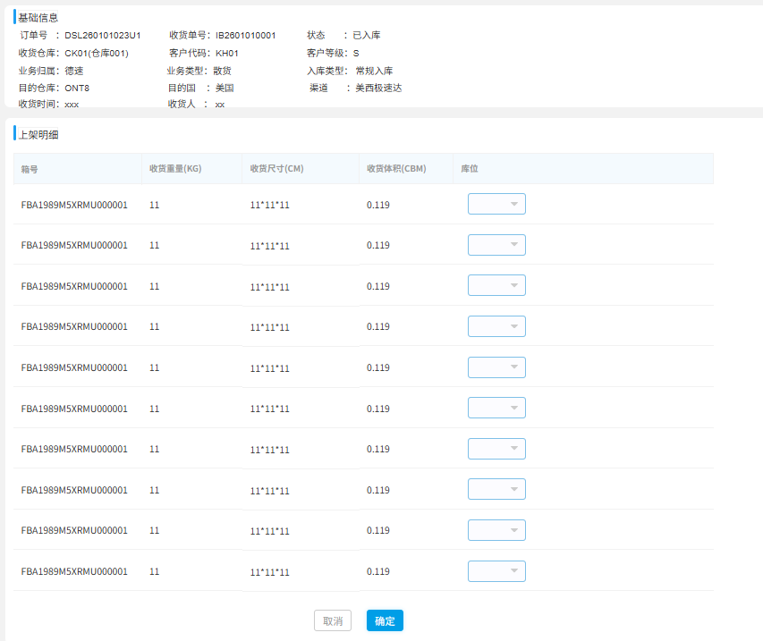

1. 导入校验：
1. ①最多可导入500条数据
1. ②必填校验同新增
1. ③需校验下拉选项是否存在（选择的某个库区在所属仓库中不存在时报错，需用户先创建库区）、数据是否合规等
1. ④导入时部分校验通过、部分校验不通过，执行校验通过的，跳过校验不通过的，页面显示错误原因

### 编辑

1、不允许批量操作，列表点击操作拦下的【编辑】，打开该条数据的编辑页面，其中【所属仓库】【所属库区】【库位编码】字段置灰禁止修改；

2、编辑校验同新增

### 删除

1. 当前库区库存为0时才允许删除
1. 点击删除按钮，二次弹窗提醒“删除后无法恢复，是否确认删除”

# 非功能性需求

## 界面操作需求

整体风格保持一致，功能操作使用按钮，操作在同一界面上完成。

运行界面可最大化最小化拖拽改变大小，兼容800X600以及以上各分辨率。

## 性能需求

## 安全性需求

## 维护与升级

## 可靠性和健壮性

## 用户文档需求

## 运行环境

---

### 表格 3

| 术语 | 名词解释 |
| --- | --- |
| 仓库 | 存储货物的物理或逻辑空间，用于区分不同地点 / 属性的库存 |
| 库区 | 仓库内按功能 / 区域划分的单元，如：入库区、存储区、拣选区、退货区、不合格品区 |
| 库位 | 货物存放的最小物理位置，如：A-01-02-03 |
| 入库 | 货物进入仓库的全过程，含收货、验收、上架 |
| 出库 | 货物从仓库发出的全过程，含拣货、复核、打包、发货 |
| 标准托数 | 是指平峰时期的托盘存放量，以高周转率为运作策略 |
| 高容托数 | 是指高峰时期的托盘存放量，以高利用率为运作策略 |
|  |  |
|  |  |

### 表格 4

| 系统 | 需求 | 需求说明 |
| --- | --- | --- |
| WMS | 登录 | 本期暂时支持账号密码登录 |
| WMS | 账号管理 | 列表 新增/编辑账号 启用/停用账号 修改密码	 |
| WMS | 角色管理 | 列表 新增/编辑角色 角色详情 |
| WMS | 菜单管理 | 列表 新增/编辑菜单 启用/停用菜单 |

### 表格 5

| 字段名称 | 是否必填 | 元件类型 | 说明 |
| --- | --- | --- | --- |
| 账号 | 是 | 单行输入框 | 1、最长100字符 |
| 密码 | 是 | 单行输入框 | 只允许输入字母、数字及符号-_.@#*! |

### 表格 6

| 查询条件 | 元件类型 | 默认值 | 规则 |
| --- | --- | --- | --- |
| 姓名 | 单行输入框 |  | 模糊搜索 |
| 账号 | 单行输入框 |  | 模糊搜索 |
| 状态 |  |  | 值：已启用、已禁用 |

### 表格 7

| 状态值 | 状态说明 | 操作 | 共享操作 |
| --- | --- | --- | --- |
| 已启用 | 新增后默认状态 | 禁用 | 编辑 |
| 已禁用 |  | 启用 | 编辑 |

### 表格 8

| 字段名称 | 是否必填 | 元件类型 | 说明 |
| --- | --- | --- | --- |
| 账号 | 是 | 单行输入框 | 1、最长100字符 |
| 姓名 | 是 | 单行输入框 | 最长200字符 |
| 密码 | 否 | 单行输入框 | 只允许输入字母、数字及符号-_.@#*! |
| 手机号 | 否 | 单行输入框 | 手机号为11位数字 |
| 邮箱 | 否 | 单行输入框 | 符合邮件格式，最长100字符 |
| 角色 | 是 | 单选下拉框 |  |
| 可见仓库 | 是 | 多选下拉框 | 1、值：全部仓库（启用及禁用的全部仓库） 2、用仓库编码(仓库名称)拼接 |
| 最后修改人 | / |  | 编辑账号、启用/禁用时更新 |
| 最后修改时 | / |  | 编辑账号、启用/禁用时更新 |

### 表格 9

| 查询条件 | 元件类型 | 默认值 | 规则 |
| --- | --- | --- | --- |
| 角色名称 | 单行输入框 |  | 模糊搜索 |

### 表格 10

| 字段名称 | 是否必填 | 元件类型 | 说明 |
| --- | --- | --- | --- |
| 角色名称 | 是 | 单行输入框 | 最长100字符 |
| 角色描述 | 是 | 单行输入框 | 最长255字符 |
| 菜单名称 | 是 | 单行输入框 | 启用的全部菜单 |
| 最后修改人 | / |  | 编辑角色时更新 |
| 最后修改时 | / |  | 编辑角色时更新 |

### 表格 11

| 查询条件 | 元件类型 | 默认值 | 规则 |
| --- | --- | --- | --- |
| 菜单名称 | 单行输入框 |  | 模糊搜索 |

### 表格 12

| 状态值 | 状态说明 | 操作 | 共享操作 |
| --- | --- | --- | --- |
| 已启用 | 新增后默认状态 | 禁用 | 编辑 |
| 已禁用 |  | 启用 | 编辑 |

### 表格 13

| 字段名称 | 是否必填 | 元件类型 | 说明 |
| --- | --- | --- | --- |
| 系统 | 是 | 单选下拉框 | 值：Web、PDA |
| 菜单名称 | 是 | 单行输入框 | 最长10字符 |
| 上级菜单 | 是 | 树形选择 | 1、值：全部可用的菜单名称 2、菜单类型=目录时隐藏；菜单类型=菜单时，显示且必填；菜单类型=按钮时，显示且必填 |
| 菜单类型 | 是 | 单选下拉框 | 值：目录，菜单，按钮 |
| 图标 | / |  |  1、目前根据现有组件库上传图标 2、菜单类型=目录时必填  |
| 权限标识 | 是 | 单行输入框 | 最长100字符 |
| 组件名称 | 否 | 单行输入框 | 1、菜单类型=菜单or目录时显示且必填；菜单类型=按钮时隐藏 2、最长50字符  |
| 组件路径 | 否 | 单行输入框 | 1、菜单类型=菜单or目录时显示且必填；菜单类型=按钮时隐藏 2、最长100字符  |
| 路由路径 | 否 | 单行输入框 | 1、菜单类型=菜单or目录时显示且必填；菜单类型=按钮时隐藏 2、最长100字符  |
| 排序 | 是 |  | 1、菜单类型=菜单or目录时显示；菜单类型=按钮时隐藏 2、大于等于0的整数 3、排序号越小，排序越靠上 |

### 表格 14

| 查询条件 | 元件类型 | 默认值 | 规则 |
| --- | --- | --- | --- |
| 仓库编码 | 单行输入框 |  | 模糊搜索，去掉输入值的头尾空格 |
| 仓库名称 | 单行输入框 |  | 模糊搜索，去掉输入值的头尾空格 |
| 仓库类型 | 单选下拉框 | 全部 | 值：揽收仓、集运仓 |
| 状态 | 单选下拉框 | 全部 | 见3.5.4 |

### 表格 15

| 状态值 | 状态说明 | 操作 |
| --- | --- | --- |
| 已启用 | 新增后的状态 | 禁用 |
| 已禁用 | 仓库停用 | 启用 |

### 表格 16

| 字段名称 | 是否必填 | 元件类型 | 规则及来源 |
| --- | --- | --- | --- |
| 仓库名称 | 是 | 单行输入框 | 最长30字符 |
| 仓库编码 | 是 | 单行输入框 | 系统内唯一，最长30字符 只允许输入字母、数字、字符- _ . |
| 仓库类型 | 是 | 单选下拉框 | 值：揽收仓、集运仓 |
| 联系人 | 是 | 单行输入框 | 最长100字符 |
| 电话 | 否 | 单行输入框 | 最长20字符 |
| 邮编 | 是 | 单行输入框 | 最长10字符 |
| 省市区 | 是 | 级联下拉框 | 国内省市区 |
| 详细地址 | 是 | 单行输入框 | 最长255字符 |

### 表格 17

| 查询条件 | 元件类型 | 默认值 | 规则 |
| --- | --- | --- | --- |
| 库区编码 | 单行输入框 |  | 模糊搜索，去掉输入值的头尾空格 |
| 库区名称 | 单行输入框 |  | 模糊搜索，去掉输入值的头尾空格 |
| 所属仓库 | 多选下拉框 | 全部 | 1、值：当前账号数据权限内的所有仓库（启用、禁用） 2、仓库编码(仓库名称)拼接  |
| 库区类型 | 多选下拉框 | 全部 | 值：托盘区、货架区 |

### 表格 18

| 字段名称 | 是否必填 | 元件类型 | 规则及来源 |
| --- | --- | --- | --- |
| 所属仓库 | 是 | 单选下拉框 | 1、值：当前账号数据权限内的所有仓库（启用、禁用） 2、仓库编码(仓库名称)拼接 |
| 库区编码 | 是 | 单行输入框 | 最长30字符，只允许输入字母、数字、字符- _ .  |
| 库区名称 | 是 | 单行输入框 | 最长30字符 |
| 库区类型 | 是 | 单选下拉框 | 值：托盘区、货架区 |

### 表格 19

| 查询条件 | 元件类型 | 默认值 | 规则 |
| --- | --- | --- | --- |
| 库位编码 | 单行输入框 |  | 模糊搜索，去掉输入值的头尾空格 |
| 所属仓库 | 多选下拉框 | 全部 | 1、值：当前账号数据权限内的所有仓库（启用、禁用） 2、用仓库编码(仓库名称)拼接 |
| 所属库区 | 多选下拉框 |  | 值：当前账号数据权限内的所有库区（启用、禁用） 用库区编码(库位名称)拼接 |

### 表格 20

| 字段名称 | 是否必填 | 元件类型 | 规则及来源 |
| --- | --- | --- | --- |
| 所属仓库 | 是 | 单选下拉框 | 1、值：当前账号数据权限内的所有仓库（启用、禁用） 2、用仓库编码(仓库名称)拼接 |
| 所属库区 | 是 | 单选下拉框 | 值：所属仓库下的库区 用库区编码(库位名称)拼接 |
| 库区编码 | 是 | 单行输入框 | 最长30字符，只允许输入字母、数字、字符- _ .  |
| 标准托数 | 否 | 单行输入框 | 库区类型=托盘区时显示；其他情况隐藏 2、＞0的整数，最大99999999  |
| 高容托数 | 否 | 单行输入框 | 库区类型=托盘区时显示；其他情况隐藏 2、＞0的整数，最大99999999  |
