# WMS

# 产品需求文档

# 需求概述

## 背景及现状

当前仓库依赖人工记忆、口头沟通为主，仓储管理整体混乱，缺乏标准化、系统化管控。日常作业中频繁出现以下问题：

1、货物存放无规则：经常找不到货、找货时间长、依赖老员工，影响出库效率；

2、拣货、复核、打包全靠人工核对，错货、漏发、多发、少发现象频发，导致客户投诉、退货增加、售后成本高；

3、缺乏过程追溯，出现问题后难以定位是哪个环节、哪个人、哪一时间出错，只能事后补救。

为彻底解决找货难、错发、多发、少发、库存不准等核心痛点，规范入库、上架、拣货、复核、出库全流程，提升订单准确率与作业效率，降低运营风险与成本，亟需建设一套标准化、可落地的仓库管理系统（WMS）。

## 名词定义

# 需求说明

## 需求流程图

### 流程图

## 需求原型

https://codesign.qq.com/s/649608809116286

## 需求功能列表

# 需求描述-OMS

## 收货订单

### 界面示意图

路径：订单管理→收货订单

### 权限说明

菜单权限：OMS，订单管理→收货订单

按钮权限：详情

数据权限：根据账号的可用仓库控制权限

注意：仓库未收货时，根据预报仓库控制权限；仓库操作收货后，根据收货仓库控制权限

### 查询条件

1、所有的下拉框都支持输入搜索，所有的输入框，都需要过滤首尾的空格

2、列表按收货单创建时间升序排列

### 状态

### 详情

1. 点击高亮的收货单号进入详情
1. 顶部可显示订单状态条
1. 下方分别显示基础信息、收货明细、操作日志

### 创建收货订单接口

收货订单主要来源于上游系统，一个订单对应一个收货订单

## 出库计划

### 界面示意图

路径：订单管理→出库计划

### 权限说明

菜单权限：OMS，订单管理→出库计划

按钮权限：详情

数据权限：根据账号的可用仓库控制权限

注意：仓库未收货时，根据预报仓库控制权限；仓库操作收货后，根据收货仓库控制权限

### 查询条件

1. 所有的下拉框都支持输入搜索，所有的输入框，都需要过滤首尾的空格
1. 按计划装柜时间升序排列（一个计划单有多个计划装柜时间的，用最早的时间参与排序）

### 状态

### 详情

列表点击高亮的出库计划单号，打开详细页面，下方可显示基础信息、出库明细、操作日志

### 创建出库计划接口

收货订单主要来源于上游系统，

## 调拨计划

### 界面示意图

路径：订单管理→调拨计划

### 权限说明

菜单权限：OMS，订单管理→调拨计划

按钮权限：详情

数据权限：根据调出仓库或调入仓库控制权限

### 查询条件

1. 所有的下拉框都支持输入搜索，所有的输入框，都需要过滤首尾的空格
1. 按创建时间升序排列

### 状态

### 详情

列表点击高亮的出库计划单号，打开详细页面，下方可显示基础信息、出库明细、操作日志

### 调拨计划生成出库单/收货订单

1. 生成调拨计划时，若计划中的全部运单均已在调出仓库收货（状态为已收货），即刻生成调入仓库的收货订单，调出仓库的出库单；
1. 生成调拨计划时，计划中的运单未在调出仓库全部收货，则需在全部运单收货后，生成调入仓库的收货订单，调出仓库的出库单
1. 生成逻辑：
1. 收货订单，1个调拨计划中的运单对应1个收货订单；入库类型=调拨入库（收货订单页面仅能查到入库类型=常规入库的），预报仓库=调入仓库，收货仓库清空，收货单号重新生成，状态=待收货，其他数据直接复制原运单对应的收货订单
1. 出库单，1个调拨计划生成1个出库单，出库类型=调拨出库，状态=待出库，其他数据取收货订单数据，但需根据仓库控制数据显示条数（见出库单说明）
1. 生成后，若调拨计划更新，则需同步更新收货订单、出库单；更新包括：
1. 调拨计划新增订单，删除订单
1. 调入仓库，调出仓库更新
1. 运单数据更新
1. 箱明细更新

### 创建调拨计划接口

上游创建转货记录时推送生成，一个转货批次号对应1个调拨计划

## 全局库存-订单库存

### 界面示意图

路径：全局库存→库存查询→订单库存

### 权限说明

菜单权限：OMS，全局库存→库存查询→订单库存

按钮权限：列表

数据权限：根据账号的可用仓库控制权限

### 查询条件

1. 所有的下拉框都支持输入搜索，所有的输入框，都需要过滤首尾的空格
1. 按库存更新时间倒序排列

### 库存规则

1. 一个入库订单，一条记录
1. 总库存=暂存库存+存储库存，总库存=0的数据无需显示
1. 库龄=当前日期-上架日期
1. 入库库存规则：
1）入库单-收货（机器扫描或人工收货）

if 库存表.订单不存在

新增库存记录，暂存库存= 订单收货数量（重量、体积、件数）

else

更新库存记录，暂存库存 + = 订单收货数量

end

1. 2）入库单-取消
收货后入库前取消，暂存库存 - = 订单收货数量

入库后取消，存储库存 - = 订单收货数量

3）入库单-上架

暂存库存–= 上架数量

存储库存 + = 上架数量

1. 4）编辑入库单
1. 更新存储库存，存储库存=更新后的数据
4、出库库存规则

1）出库单-出库

更新库存记录，存储库存–=出库数量

## 全局库存-箱库存

### 界面示意图

路径：全局库存→库存查询→箱库存

### 权限说明

菜单权限：OMS，全局库存→库存查询→订单库存

按钮权限：列表

数据权限：根据账号的可用仓库控制权限

### 查询条件

1. 所有的下拉框都支持输入搜索，所有的输入框，都需要过滤首尾的空格
1. 按库存更新时间倒序排列

### 库存规则

1. 一个箱子，一条记录
1. 总库存=暂存库存+存储库存，总库存=0的数据无需显示
1. 入库库存规则：
1）入库单-收货（机器分拣或人工收货）

if 库存表.订单不存在

新增库存记录，暂存库存= 订单收货数量（重量、体积、件数）

else

更新库存记录，暂存库存 + = 订单收货数入库量

end

1. 2）入库单-取消
收货后入库前取消，暂存库存 - = 订单收货数量

入库后取消，存储库存 - = 订单收货数量

3）入库单-绑托

更新托位号

4）入库单-上架

暂存库存–= 上架数量

存储库存 + = 上架数量

1. 5）编辑入库单
1. 更新存储库存，存储库存=更新后的数据
4、出库库存规则

1）出库单-出库

更新库存记录，存储库存–=出库数量

## 全局库存-订单库存

### 界面示意图

路径：全局库存→库存查询→订单库存

### 权限说明

菜单权限：OMS，全局库存→库存查询→订单库存

按钮权限：列表

数据权限：根据账号的可用仓库控制权限

### 查询条件

1. 所有的下拉框都支持输入搜索，所有的输入框，都需要过滤首尾的空格
1. 按库存更新时间倒序排列

### 库存规则

1. 一个入库订单，一条记录
1. 总库存=暂存库存+存储库存，总库存=0的数据无需显示
1. 库龄=当前日期-上架日期
1. 入库库存规则：
1）入库单-收货（机器分拣或人工收货）

if 库存表.订单不存在

新增库存记录，暂存库存= 订单收货数量（重量、体积、件数）

else

更新库存记录，暂存库存 + = 订单收货数量

end

2）入库单-取消

3）入库单-上架

暂存库存–= 上架数量

存储库存 + = 上架数量

1. 4）编辑入库单
1. 更新存储库存，存储库存=更新后的数据
4、出库库存规则

1）出库单-出库

更新库存记录，存储库存–=出库数量

## 全局库存-箱库存

### 界面示意图

路径：全局库存→库存查询→箱库存

### 权限说明

菜单权限：OMS，全局库存→库存查询→订单库存

按钮权限：列表

数据权限：根据账号的可用仓库控制权限

### 查询条件

1. 所有的下拉框都支持输入搜索，所有的输入框，都需要过滤首尾的空格
1. 按库存更新时间倒序排列

### 库存规则

1. 一个箱子，一条记录
1. 总库存=暂存库存+存储库存，总库存=0的数据无需显示
1. 入库库存规则：
1）入库单-收货（机器分拣或人工收货）

if 库存表.订单不存在

新增库存记录，暂存库存= 订单收货数量（重量、体积、件数）

else

更新库存记录，暂存库存 + = 订单收货数量

end

2）入库单-取消

3）入库单-绑托

更新托位号

4）入库单-上架

暂存库存–= 上架数量

存储库存 + = 上架数量

1. 5）编辑入库单
1. 更新存储库存，存储库存=更新后的数据
4、出库库存规则

1）出库单-出库

更新库存记录，存储库存–=出库数量

# 需求描述-WMS

## 收货入库

### 界面示意图

路径：入库管理→收货入库

### 权限说明

菜单权限：WMS，入库管理→收货入库

按钮权限：暂无

### 确认入库

1. 进入收货入库页面，输入如下内容

1. 2、点击【确定】或【回车键】，进行如下校验
1. 必填、合规校验
1. 箱号是否存在
1. 校验通过后，根据输入内容回显到收货明细，且重量、长、宽、高可编辑，可删除某箱数据
1. 点击同步客户数据按钮，可将上游预报重量、尺寸回显到收货明细
1. 点击保存临时数据，可将当前用户在页面录入数据暂存；点击同步临时数据，可读取上次保存的数据并回显到收货明细

1. 收货明细需要根据箱号对应的单号分组

1. 点击确认入库时，需校验
1. 至少存在1行数据
1. 如上规则校验箱号、重量、长、宽、高（均为必填）
1. 最多可录入10个订单
1. 校验通过后
1. 更新收货数据（重量、长、宽、高）-同步到收货订单的明细
1. 若收货件数=预报件数，状态=已收货
1. 若收货件数＞预报件数，状态=已收货，同时标记异常
1. 若收货件数＜预报件数，状态=收货中

## 到货扫描

1. 在数据字典配置仓库-机器编码的对应关系，机器扫描入库时，若收货件数=预报件数，状态=已收货；若收货件数＞预报件数，状态=异常；若收货件数＜预报件数，状态=收货中
1. 收货后，需更新货箱入库数据和收货仓库，记录操作日志，并回传TMS

## 无单收货

### WMS新增打印临时标签功能

1）入口：入库管理列表→打印临时标签

2）需控制按钮权限

2）点击后，打开如下弹窗

1. 点击确定后，打印10*10cm的标签，条码生成规则：TP+年月日+U+5位流水号

### PDA入库管理新增创建临时订单功能

1）入口：PDA→入库管理→新增临时收货单

2）需控制按钮权限

3）点击按钮，进入新增临时收货单页面

4）扫描临时标签后，页面回显扫描箱号，已扫描的箱号支持删除

1. 点击保存时，需校验当前箱号是否已关联其他订单
1. 点击保存后，同时生成收货订单

### TMS新增入库认领功能

1. 路径：物流→入库认领

2）权限

菜单权限：TMS，物流→入库认领

按钮权限：认领

数据权限：暂无

3）查询条件

1、所有的下拉框都支持输入搜索，所有的输入框，都需要过滤首尾的空格

2、列表按创建时间升序排列

4）状态

5）认领

1. 仅待认领的认领单允许认领
1. 点击认领按钮，打开如下弹窗

1. 认领后，更新列表运单号字段，将运单的预报数据更新至收货单（若有贴标作业，则更新箱号）；若收货单已收货，则需将入库数据同步至TMS
1. 6）取消：待认领且未收货的单可取消，取消需二次弹窗确认

## 入库管理

### 界面示意图

路径：入库管理→入库管理

### 权限说明

菜单权限：WMS，入库管理→入库管理

按钮权限：详情

数据权限：根据账号的可用仓库控制权限

### 查询条件

1、所有的下拉框都支持输入搜索，所有的输入框，都需要过滤首尾的空格

2、列表按收货单创建时间升序排列

3、入库订单操作收货后，显示到入库单列表，入库类型=常规入库

4、转运入库的单且产生操作收货后需显示在入库单，入库类型=转运入库

5、根据切换时所选的仓库显示数据

### 状态

### 上架

1. 点击【上架】按钮，打开如下页面；其中，库位允许编辑且必填

1. 2、提交后，订单状态=已入库，记录操作日志

### 编辑

1. 1、点击【编辑】按钮，打开如下页面
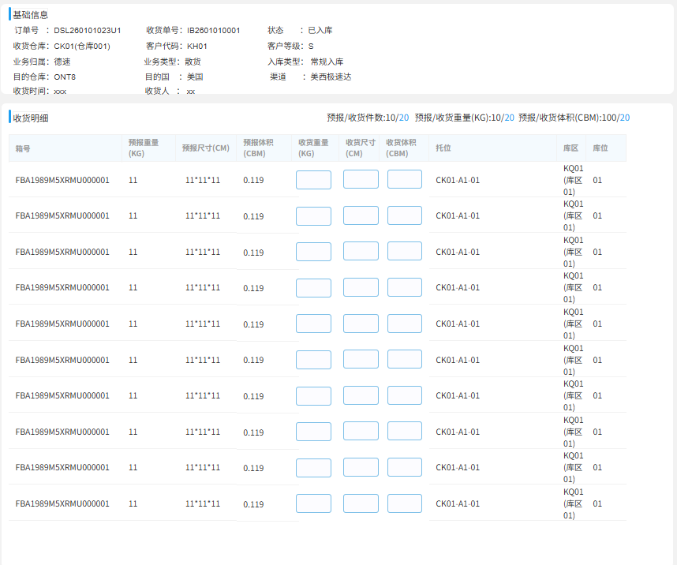

### 详情

1. 点击高亮的收货单号进入详情
1. 2、顶部可显示订单状态条
1. 3、下方分别显示基础信息、收货明细、操作日志

## 出库管理

### 界面示意图

路径：出库管理→出库管理

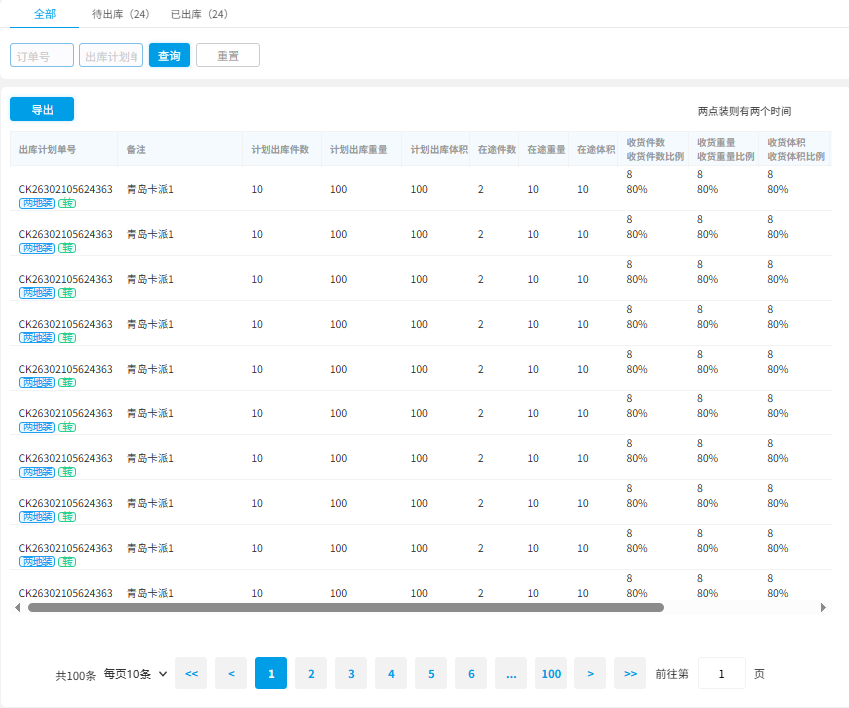

### 权限说明

菜单权限：WMS，出库管理→出库管理

按钮权限：详情

数据权限：根据账号的可用仓库控制权限

如出库计划有10个单，有3个单归属于A仓库，7个单归属于B仓库，则A仓库的出库单，明细数据和统计数据均显示A仓库的；B仓库同理（仓库归属判断：有收货仓库按收货仓库，无收货仓库按预报仓库）

### 查询条件

1. 所有的下拉框都支持输入搜索，所有的输入框，都需要过滤首尾的空格
1. 按计划装柜时间升序排列（一个计划单有多个计划装柜时间的，用最早的时间参与排序）
1. 创建出库计划后，同步生成出库单列表，出库类型=常规出库
4、创建调拨计划后，同步生成出库单列表，出库类型=调拨出库，

5、根据切换时所选的仓库显示数据

### 状态

### 确认出库

1. 1、点击【确认出库】按钮，打开如下页面
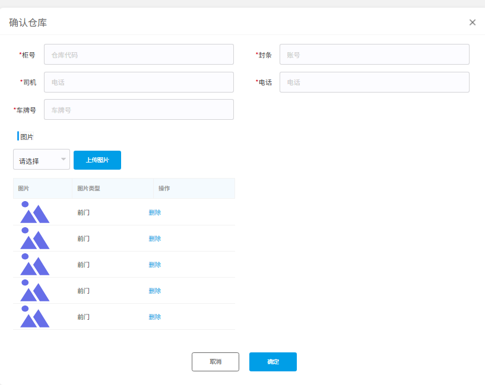

### 详情

列表点击高亮的出库计划单号，打开详细页面，下方可显示基础信息、出库明细、操作日志

### 创建出库单接口

收货订单主要来源于上游系统，

### 生成下架作业

1. 1、点击【生成下架作业】按钮，打开如下页面

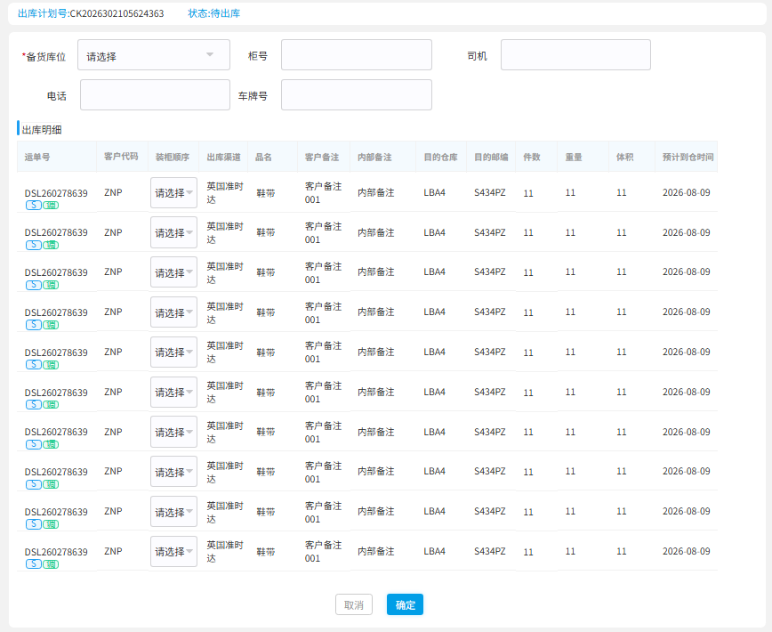

1. 2、点击【确定】，生成移库作业，一个运单号1个作业单；作业类型=拣货下架，件数=收货件数，初始库位=当前运单上架库位；目标库位：后续根据库位推荐策略显示（暂无）

## 移库作业

### 界面示意图

路径：库内作业→移库作业

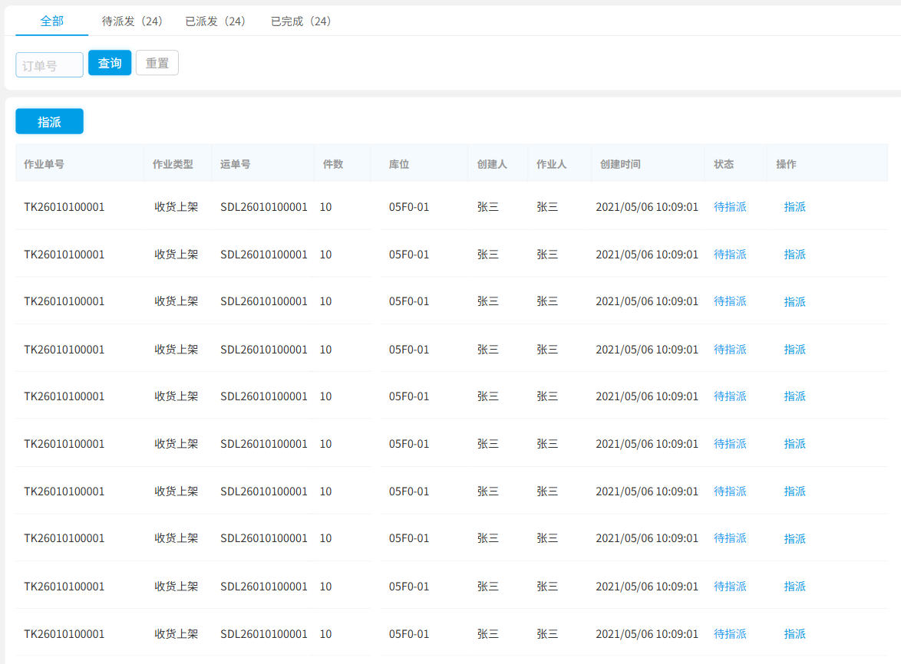

### 权限说明

菜单权限：WMS，库内作业→移库作业

按钮权限：详情

数据权限：根据账号的可用仓库控制权限

### 查询条件

1. 所有的下拉框都支持输入搜索，所有的输入框，都需要过滤首尾的空格
1. 按创建时间升序排列

### 状态

### 派发

1. 勾选作业单，点击【派发】按钮，打开如下页面
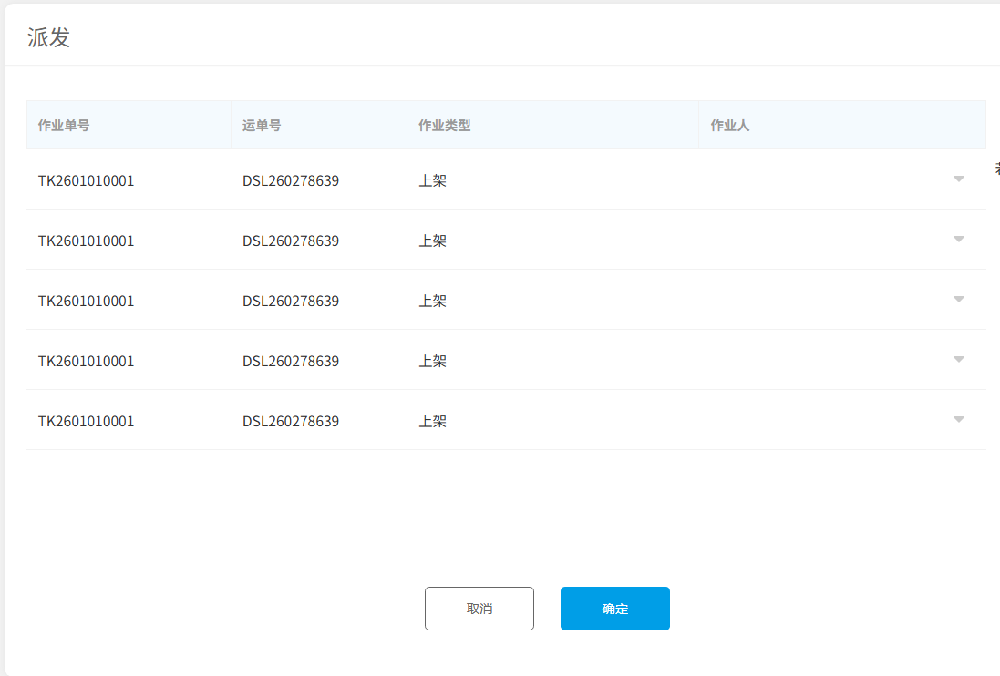

2、点击【确定】，则更新作业单的作业人，更新作业单状态=已派发

### 创建作业单

1. 入库单中的所有箱都绑托后，生成收货上架作业，一个运单1个作业单；其中，作业类型=收货上架，件数=收货件数，初始库位，若是机器测量，显示设备号+分货口；若是人工测量，显示人工收货；目标库位：后续根据库位推荐策略显示（暂无）；
1. 出库单点击生成下架后，生成拣货下架作业，一个运单号1个作业单；作业类型=拣货下架，件数=收货件数，初始库位=当前运单上架库位；目标库位：后续根据库位推荐策略显示（暂无）；

## 杂项作业

### 界面示意图

路径：库内作业→杂项作业

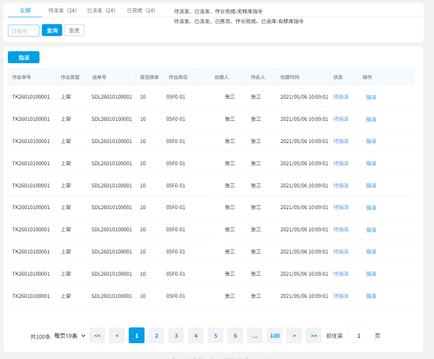

### 权限说明

菜单权限：WMS，库内作业→杂项作业

按钮权限：详情

数据权限：根据账号的可用仓库控制权限（当前仓库收货的作业单）

### 查询条件

1. 所有的下拉框都支持输入搜索，所有的输入框，都需要过滤首尾的空格
1. 按创建时间升序排列

### 状态

### 新增杂项作业-换标

1. 点击【新增】按钮，打开如下弹窗
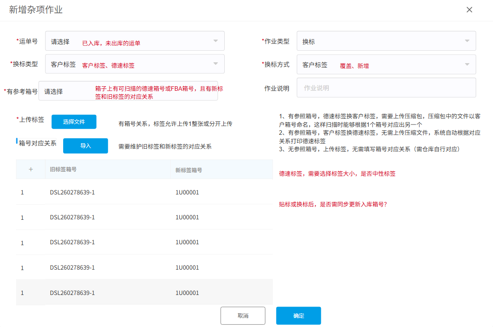

1. 箱号对应关系支持导入

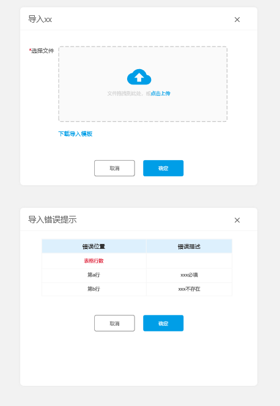

1. 导入时，需校验
1. 1）旧标签箱号、新标签箱号必填
1. 2）旧标签箱号是否存在

1. 点击【确定】时，需：
1. 进行必填、合规校验
1. 若上传的标签文件为压缩文件&压缩文件有多个pdf文件&换标类型=客户标签，需校验①文件格式是否为pdf；②文件名是否和新标签箱号一一对应；若上传的标签文件为pdf文件或上传的标签文件解压只有1个pdf文件或换标类型=德速标签，无需校验文件名和新标签箱号的对应关系
1. 提交后，生成作业单号，状态=待派发，同时记录日志

### 新增杂项作业-贴标

1. 点击【新增】按钮，打开如下弹窗
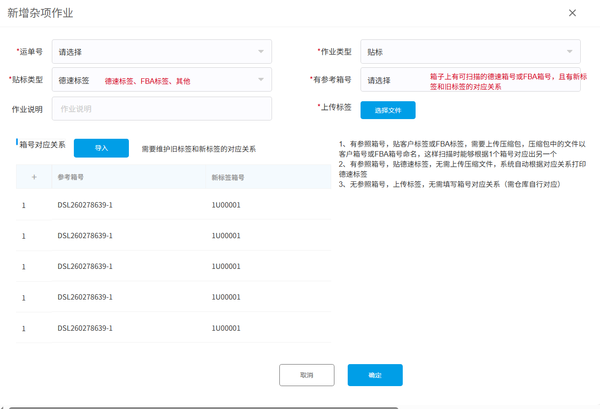

1. 箱号对应关系支持导入

1. 导入时，需校验
1. 1）旧标签箱号、新标签箱号必填
1. 2）旧标签箱号是否存在

1. 点击【确定】时，需：
1. 进行必填、合规校验
1. 若上传的标签文件为压缩文件&压缩文件有多个pdf文件&换标类型=客户标签，需校验①文件格式是否为pdf；②文件名是否和新标签箱号一一对应；若上传的标签文件为pdf文件或上传的标签文件解压只有1个pdf文件，无需校验文件名和新标签箱号的对应关系
1. 提交后，生成作业单号，状态=待派发，同时记录日志

### 新增杂项作业-贴尾程标签

1. 点击【新增】按钮，打开如下弹窗
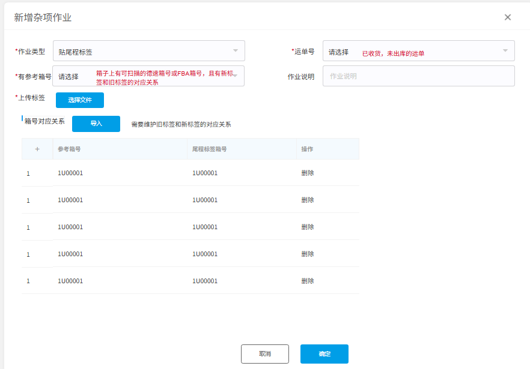

1. 1、箱号对应关系支持导入，导入时，需校验
1. 1）旧标签箱号、新标签箱号必填
1. 2）旧标签箱号是否存在

1. 点击【确定】时，需：
1. 进行必填、合规校验
1. 若上传的标签文件为压缩文件，需校验①文件格式是否为pdf；②文件名是否和新标签箱号一一对应；
1. 提交后，生成作业单号，状态=待派发，同时记录日志

### 新增杂项作业-复测/验货

1. 点击【新增】按钮，打开如下弹窗

### 新增杂项作业-打板/拆板

1. 点击【新增】按钮，打开如下弹窗

1. 提交后，生成作业单号，状态=待派发，同时记录日志

### 派发

1. 勾选作业单，点击【派发】按钮，打开如下页面

1. 点击【确定】后，
1. 更新上述字段，记录操作日志，状态=已派发
1. 若是否移库=是，则对应作业单需生成移库作业（分别生成上架作业和下架作业）；
1. ①一个运单1个下架作业单；其中，作业类型=杂项作业下架，件数=收货件数，初始库位=当前库位；目标库位：杂项作业派发时所选库位；
1. ②一个运单1个上架作业单；其中，作业类型=返库上架，件数=收货件数，初始库位=作业库位；目标库位：暂无；
1. 注意：一个运单可同时存在多种类型的杂项作业，生成移库作业时，若该单的上架作业或下架作业已存在且未完成，不再重新生成移库作业
1. 举例：
1. DSL001-复测，DSL001-贴标
1. 派发时
1. DSL001-复测，需要移库，作业库位：050F（派发-下架到作业库位-复测-返库上架）
1. DSL001-贴标，需要移库，作业库位：050F（派发-下架到作业库位-复测-返库上架）--该单不需再生成移库作业

## 贴标

1. 位置：库内作业→贴标
1. 第一次扫描参考箱号或输入参考箱号后回车，根据当前箱号查询箱号对应的贴标作业单；若上传的标签文件为单个，则打印方式=扫描时批量打印，同时需连接打印机自动打印对应标签文件
1. 1）扫描新标签箱号或输入后回车时，若有参考箱号，则需校验扫描的箱号与箱号对应关系是否一致，一致则在右侧回显新标签箱号，同时清空左侧内容，自动跳转至参考箱号；不一致则提示“当前箱号和贴标箱号不一致”
1. 2）扫描新标签箱号或输入后回车时，若无参考箱号，无需校验参考箱号的新标签箱号对应关系，在右侧回显新标签箱号，同时清空左侧内容
1. 3）点击完成，若有箱号对应关系，需扫描数量=箱号对应关系条数，提示“剩余xx箱未扫描”
1. 第一次扫描参考箱号或输入参考箱号后回车，根据当前箱号查询箱号对应的贴标作业单；若上传的标签文件为多个，则打印方式=扫描时单个打印，则需打印出当前箱号对应的标签，带出新标签箱号，无需校验箱号对应关系

1. 点击完成后，记录操作日志，同时PDA支持用新标签箱号

## 换标

1. 位置：库内作业→贴标
1. 第一次扫描参考箱号或输入参考箱号后回车，根据当前箱号查询箱号对应的贴标作业单；若上传的标签文件为单个，则打印方式=扫描时批量打印，同时需连接打印机自动打印对应标签文件
1. 1）扫描新标签箱号或输入后回车时，若有参考箱号，则需校验扫描的箱号与箱号对应关系是否一致，一致则在右侧回显新标签箱号，同时清空左侧内容，自动跳转至参考箱号；不一致则提示“当前箱号和贴标箱号不一致”
1. 2）扫描新标签箱号或输入后回车时，若无参考箱号，无需校验参考箱号的新标签箱号对应关系，在右侧回显新标签箱号，同时清空左侧内容
1. 3）点击完成，若有箱号对应关系，需扫描数量=箱号对应关系条数，提示“剩余xx箱未扫描”

1. 第一次扫描参考箱号或输入参考箱号后回车，根据当前箱号查询箱号对应的贴标作业单；若上传的标签文件为多个，则打印方式=扫描时单个打印，则需打印出当前箱号对应的标签，带出新标签箱号，无需校验箱号对应关系

3、点击完成后，记录操作日志，同时PDA支持用新标签箱号

## 贴尾程标签

1. 位置：库内作业→贴尾程标签
1. 第一次扫描参考箱号或输入参考箱号后回车，根据当前箱号查询箱号对应的贴标作业单；若上传的标签文件为单个，则打印方式=扫描时批量打印，同时需连接打印机自动打印对应标签文件
1. 1）扫描新标签箱号或输入后回车时，若有参考箱号，则需校验扫描的箱号与箱号对应关系是否一致，一致则在右侧回显新标签箱号，同时清空左侧内容，自动跳转至参考箱号；不一致则提示“当前箱号和贴标箱号不一致”
1. 2）扫描新标签箱号或输入后回车时，若无参考箱号，无需校验参考箱号的新标签箱号对应关系，在右侧回显新标签箱号，同时清空左侧内容
1. 3）点击完成，若有箱号对应关系，需扫描数量=箱号对应关系条数，提示“剩余xx箱未扫描”

1. 第一次扫描参考箱号或输入参考箱号后回车，根据当前箱号查询箱号对应的贴标作业单；若上传的标签文件为多个，则打印方式=扫描时单个打印，则需打印出当前箱号对应的标签，带出新标签箱号，无需校验箱号对应关系

3、点击完成后，记录操作日志，同时PDA支持用新标签箱号

## 库存查询-订单库存

### 界面示意图

路径：库存查询→订单库存

### 权限说明

菜单权限：OMS，全局库存→库存查询→订单库存

按钮权限：列表

数据权限：根据账号的可用仓库控制权限

### 查询条件

1. 所有的下拉框都支持输入搜索，所有的输入框，都需要过滤首尾的空格
1. 按库存更新时间倒序排列
1. 仅查询当前所选仓库的库存

### 库存规则

1. 一个入库订单，一条记录
1. 总库存=暂存库存+存储库存，总库存=0的数据无需显示
1. 库龄=当前日期-上架日期
1. 入库库存规则：
1）入库单-收货（机器分拣或人工收货）

if 库存表.订单不存在

新增库存记录，暂存库存= 订单收货数量（重量、体积、件数）

else

更新库存记录，暂存库存 + = 订单收货数量

end

1. 入库单-取消
收货后入库前取消，暂存库存暂存库存 - = 订单收货数量

3）入库单-上架

暂存库存–= 上架数量

存储库存 + = 上架数量

1. 4）编辑入库单
1. 更新存储库存，存储库存=更新后的数据
4、出库库存规则

1）出库单-出库

更新库存记录，存储库存–=出库数量

## 库存查询-箱库存

### 界面示意图

路径：库存查询→箱库存

### 权限说明

菜单权限：OMS，全局库存→库存查询→订单库存

按钮权限：列表

数据权限：根据账号的可用仓库控制权限

### 查询条件

1. 所有的下拉框都支持输入搜索，所有的输入框，都需要过滤首尾的空格
1. 按库存更新时间倒序排列
1. 3、仅查询当前所选仓库的库存

### 库存规则

1. 一个箱子，一条记录
1. 总库存=暂存库存+存储库存，总库存=0的数据无需显示
1. 入库库存规则：
1）入库单-收货（机器分拣或人工收货）

if 库存表.订单不存在

新增库存记录，暂存库存= 订单收货数量（重量、体积、件数）

else

更新库存记录，暂存库存 + = 订单收货数量

end

2）入库单-取消

3）入库单-绑托

更新托位号

4）入库单-上架

暂存库存–= 上架数量

存储库存 + = 上架数量

1. 5）编辑入库单
1. 更新存储库存，存储库存=更新后的数据
4、出库库存规则

1）出库单-出库

更新库存记录，存储库存–=出库数量

# 需求描述-PDA

## 绑托

### 界面示意图

路径：PDA→入库管理→绑托

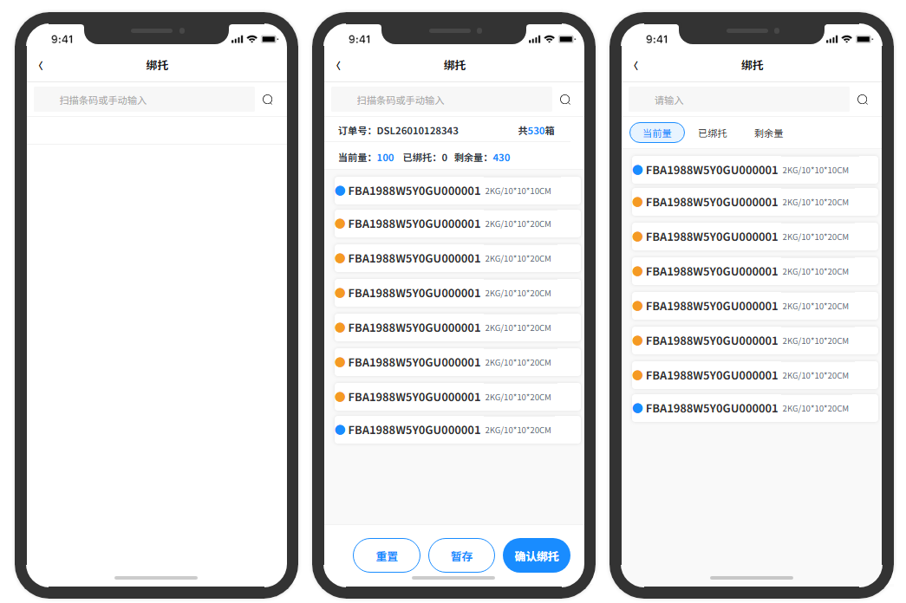

### 权限说明

菜单权限：PDA，入库管理→绑托

按钮权限：暂无

### 绑托

1. 点击绑托按钮，进入绑托页面

1. 扫描箱条码（客户箱号或德速箱号）后，需校验
1. 校验箱号/订单号是否存在
1. 仅收货中or已收货or绑托中的单允许绑托
1. 已绑托的货箱不允许重复绑托
1. PDA交互逻辑：
1. 第1次扫描时，根据箱号查询运单号，总件数，显示当前箱的箱号、尺寸、重量，颜色标记为蓝色（或高亮显示？）
1. 第2次扫描时，带出所扫描的箱号，重量，长*宽*高；同时带出第1箱到当前箱中的全部箱号（带出逻辑：根据过机的顺序带出，带出的箱号显示为橙色；若非过机测量，则不用带出）
1. 第3次扫描时，逻辑与第2次相同，带出第2、3次间的数据
1. 长按当前箱号，可从当前量中剔除该箱号；下次再扫描其他箱号时，不能再根据过机顺序带出已剔除箱号
1. 点击运单号下方的统计数据，可进入到查询列表，分别展示不同状态的的数据，点击标签可切换

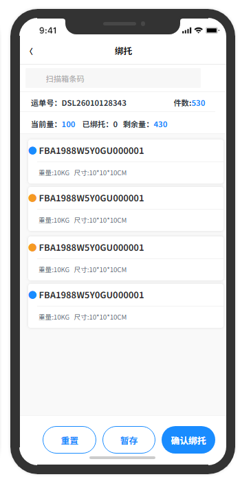

1. 点击重置，清空当前页面数据
1. 点击暂存时，至少扫描1箱数据；暂存后，下次扫描时，自动带出当前运单的暂存数据
1. 点击确认绑托
1. 至少扫描1箱数据
1. 剩余量-当前量≤5时，需提醒“剩余5箱及以下，请检查”，用户确认后，可提交绑托
1. 绑托后
1. 对应货箱状态变为已绑托；
1. 当入库单状态=已收货且全部货箱均为已绑托后，入库单状态变为已绑托，收货订单状态变为已绑托
1. 操作端记录绑托日志（记录到什么程度，暂存的也要记录？）

## 上架

### 界面示意图

路径：PDA→入库管理→上架

### 权限说明

菜单权限：PDA，入库管理→上架

按钮权限：暂无

### 上架

1. 点击上架按钮，进入上架页面

1、前置条件：已绑托
2、扫描箱号需校验：
① 箱号/运单/作业单号存在
②当前箱号已绑托
③ 已上架的货箱不允许重复上架：

2、扫描箱号逻辑
2.1 通过移库作业，点击单号，进入上架页面，
①带出运单号、作业单号、作业类型、当前运单已上架
②扫描任意箱号，显示当前箱号，并带出当前箱号对应的托号、托下的箱数
2.2 点击上架按钮，进入上架页面
①扫描任意箱号，带出箱号对应的运单号、作业单号、作业类型、当前运单已上架箱数和托数、未上架箱数和托数

3、带出库位逻辑
3.1 手动选择：
①若当前运单关联了出库单（根据运单+当前仓库查到对应仓库的出库单），扫描只能选择库区类型=备货区的库位；若出库单下已有运单下架到备货区，则带出该备货区库位，禁止编辑；若当前运单未关联出库单，只能选库区类型=存储区的库位
3.2 扫描带出：扫描当前库位上已有箱号，带出箱号对应库位

4、提醒逻辑：
①若当前仓库库容模式为标准库容，且当前库位托数+1＞库区的标准托数，则提醒“已超过库位最大托数，是否确认上架”，
②若当前仓库库容模式为高峰库容，且当前库位托数+1＞库区的高容托数，则提醒“已超过库位最大托数，是否确认上架”
③ 若当前运单存在其他托已上架到其他库位，则提示“当前库位和运单已上架的历史库位xxx不一致，是否确认上架”

5、点击已上架或未上架箱/托数，可显示当前作业单号下的全部托明细
（点击上架页面顶部，进入上架明细页面，统计全部托数、已上架托数、未上架托数，点击不同TAB显示对应的托数、箱号、库位）
6、点击上架后，当前托号下的全部货箱状态变为已上架；当运单下的所有货箱都为已上架后，入库单状态变为已上架

## 下架

### 界面示意图

路径：PDA→出库管理→下架

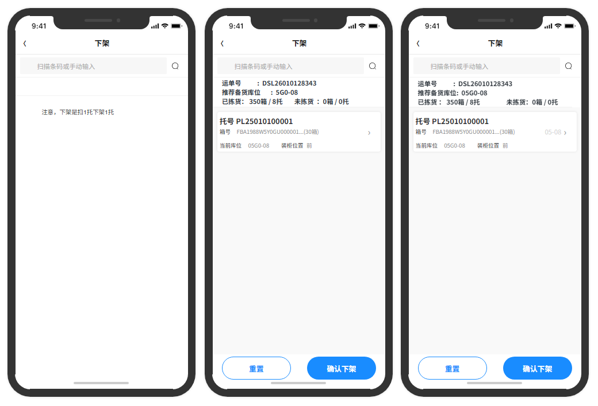

### 权限说明

菜单权限：PDA，入库管理→下架

按钮权限：暂无

### 下架

1. 点击下架按钮，进入下架页面

1. 扫描箱条码（客户箱号或德速箱号）后，需校验
1. 校验箱号/订单号是否存在
1. 下架任务存在，否则提示“当前箱号未生成下架任务”
1. 已下架的托/箱不允许重复下架
1. PDA交互逻辑：
1. 先扫描当前托盘上的箱号，带出箱号对应的订单号及托信息，并将当前扫描的箱号放在第1个，并带出推荐备货库位（生成下架单时选择的备货库位）；
1. 若为出库单中扫描的第1托，需用户手动选择库位；若非第1箱，则自动带出
1. 点击确认确认下架，将当前托中的全部箱号下架

1. 点击重置，清空当前页面数据
1. 点击确认下架，
1. 对应货箱状态变为已下架；
1. 若当前下架箱号为所在出库单的第1箱，则更新推荐备货库位（PC端下架任务的目标库位）为下架库位
1. 操作端记录日志

## 复核

### 界面示意图

路径：PDA→出库管理→复核

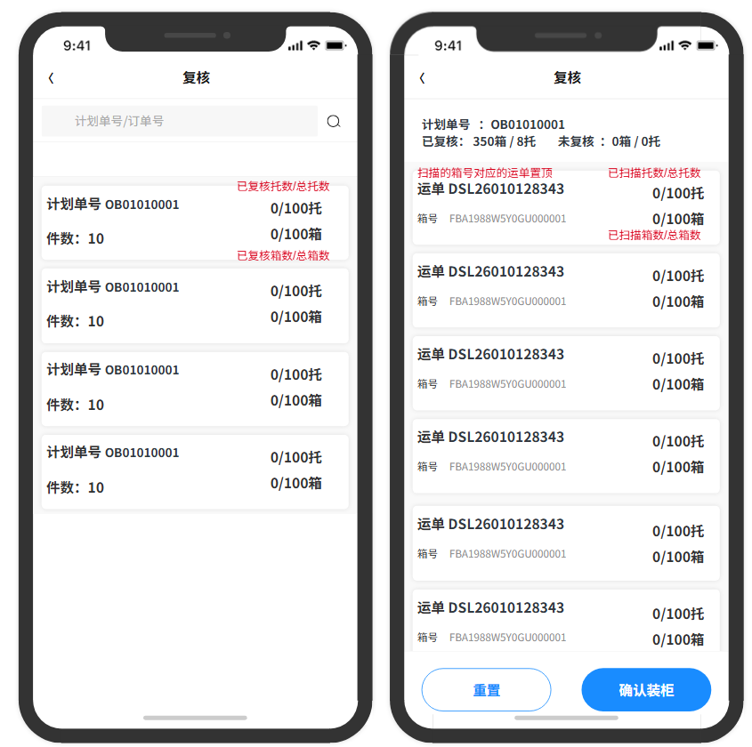

### 权限说明

菜单权限：PDA，出库管理→复核

按钮权限：暂无

### 复核

1. 点击复核按钮，进入复核页面
1. PDA交互逻辑：
1. 点击复核，进入复核页面，默认查询当前仓库全部待出库且未复核完成的的出库计划和调拨计划（调拨计划新增已下架、已复核状态），统计已复核托数/总托数、已复核箱数/总箱数，排序？
1. 点击计划单号后，进入复核页面（上方为计划单号、已复核箱数/托数、未复核箱数/托数），同时显示出库计划中的全部运单及运单的总托数，总箱数
1. 扫描后，需更新已扫描托数、箱数
1. 数据统计：
1. ①顶部显示已复核数据（箱数/托数），未复核数据（箱数/托数）
1. ②每个运单已扫托数/总托数、已扫箱数/总箱数
1. 举例：当前箱号对应托有10箱数据，当前箱号对运单有5托/100箱，扫描当前箱号后，统计数据更新为：1/5托，10/100箱
1. 扫描箱条码（客户箱号或德速箱号）后，需校验
1. 校验箱号/订单号是否存在于当前出库计划
1. 已复核的货箱不允许重复扫描
1. 点击确认复核，需校验：至少扫描1箱数据
1. 点击重置，清空当前页面数据
1. 点击确认复核后，
1. 对应货箱/托状态变为已复核
1. 允许部分复核
1. 若某个运单全部复核完成，则对应的下架任务自动完成
1. 操作端记录日志

1. 1个箱号对应多个运单号

## 装柜

### 界面示意图

路径：PDA→出库管理→装柜

### 权限说明

菜单权限：PDA，出库管理→装柜

按钮权限：暂无

### 装柜

1. 点击装柜按钮，进入装柜页面
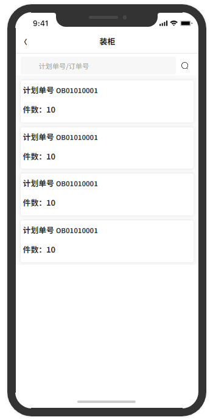

1. PDA交互逻辑：
1. 进入装柜页面，显示全部已复核待装柜的计划单号（调拨计划和出库计划），支持输入计划单号搜索
1. 点击计划单号，显示单号信息，已装柜箱数（已扫描）、未装柜箱数，以及计划单号中的全部运单，排序？
1. 维护装柜信息，显示图3弹窗，此时所有字段非必填
1. 扫描时，需校验扫描顺序是否按前、中、后，即必须扫描装柜顺序为前的，才能扫描中的，最后扫描后的
1. 每次扫描，已扫箱数+1
1. 点击确认装柜：
1. a.校验所有箱均已扫描
1. b.打开装柜信息弹窗，带出上次维护数据，此时所有字段为必填

1. 扫描箱号时需校验：
1. 校验客户箱号/速达箱号是否存在于当前计划单重
1. 已复核的货箱不允许重复复核
1. 点击重置，清空当前页面数据
1. 确认装柜后，
1. 对应货箱/托状态变为已出库
1. 操作端记录日志

## 移库作业

### 界面示意图

路径：PDA→库内作业→移库作业

### 权限说明

菜单权限：PDA，库内作业→移库作业

按钮权限：暂无

### 移库作业

1. 点击移库作业按钮，进入对应页面
1. 上架TAB显示作业类型=收货上架or返库上架，且作业状态=待派发or已派发的作业单，TAB需统计作业单条数
1. 下架TAB显示作业类型=拣货下架or杂项作业下架，且作业类型=待派发or已派发的作业单，TAB需统计作业单条数
1. 已派发的作业单，仅作业人能查看；未派发的作业单，所有有此仓库&页面权限的人均可查看
1. 排序：已派发的置顶显示（页面加上置顶标识），相同状态的按创建时间升序排列
1. 支持输入运单号/箱号，扫描箱号搜索
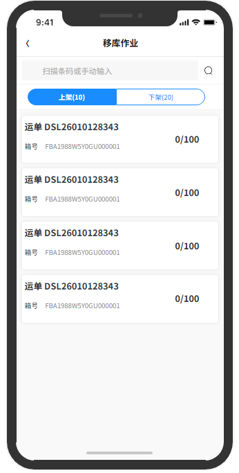

1. PDA交互逻辑：
1. 上架TAB显示运单号、第一个箱号、总托数、总箱数，点击运单号，跳转到上架页面
1. 下架TAB显示运单号、第一个箱号、已下架托数/总托数、已下架箱数/总箱数，点击运单号，可跳转至下架页面

## 验货

### 界面示意图

路径：PDA→库内作业→验货

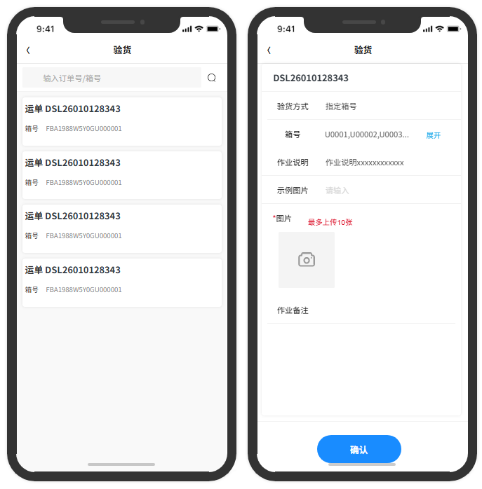

### 权限说明

菜单权限：PDA，库内作业→验货

按钮权限：暂无

### 验货

1. 点击验货按钮，进入对应页面，显示状态=已派发&作业类型=验货的作业单，支持输入订单号/箱号或扫描箱号搜索
1. 点击任意单号，进入验货页面

1. 点击确认后，状态=作业完成，记录操作日志

## 打板/拆板

### 界面示意图

路径：PDA→库内作业→打板/拆板

### 权限说明

菜单权限：PDA，库内作业→打板/拆板

按钮权限：暂无

### 打板/拆板

1. 点击打板/拆板，进入对应页面，显示状态=已派发&作业类型=打板/拆板的作业单，支持输入订单号/箱号或扫描箱号搜索
1. 点击任意单号，进入验货页面

1. 点击确认后，状态=作业完成，记录操作日志

1. 1）杂项作业，有移库作业时，若下架作业生成后还未确认下架，是否能操作杂项作业？还是必须要确认下架后，杂项作业才能查出对应作业单；

## 复测

### 界面示意图

路径：PDA→库内作业→验货

### 权限说明

菜单权限：PDA，库内作业→验货

按钮权限：暂无

### 复测

1. 点击浮窗，进入对应页面，显示状态=已派发&作业类型=打板/拆板的作业单，支持输入订单号/箱号或扫描箱号搜索
1. 点击任意单号，进入验货页面
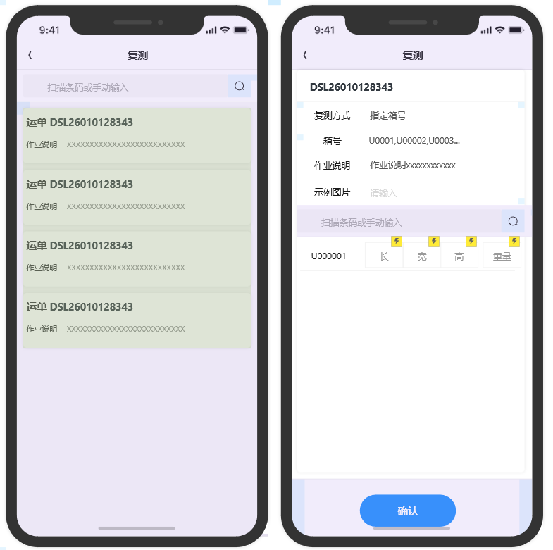

1. 点击确认后，状态=作业完成，记录操作日志
1. 复测上传示例图片的作用是？
1. 1）杂项作业，有移库作业时，若下架作业生成后还未确认下架，是否能操作杂项作业？还是必须要确认下架后，杂项作业才能查出对应作业单；

# 非功能性需求

## 界面操作需求

整体风格保持一致，功能操作使用按钮，操作在同一界面上完成。

运行界面可最大化最小化拖拽改变大小，兼容800X600以及以上各分辨率。

## 性能需求

## 安全性需求

## 维护与升级

## 可靠性和健壮性

## 用户文档需求

## 运行环境

---

### 表格 3

| 术语 | 名词解释 |
| --- | --- |
| 仓库 | 存储货物的物理或逻辑空间，用于区分不同地点 / 属性的库存 |
| 库区 | 仓库内按功能 / 区域划分的单元，如：入库区、存储区、拣选区、退货区、不合格品区 |
| 库位 | 货物存放的最小物理位置，如：A-01-02-03 |
| 入库 | 货物进入仓库的全过程，含收货、验收、上架 |
| 出库 | 货物从仓库发出的全过程，含拣货、复核、打包、发货 |
| 标准托数 | 是指平峰时期的托盘存放量，以高周转率为运作策略 |
| 高容托数 | 是指高峰时期的托盘存放量，以高利用率为运作策略 |
|  |  |
|  |  |

### 表格 4

| 系统 | 需求 | 需求说明 |
| --- | --- | --- |
| WMS | 登录 | 本期暂时支持账号密码登录 |
| WMS | 账号管理 | 列表 新增/编辑账号 启用/停用账号 修改密码	 |
| WMS | 角色管理 | 列表 新增/编辑角色 角色详情 |
| WMS | 菜单管理 | 列表 新增/编辑菜单 启用/停用菜单 |
|  |  |  |

### 表格 5

| 查询条件 | 元件类型 | 默认值 | 规则 |
| --- | --- | --- | --- |
| 收货时间 预计到仓时间  | 日期选择框 | 开始日期-结束日期  | 1、格式：YYYY-MM-DD~YYYY-MM-DD 2、开始日期不能大于结束日期，开始日期从0点开始，结束日期到23:59:59结束 |
| 订单号 参考号 收货单号 | 多行输入框 | 请输入 | 精确搜索，多个用逗号或空格隔开 |
| 客户代码 | 单行输入框 | 请输入 | 模糊搜索 |
| 渠道 | 单行输入框 |  | 模糊搜索 |
| 收货仓库 | 多选下拉框 | 仓库 | 值：当前账号的可见仓库，支持输入搜索 显示格式：仓库代码(仓库名称)	 |
| 目的国 | 多选下拉框 |  | 字典值：国家二字码 |
| 业务类型 | 单选下拉框 |  | 值：散货、整柜 |
| 业务归属 | 单选下拉框 |  | 值：德速、速达、德捷 |
| 运输类型 | 单选下拉框 |  | 值：海运、空运、快递 |
| 状态 | 单选下拉框 | 状态 | 字典值：如下状态 |
| 预报仓库？？ |  |  | 预报仓库和收货仓库是否需合并为1个查询条件 |

### 表格 6

| 状态值 | 状态说明 | 操作 | 共享操作 |
| --- | --- | --- | --- |
| 待收货 | 上游下方收货单后的初始状态 |  | 详情 |
| 收货中 | 预报件数＞已收货件数 |  | 详情 |
| 已收货 | 已过分拣机测量或手动收货入库 |  | 详情 |
| 已入库 | 绑定库位后，状态变为已入库 |  | 详情 |
| 已取消 | 已收货的订单，上游打回，客户删除后，收货订单变为已取消 |  | 详情 |
| 异常 | 上游推送订单时，校验是否异常，推送至收货订单页面 |  |  |

### 表格 7

| 序号 | 收货订单字段 | TMS字段 | 是否必填 | 规则及来源 | 备注 |
| --- | --- | --- | --- | --- | --- |
| 1 | 订单号 | 订单号 | / | 德速系统：德速订单号 速达系统：速达订单号 德捷系统：德捷订单号 |  |
| 2 | 参考号 | 参考号 | 是 | 德速系统：德速参考号 速达系统：速达参考号 德捷系统：德捷参考号 |  |
| 3 | 客户代码 | 客户代码 | 否 | 上游客户代码 |  |
| 7 | 客户等级 | 客户等级 | 否 | 值：S |  |
| 8 | 目的国 | 目的国 | 是 |  |  |
| 9 | 目的仓库 | 目的仓库 | 是 |  |  |
| 10 | 渠道 | 渠道 | 否 |  |  |
| 11 | 预报箱数 | 客户箱数 | 是 |  |  |
| 12 | 预报重量 | 客户重量 | 是 |  |  |
| 13 | 预报体积 | 客户体积 | 是 |  |  |
| 14 | 预报仓库 |  | 是 | 上游起运地对应的仓库 |  |
| 15 | 收货箱数 | / | / | 实际收货总箱数 |  |
| 16 | 收货重量 | / | / | 实际收货总重量 |  |
| 17 | 收货体积 | / | / | 实际收货总体积 |  |
| 18 | 收货仓库 |  |  | 实际发生收货动作的仓库 |  |
| 19 | 预计到仓时间 | 预计到仓时间 | 是 | YYMMDD HH:MM:SS |  |
| 20 | 业务类型 |  | 是 | 整柜订单时，业务类型=整柜； 非整柜订单时，业务类型=散货 |  |
| 21 | 业务归属 |  | 是 | 值：德速、速达、德捷 |  |
| 22 | 运输类型 | 运输类型 | 是 | 值：海运、空运、快递 |  |
| 23 | 收货人 |  |  |  |  |
| 24 | 收货时间 |  |  |  |  |
| 25 | 异常类型 | 异常类型 |  |  |  |
| 26 | 异常备注 | 异常备注 |  |  |  |
| 27 | 状态 |  |  | 初始状态=待收货 |  |
| 收货明细 | 收货明细 | 收货明细 | 收货明细 | 收货明细 |  |
| 28 | 箱号 | 下单箱号 | 是 |  |  |
| 29 | 预报重量 | 下单箱重 | 是 |  |  |
| 30 | 预报尺寸 | 下单长宽高 | 是 |  |  |
| 31 | 预报体积 | 下单体积 | 是 |  |  |
| 32 | 收货重量 | / | / |  |  |
| 33 | 收货尺寸 | / | / |  |  |
| 34 | 收货体积 | / | / |  |  |
| 35 | 托位号 | / | / |  |  |
| 36 | 库区 | / | / |  |  |
| 37 | 库位 | / | / |  |  |

### 表格 8

| 查询条件 | 元件类型 | 默认值 | 规则 |
| --- | --- | --- | --- |
| 订单号 出库计划号 | 单行输入框 |  | 精确搜索，多个用逗号或空格隔开 |
| 收货仓库 | 多选下拉框 |  | 值：当前账号的可见仓库，支持输入搜索 显示格式：仓库代码(仓库名称) |

### 表格 9

| 状态值 | 状态说明 | 操作 | 共享操作 |
| --- | --- | --- | --- |
| 待出库 | 上游下方出库计划后的初始状态 |  | 详情 |
| 已出库 | 出库计划已确认出库 |  | 详情 |

### 表格 10

| 序号 | 出库计划字段 | TMS字段 | 是否必填 | 规则及来源 | 备注 |
| --- | --- | --- | --- | --- | --- |
| 1 | 出库计划单号 | 出库计划单号 | 是 | 上游计划单号 |  |
| 2 | 业务归属 |  | 是 | 上游系统，如德速，速达，德捷（列表页面拼接到出库计划后） |  |
| 3 | 备注 | 备注 | 否 | 上游计划单的备注 |  |
| 4 | 计划件数 | 件数 |  | 出库计划的总件数（总箱数） |  |
| 5 | 计划订单数 | / |  | 出库计划的总订单数 |  |
| 6 | 计划重量 | / |  | 出库计划总重量（计算时有收货重量用收货重量，无收货重量用预报重量） |  |
| 7 | 计划体积 | / |  | 出库计划总重量（计算时有收货重量用收货重量，无收货重量用预报重量） |  |
| 8 | 收货件数 |  |  | 实际收货件数 |  |
| 9 | 收货重量 |  |  | 实际收货重量 |  |
| 10 | 收货体积 |  |  | 实际收货体积 |  |
| 11 | 收货订单数 |  |  | 实际收货订单数 |  |
| 14 | 在库比例 |  |  | 在库件数/总计划件数 |  |
| 15 | 计划装柜时间1 | 计划装柜时间1 | 是 | 第1个仓库的计划装柜时间 |  |
| 16 | 计划装柜时间2 | 计划装柜时间2 | 否 | 第2个仓库的计划装柜时间 |  |
| 17 | 是否两地装 | 是否两地装 | 是 |  |  |
| 18 | 装柜仓库 | 装柜仓库 | 是 |  |  |
| 19 | 柜号 | 柜号 | 否 |  |  |
| 20 | 司机电话 | 司机电话 | 否 |  |  |
| 21 | 司机 | 司机 | 否 |  |  |
| 22 | 车牌号 | 车牌号 | 否 |  |  |
| 23 | 状态 | / | / | 初始状态=待收货 |  |
| 出库明细 | 出库明细 | 出库明细 | 出库明细 | 出库明细 |  |
| 24 | 订单号 | 订单号 | 是 |  |  |
| 25 | 客户代码 | 客户代码 | 是 |  |  |
| 26 | 装柜顺序 | 装柜顺序 | 是 |  |  |
| 27 | 出库渠道 | 出库渠道 | 是 |  |  |
| 28 | 品名 | 品名 | 是 |  |  |
| 29 | 客户备注 | 客户备注 | 是 |  |  |
| 30 | 内部备注 | 内部备注 | 是 |  |  |
| 31 | 目的仓库 | 目的仓库 | 是 |  |  |
| 32 | 目的邮编 | 目的邮编 | 是 |  |  |
| 33 | 件数 | 件数 | 是 |  |  |
| 34 | 重量 | 重量 | 是 |  |  |
| 35 | 体积 | 体积 | 是 |  |  |
| 36 | 预计到仓时间 | 预计到仓时间 | 是 |  |  |

### 表格 11

| 查询条件 | 元件类型 | 默认值 | 规则 |
| --- | --- | --- | --- |
| 订单号 调拨计划号 | 单行输入框 |  | 精确搜索，多个用逗号或空格隔开 |
| 调入仓库 调出仓库 | 多选下拉框 |  | 值：当前账号的可见仓库，支持输入搜索 显示格式：仓库代码(仓库名称) |

### 表格 12

| 状态值 | 状态说明 | 操作 | 共享操作 |
| --- | --- | --- | --- |
| 待出库 | 上游下方出库计划后的初始状态 |  | 详情 |
| 已出库 | 调出仓库已出库 |  | 详情 |
| 已完成 | 调入仓库已收货 |  |  |

### 表格 13

| 序号 | 出库计划字段 | TMS字段 | 是否必填 | 规则及来源 | 备注 |
| --- | --- | --- | --- | --- | --- |
| 1 | 调拨计划单号 |  | 是 |  |  |
| 3 | 备注 | 备注 | 否 | 上游计划单的备注 |  |
| 4 | 计划件数 | 件数 |  | 计划的总件数（总箱数） |  |
| 6 | 计划重量 | / |  | 计划总重量（计算时有收货重量用收货重量，无收货重量用预报重量） |  |
| 7 | 计划体积 | / |  | 计划总重量（计算时有收货重量用收货重量，无收货重量用预报重量） |  |
| 8 | 司机电话 | 司机电话 | 否 |  |  |
| 9 | 司机 | 司机 | 否 |  |  |
| 10 | 车牌号 | 车牌号 | 否 |  |  |
| 11 | 状态 | / | / | 初始状态=待出库 |  |
| 调拨明细 | 调拨明细 | 调拨明细 | 调拨明细 | 调拨明细 |  |
| 12 | 订单号 | 订单号 | 是 |  |  |
| 13 | 客户代码 | 客户代码 | 是 |  |  |
| 14 | 件数 | 件数 | 是 |  |  |
| 15 | 重量 | 重量 | 是 |  |  |
| 16 | 体积 | 体积 | 是 |  |  |

### 表格 14

| 查询条件 | 元件类型 | 默认值 | 规则 |
| --- | --- | --- | --- |
| 订单号 参考号 收货单号 | 多行输入框 | 请输入 | 精确搜索，多个用逗号或空格隔开 |
| 客户代码 | 单行输入框 | 请输入 | 模糊搜索 |
| 收货仓库 | 单选下拉框 |  | 值：当前账号的可见仓库，支持输入搜索 显示格式：仓库代码(仓库名称) |

### 表格 15

| 查询条件 | 元件类型 | 默认值 | 规则 |
| --- | --- | --- | --- |
| 箱号 | 多行输入框 | 请输入 | 精确搜索，多个用逗号或空格隔开 |
| 客户代码 | 单行输入框 | 请输入 | 模糊搜索 |
| 收货仓库 | 单选下拉框 |  | 值：当前账号的可见仓库，支持输入搜索 显示格式：仓库代码(仓库名称) |

### 表格 16

| 查询条件 | 元件类型 | 默认值 | 规则 |
| --- | --- | --- | --- |
| 订单号 参考号 收货单号 | 多行输入框 | 请输入 | 精确搜索，多个用逗号或空格隔开 |
| 客户代码 | 单行输入框 | 请输入 | 模糊搜索 |
| 收货仓库 | 单选下拉框 |  | 值：当前账号的可见仓库，支持输入搜索 显示格式：仓库代码(仓库名称) |

### 表格 17

| 查询条件 | 元件类型 | 默认值 | 规则 |
| --- | --- | --- | --- |
| 箱号 | 多行输入框 | 请输入 | 精确搜索，多个用逗号或空格隔开 |
| 客户代码 | 单行输入框 | 请输入 | 模糊搜索 |
| 收货仓库 | 单选下拉框 |  | 值：当前账号的可见仓库，支持输入搜索 显示格式：仓库代码(仓库名称) |

### 表格 18

| 字段名称 | 是否必填 | 组件类型 | 规则及来源 |
| --- | --- | --- | --- |
| 箱号 | 是 | 输入框 |  |
| 单箱重 | 是 | 输入框 | ＞0，≤9999.99，最多2位小数 |
| 长 | 是 | 单选下拉框 | ＞0，≤9999.99，最多2位小数 |
| 宽 | 是 | 单选下拉框 | ＞0，≤9999.99，最多2位小数 |
| 高 | 是 | 单行输入框 | ＞0，≤9999.99，最多2位小数 |
| 箱数 | 否 | 单行输入框 | ＞0，≤100的整数 |

### 表格 19

| 字段名称 | 是否必填 | 组件类型 | 规则及来源 |
| --- | --- | --- | --- |
| 订单号 | / | / | 根据箱号查询入库订单的订单号 |
| 客户代码 | / | / | 根据箱号查询入库订单的客户代码 |
| 目的仓库 | / | / | 根据箱号查询入库订单的目的仓库代码 |
| 渠道 | / | / | 根据箱号查询入库订单的入库渠道 |
| 预报件数 | / | / | 根据箱号查询入库订单的预报件数 |
| 预报重量 | / | / | 根据箱号查询入库订单的预报重量 |
| 预报体积 | / | / | 根据箱号查询入库订单的预报体积 |
| 异常备注 |  |  |  |
| 收货明细list | 收货明细list | 收货明细list | 收货明细list |
| 箱号 | / |  | 根据输入的箱号回显，若箱数＞1，则根据显示多条数据 如箱号输入DSL260334633-1，箱数为2，则显示 DSL260334633-1，DSL260334633-2；若下方已存在DSL260334633-1，则显示DSL260334633-2，DSL260334633-3 |
| 重量 | 是 | 单行输入框 | ＞0，≤9999.99，最多2位小数 |
| 长 | 是 | 单选下拉框 | ＞0，≤9999.99，最多2位小数 |
| 宽 | 是 | 单选下拉框 | ＞0，≤9999.99，最多2位小数 |
| 高 | 是 | 单行输入框 | ＞0，≤9999.99，最多2位小数 |
| 体积 | / | / | 长*宽*高/1000000，保留6位小数 |
| 合计重量 | / | / | 重量之后 |
| 合计提交 | / | / | 体积之后 |

### 表格 20

| 字段名称 | 是否必填 | 组件类型 | 规则及来源 |
| --- | --- | --- | --- |
| 打印数量 | 是 | 单行输入框 | ＞1，≤1000，整数 |

### 表格 21

| 字段名称 | 是否必填 | 组件类型 | 规则及来源 |
| --- | --- | --- | --- |
| 图片 | 是 | 上传组件 | 最少上传1张，最多可上传10张 |
| 备注 | 否 | 多行输入框 | 最多255字符 |
| 箱list |  |  |  |
| 箱号 | 是 | 扫描输入 |  |

### 表格 22

| 序号 | 序号 | 收货订单字段 | 规则及来源 | 备注 |
| --- | --- | --- | --- | --- |
| 1 | 1 | 收货单号 | IB+年月日+5位流水号 |  |
| 2 | 2 | 运单号 | - |  |
| 3 | 3 | 参考号 | - |  |
| 4 | 4 | 客户代码 | - |  |
| 5 | 5 | 客户等级 | - |  |
| 6 | 6 | 目的国 | - |  |
| 7 | 7 | 目的仓库 | - |  |
| 8 | 8 | 渠道 | - |  |
| 11 | 11 | 预报箱数 | - |  |
| 12 | 12 | 预报重量 | - |  |
| 13 | 13 | 预报体积 | - |  |
| 14 | 14 | 预报仓库 | - |  |
| 15 | 15 | 收货箱数 | - |  |
| 16 | 16 | 收货重量 | - |  |
| 17 | 17 | 收货体积 | - |  |
| 18 | 18 | 收货仓库 | - |  |
| 19 | 19 | 预计到仓时间 | - |  |
| 20 | 20 | 业务类型 | - |  |
| 21 | 21 | 业务归属 | - |  |
| 22 | 22 | 入库类型 | 无单收货 |  |
| 22 | 22 | 运输类型 | - |  |
| 23 | 23 | 收货人 | - |  |
| 24 | 24 | 收货时间 | - |  |
| 25 | 25 | 异常类型 | - |  |
| 26 | 26 | 异常备注 | - |  |
| 27 | 27 | 状态 | 初始状态=待收货 |  |
|  |
| 28 | 28 | 箱号 | 扫描箱号 |  |
| 29 | 29 | 预报重量 |  |  |
| 30 | 30 | 预报尺寸 |  |  |
| 31 | 31 | 预报体积 |  |  |
| 32 | 32 | 收货重量 |  |  |
| 33 | 33 | 收货尺寸 |  |  |
| 34 | 34 | 收货体积 |  |  |
| 35 | 35 | 托位号 |  |  |
| 36 | 36 | 库区 |  |  |
| 37 | 37 | 库位 |  |  |

### 表格 23

| 查询条件 | 元件类型 | 默认值 | 规则 |
| --- | --- | --- | --- |
| 创建时间 |  | 开始日期-结束日期  | 1、格式：YYYY-MM-DD~YYYY-MM-DD 2、开始日期不能大于结束日期，开始日期从0点开始，结束日期到23:59:59结束 |
| 收货单号 | 单行输入框 | 请输入 | 精确搜索，多个用逗号或空格隔开 |
| 运单号 | 单行输入框 |  | 精确搜索，多个用逗号或空格隔开 |
| 仓库 | 多选下拉框 |  |  |

### 表格 24

| 状态值 | 状态说明 | 操作 | 共享操作 |
| --- | --- | --- | --- |
| 待认领 | 初始状态 |  | 详情 |
| 已认领 | 预报件数＞已收货件数 |  | 详情 |

### 表格 25

| 字段名称 | 是否必填 | 组件类型 | 规则及来源 |
| --- | --- | --- | --- |
| 订单号 | 是 | 单选下拉框 | 选项：状态为待交寄、待入库的订单 |

### 表格 26

| 查询条件 | 元件类型 | 默认值 | 规则 |
| --- | --- | --- | --- |
| 收货时间 预计到仓时间  | 日期选择框 | 开始日期-结束日期  | 1、格式：YYYY-MM-DD~YYYY-MM-DD 2、开始日期不能大于结束日期，开始日期从0点开始，结束日期到23:59:59结束 |
| 订单号 参考号 收货单号 | 多行输入框 | 请输入 | 精确搜索，多个用逗号或空格隔开 |
| 客户代码 | 单行输入框 | 请输入 | 模糊搜索 |
| 渠道 | 单行输入框 |  | 模糊搜索 |
| 目的国 | 多选下拉框 |  | 字典值：国家二字码 |
| 业务类型 | 单选下拉框 |  | 值：散货、整柜 |
| 业务归属 | 单选下拉框 |  | 值：德速、速达、德捷 |
| 运输类型 | 单选下拉框 |  | 值：海运、空运、快递 |
| 状态 | 单选下拉框 | 状态 | 字典值：如下状态 |
|  |  |  |  |

### 表格 27

| 状态值 | 状态说明 | 操作 | 共享操作 |
| --- | --- | --- | --- |
| 收货中 | 预报件数＞已收货件数 | 收货入库 |  |
| 已收货 | 已过分拣机测量或手动收货入库 | 入库落位 |  |
| 已入库 | 绑定库位后，状态变为已入库 |  |  |
| 异常 | 上游推送订单时，校验是否异常，推送至收货订单页面； |  |  |
|  |  |  |  |

### 表格 28

| 字段名称 | 是否必填 | 组件类型 | 规则及来源 |
| --- | --- | --- | --- |
| 库位 | 是 | 单选下拉框 | 可根据库位编码模糊查询 |

### 表格 29

| 字段名称 | 是否必填 | 组件类型 | 规则及来源 |
| --- | --- | --- | --- |
| 订单号 | / | / | 根据箱号查询入库订单的订单号 |
| 收货单号 | / | / | IB+年月日+5位随机数 |
| 状态 | / | / | 收货单状态 |
| 收货仓库 | / | / | 实际收货的仓库 |
| 客户代码 | / | / | 客户代码 |
| 客户等级 | / | / | 客户等级 |
| 业务归属 | / | / |  |
| 业务类型 | / | / |  |
| 入库类型 | / | / |  |
| 目的仓库 | / | / |  |
| 目的国 | / | / |  |
| 渠道 | / | / |  |
| 预报件数 | / | / |  |
| 预报重量 | / | / |  |
| 预报体积 | / | / |  |
|  |  |  |  |
| 收货明细list |  |  |  |
| 箱号 | / |  | 根据输入的箱号回显，若箱数＞1，则根据显示多条数据 如箱号输入DSL260334633-1，箱数为2，则显示 DSL260334633-1，DSL260334633-2；若下方已存在DSL260334633-1，则显示DSL260334633-2，DSL260334633-3 |
| 重量 | 是 | 单行输入框 | ＞0，≤9999.99，最多2位小数 |
| 长 | 是 | 单选下拉框 | ＞0，≤9999.99，最多2位小数 |
| 宽 | 是 | 单选下拉框 | ＞0，≤9999.99，最多2位小数 |
| 高 | 是 | 单行输入框 | ＞0，≤9999.99，最多2位小数 |
| 体积 | / | / | 长*宽*高/1000000，保留6位小数 |

### 表格 30

| 字段名称 | 是否必填 | 组件类型 | 规则及来源 |
| --- | --- | --- | --- |
| 订单号 | / | / | 根据箱号查询入库订单的订单号 |
| 收货单号 | / | / | IB+年月日+5位随机数 |
| 状态 | / | / | 收货单状态 |
| 收货仓库 | / | / | 实际收货的仓库 |
| 客户代码 | / | / | 客户代码 |
| 客户等级 | / | / | 客户等级 |
| 业务归属 | / | / |  |
| 业务类型 | / | / |  |
| 入库类型 | / | / |  |
| 目的仓库 | / | / |  |
| 目的国 | / | / |  |
| 渠道 | / | / |  |
| 预报件数 | / | / |  |
| 预报重量 | / | / |  |
| 预报体积 | / | / |  |
|  |  |  |  |
| 收货明细list |  |  |  |
| 箱号 | / |  | 根据输入的箱号回显，若箱数＞1，则根据显示多条数据 如箱号输入DSL260334633-1，箱数为2，则显示 DSL260334633-1，DSL260334633-2；若下方已存在DSL260334633-1，则显示DSL260334633-2，DSL260334633-3 |
| 重量 | 是 | 单行输入框 | ＞0，≤9999.99，最多2位小数 |
| 长 | 是 | 单选下拉框 | ＞0，≤9999.99，最多2位小数 |
| 宽 | 是 | 单选下拉框 | ＞0，≤9999.99，最多2位小数 |
| 高 | 是 | 单行输入框 | ＞0，≤9999.99，最多2位小数 |
| 体积 | / | / | 长*宽*高/1000000，保留6位小数 |

### 表格 31

| 查询条件 | 元件类型 | 默认值 | 规则 |
| --- | --- | --- | --- |
| 订单号 出库计划单号 调拨计划单号 | 单行输入框 |  | 精确搜索，多个用逗号或空格隔开 |
| 出库类型 | 单选下拉框 |  | 值：计划出库，调拨出库 |

### 表格 32

| 状态值 | 状态说明 | 操作 | 共享操作 |
| --- | --- | --- | --- |
| 待出库 | 上游下方出库计划后的初始状态 | 拣货完成、确认出库 | 详情 |
| 已拣货 | 点击拣货完成后，状态变为已拣货 | 确认出库 | 详情 |
| 已出库 | 出库单已确认出库 |  |  |

### 表格 33

| 字段名称 | 是否必填 | 组件类型 | 规则及来源 |
| --- | --- | --- | --- |
| 柜号 | 是 | 单行输入框 | 最多20字符 |
| 封条 | 是 | 单行输入框 | 最多20字符 |
| 司机 | 是 | 单行输入框 | 最多20字符 |
| 电话 | 是 | 单行输入框 | 最多20字符 |
| 车牌号 | 是 | 单行输入框 | 最多20字符 |
| 图片list | 至少上传1张图片，最多上传10张图片 | 至少上传1张图片，最多上传10张图片 | 至少上传1张图片，最多上传10张图片 |
| 图片 | 是 | 上传组件 | 所有图片类型，最大可10MB |
| 图片类型 | 是 | 单选下拉框 | 值：关门、前端、中部、后端、封条、车牌、空柜、单据 |

### 表格 34

| 序号 | 序号 | 出库计划字段 | 是否必填 | 规则及来源 | 备注 |
| --- | --- | --- | --- | --- | --- |
| 1 | 1 | 出库计划单号 | 是 | 上游计划单号 |  |
| 2 | 2 | 业务归属 | 是 | 上游系统，如德速，速达，德捷（列表页面拼接到出库计划后） |  |
| 3 | 3 | 备注 | 否 | 上游计划单的备注 |  |
| 4 | 4 | 计划件数 |  | 出库计划的总件数（总箱数） |  |
| 5 | 5 | 计划订单数 |  | 出库计划的总订单数 |  |
| 6 | 6 | 计划重量 |  | 出库计划总重量（计算时有收货重量用收货重量，无收货重量用预报重量） |  |
| 7 | 7 | 计划体积 |  | 出库计划总重量（计算时有收货重量用收货重量，无收货重量用预报重量） |  |
| 8 | 8 | 收货件数 |  | 实际收货件数 |  |
| 9 | 9 | 收货重量 |  | 实际收货重量 |  |
| 10 | 10 | 收货体积 |  | 实际收货体积 |  |
| 11 | 11 | 收货订单数 |  | 实际收货订单数 |  |
| 14 | 14 | 在库比例 |  | 已收货件数/总计划件数（需动态变化） |  |
| 15 | 15 | 计划装柜时间1 | 是 | 第1个仓库的计划装柜时间 |  |
| 16 | 16 | 计划装柜时间2 | 否 | 第2个仓库的计划装柜时间 |  |
| 17 | 17 | 是否两地装 | 是 |  |  |
| 18 | 18 | 装柜仓库 | 是 |  |  |
| 19 | 19 | 柜号 | 否 |  |  |
| 20 | 20 | 司机电话 | 否 |  |  |
| 21 | 21 | 司机 | 否 |  |  |
| 22 | 22 | 车牌号 | 否 |  |  |
| 23 | 23 | 状态 | / | 初始状态=待收货 |  |
|  |
| 24 | 24 | 订单号 | 是 |  |  |
| 25 | 25 | 客户代码 | 是 |  |  |
| 26 | 26 | 装柜顺序 | 是 |  |  |
| 27 | 27 | 出库渠道 | 是 |  |  |
| 28 | 28 | 品名 | 是 |  |  |
| 29 | 29 | 客户备注 | 是 |  |  |
| 30 | 30 | 内部备注 | 是 |  |  |
| 31 | 31 | 目的仓库 | 是 |  |  |
| 32 | 32 | 目的邮编 | 是 |  |  |
| 33 | 33 | 件数 | 是 |  |  |
| 34 | 34 | 重量 | 是 |  |  |
| 35 | 35 | 体积 | 是 |  |  |
| 36 | 36 | 预计到仓时间 | 是 |  |  |

### 表格 35

| 字段名称 | 是否必填 | 组件类型 | 规则及来源 |
| --- | --- | --- | --- |
| 备货库位 | 是 | 单选下拉框 | 当前仓库的库区 |
| 柜号 | 否 | 单行输入框 | 最多20字符 |
| 司机 | 否 | 单行输入框 | 最多20字符 |
| 电话 | 否 | 单行输入框 | 最多20字符 |
| 车牌号 | 否 | 单行输入框 | 最多20字符 |
| 出库明细 |  |  |  |
| 运单号 | 根据出库单带出 | 根据出库单带出 | 根据出库单带出 |
| 客户代码 | 根据出库单带出 | 根据出库单带出 | 根据出库单带出 |
| 装柜顺序 | 否 | 单选下拉框 | 值：前，中，后 默认带出出库单的装柜顺序，可修改 |
| 出库渠道 | 根据出库单带出 | 根据出库单带出 | 根据出库单带出 |
| 品名 | 根据出库单带出 | 根据出库单带出 | 根据出库单带出 |
| 客户备注 | 根据出库单带出 | 根据出库单带出 | 根据出库单带出 |
| 内部备注 | 根据出库单带出 | 根据出库单带出 | 根据出库单带出 |
| 目的仓库 | 根据出库单带出 | 根据出库单带出 | 根据出库单带出 |
| 目的邮编 | 根据出库单带出 | 根据出库单带出 | 根据出库单带出 |
| 件数 | 根据出库单带出 | 根据出库单带出 | 根据出库单带出 |
| 重量 | 根据出库单带出 | 根据出库单带出 | 根据出库单带出 |
| 体积 | 根据出库单带出 | 根据出库单带出 | 根据出库单带出 |
| 预计到仓时间 | 根据出库单带出 | 根据出库单带出 | 根据出库单带出 |

### 表格 36

| 查询条件 | 元件类型 | 默认值 | 规则 |
| --- | --- | --- | --- |
| 作业单号 | 单行输入框 |  | 精确搜索，多个用逗号或空格隔开 |
| 运单号 | 单行输入框 |  | 精确搜索，多个用逗号或空格隔开 |
| 作业类型 | 单选下拉框 |  | 值：收货上架、拣货下架、杂项作业下架、返库上架 |

### 表格 37

| 状态值 | 状态说明 | 操作 | 共享操作 |
| --- | --- | --- | --- |
| 待派发 | 生成移库作业，待指定作业人 | 派发 | 详情 |
| 已派发 | 已派发作业指令 |  | 详情 |
| 已完成 |  |  |  |

### 表格 38

| 字段名称 | 是否必填 | 组件类型 | 规则及来源 |
| --- | --- | --- | --- |
| 作业单号 | / | 根据单号带出 | 根据单号带出 |
| 运单号 | / | 根据单号带出 | 根据单号带出 |
| 作业类型 | / | 根据单号带出 | 根据单号带出 |
| 作业人 | 是 | 单选下拉框 | 值：拥有当前仓库权限的用户姓名 |

### 表格 39

| 查询条件 | 元件类型 | 默认值 | 规则 |
| --- | --- | --- | --- |
| 作业单号 | 单行输入框 |  | 精确搜索，多个用逗号或空格隔开 |
| 运单号 | 单行输入框 |  | 精确搜索，多个用逗号或空格隔开 |
| 作业类型 | 单选下拉框 |  | 值：换标、 |

### 表格 40

| 状态值 | 状态说明 | 操作 | 共享操作 |
| --- | --- | --- | --- |
| 待派发 | 生成移库作业，待指定作业人 | 派发 | 详情 |
| 已派发 | 已派发作业指令 |  | 详情 |
| 作业完成 | 作业完成 |  |  |
| 已下架 | 派发时有移库指令，且对应的下架指令已执行下架 |  |  |
| 已返库 | 派发时有移库指令，且对应的上架指令已执行上架 |  |  |

### 表格 41

| 字段名称 | 是否必填 | 组件类型 | 规则及来源 |
| --- | --- | --- | --- |
| 运单号 | 是 | 单选下拉框 | 值：当前仓库已收货待出库的运单，选项支持输入模糊搜索 若是TMS创建，则查询全部选到全部已入库待出库的单 |
| 作业类型 | 是 | 单选下拉框 |  |
| 换标类型 | 是 | 单选下拉框 | 值：客户标签，德速标签 |
| 换标方式 | 是 | 单选下拉框 | 值：覆盖，新增 |
| 有参考箱号 | 是 | 单选下拉框 | 值：是，否 |
| 作业说明 | 否 | 多行输入框 | 最大255字符 |
| 上传标签 | / | / | 换标类型=德速标签时隐藏；换标类型=客户标签时显示且必填，文件格式为pdf或压缩包(zip)，只能上传1个 |
| 箱号对应关系 | 无参考箱号，隐藏箱号对应关系；有参考箱号，箱号对应关系显示且必填 | 无参考箱号，隐藏箱号对应关系；有参考箱号，箱号对应关系显示且必填 | 无参考箱号，隐藏箱号对应关系；有参考箱号，箱号对应关系显示且必填 |
| 序号 | / | / | 系统自动按顺序生成 |
| 旧标签箱号 | 是 | 单行输入框 | 最长30字符 |
| 新标签箱号 | 是 | 单行输入框 | 最长30字符 |

### 表格 42

| 字段名称 | 是否必填 | 组件类型 | 规则及来源 |
| --- | --- | --- | --- |
| 运单号 | 是 | 单选下拉框 | 值：当前仓库已收货待出库的运单，选项支持输入模糊搜索 若是TMS创建，则查询全部选到全部已入库待出库的单 |
| 作业类型 | 是 | 单选下拉框 |  |
| 贴标类型 | 是 | 单选下拉框 | 值：客户标签，德速标签、其他 |
| 有参考箱号 | 是 | 单选下拉框 | 值：是，否 |
| 作业说明 | 否 | 多行输入框 | 最大255字符 |
| 上传标签 | / | / | 换标类型=德速标签时隐藏；换标类型=客户标签时显示且必填，文件格式为pdf或压缩包，只能上传1个 |
| 箱号对应关系 | 无参考箱号，隐藏箱号对应关系；有参考箱号，箱号对应关系显示且必填 | 无参考箱号，隐藏箱号对应关系；有参考箱号，箱号对应关系显示且必填 | 无参考箱号，隐藏箱号对应关系；有参考箱号，箱号对应关系显示且必填 |
| 序号 | / | / | 系统自动按顺序生成 |
| 参考箱号 | 是 | 单行输入框 | 最长30字符 |
| 新标签箱号 | 是 | 单行输入框 | 最长30字符 |

### 表格 43

| 字段名称 | 是否必填 | 组件类型 | 规则及来源 |
| --- | --- | --- | --- |
| 运单号 | 是 | 单选下拉框 | 值：当前仓库已收货待出库的运单，选项支持输入模糊搜索 若是TMS创建，则查询全部选到全部已入库待出库的单 |
| 作业类型 | 是 | 单选下拉框 | 贴尾程标签 |
| 有参考箱号 | 是 | 单选下拉框 | 值：是，否 |
| 作业说明 | 否 | 多行输入框 | 最大255字符 |
| 上传标签 | / | / | 有参考箱号=是，文件格式为压缩包 有参考箱号=否，文件格式为pdf 只能上传1个 |
| 箱号对应关系 | 无参考箱号，隐藏箱号对应关系；有参考箱号，箱号对应关系显示且必填 | 无参考箱号，隐藏箱号对应关系；有参考箱号，箱号对应关系显示且必填 | 无参考箱号，隐藏箱号对应关系；有参考箱号，箱号对应关系显示且必填 |
| 序号 | / | / | 系统自动按顺序生成 |
| 参考箱号 | 是 | 单行输入框 | 最长30字符 |
| 标签箱号 | 是 | 单行输入框 | 最长30字符 |

### 表格 44

| 字段名称 | 是否必填 | 组件类型 | 规则及来源 |
| --- | --- | --- | --- |
| 运单号 | 是 | 单选下拉框 | 值：当前仓库已收货待出库的运单，选项支持输入模糊搜索 若是TMS创建，则查询全部选到全部已入库待出库的单 |
| 作业类型 | 是 | 单选下拉框 |  |
| 复测方式 | 是 | 单选 | 指定箱号、随机箱号 |
| 箱号 | / | 多选下拉框 | 复测方式=指定箱号时，显示且必填，否则隐藏 选项：所选运单下的全部箱号；选项值可输入搜索，可全选 |
| 箱数 | / | 单行输入框 | 复测方式=随机箱号时，显示且必填，否则隐藏 值：＞0的整数，≤运单总箱数 |
| 作业说明 | 否 | 多行输入框 | 最大255字符 |
| 示例图片 |  |  |  |

### 表格 45

| 字段名称 | 是否必填 | 组件类型 | 规则及来源 |
| --- | --- | --- | --- |
| 运单号 | 是 | 多选下拉框 | 值：当前仓库已收货待出库的运单，选项支持输入模糊搜索 若是TMS创建，则查询全部选到全部已入库待出库的单 |
| 作业类型 | 是 | 单选下拉框 |  |
| 作业说明 | 否 | 多行输入框 | 最大255字符 |

### 表格 46

| 字段名称 | 是否必填 | 组件类型 | 规则及来源 |
| --- | --- | --- | --- |
| 作业单号 | / | 根据单号带出 | 根据单号带出 |
| 运单号 | / | 根据单号带出 | 根据单号带出 |
| 作业类型 | / | 根据单号带出 | 根据单号带出 |
| 是否移库 | 是 | 单选下拉框 | 值：是，否 |
| 目标库位 | / | 单选下拉框 | 是否移库=是，目标库位必填； 是否移库=否，目前库位禁选 |
| 作业人 | 是 | 单选下拉框 | 值：拥有当前仓库权限的用户 |

### 表格 47

| 字段名称 | 是否必填 | 组件类型 | 规则及来源 |
| --- | --- | --- | --- |
| 参考箱号 | 是 |  |  |
| 运单号 | / | 根据作业单号带出 | 根据作业单号带出 |
| 客户代码 | / | 根据作业单号带出 | 根据作业单号带出 |
| 目的国 | / | 根据作业单号带出 | 根据作业单号带出 |
| 目的仓库 | / | 根据作业单号带出 | 根据作业单号带出 |
| 渠道 | / | 根据作业单号带出 | 根据作业单号带出 |
| 换标类型 | / | 根据作业单号带出 | 根据作业单号带出 |
| 换标方式 | / | 根据作业单号带出 | 根据作业单号带出 |
| 作业说明 | / | 根据作业单号带出 | 根据作业单号带出 |
| 应扫 | / |  | 有箱号对应关系时，带出对应关系总条数 |
| 已扫 | / |  |  |
| 箱单list |  |  |  |
| 参考箱号 |  |  | 每次扫描/输入参考箱号时带出 |
| 新标签箱号 |  |  | 每次扫描或输入新标签箱号时带出 |

### 表格 48

| 字段名称 | 是否必填 | 组件类型 | 规则及来源 |
| --- | --- | --- | --- |
| 参考箱号 | 是 |  |  |
| 运单号 | / | 根据作业单号带出 | 根据作业单号带出 |
| 客户代码 | / | 根据作业单号带出 | 根据作业单号带出 |
| 目的国 | / | 根据作业单号带出 | 根据作业单号带出 |
| 目的仓库 | / | 根据作业单号带出 | 根据作业单号带出 |
| 渠道 | / | 根据作业单号带出 | 根据作业单号带出 |
| 换标类型 | / | 根据作业单号带出 | 根据作业单号带出 |
| 换标方式 | / | 根据作业单号带出 | 根据作业单号带出 |
| 作业说明 | / | 根据作业单号带出 | 根据作业单号带出 |
| 应扫 | / |  | 有箱号对应关系时，带出对应关系总条数 |
| 已扫 | / |  |  |
| 箱单list |  |  |  |
| 参考箱号 |  |  | 每次扫描/输入参考箱号时带出 |
| 新标签箱号 |  |  | 每次扫描或输入新标签箱号时带出 |

### 表格 49

| 字段名称 | 是否必填 | 组件类型 | 规则及来源 |
| --- | --- | --- | --- |
| 参考箱号 | 是 |  |  |
| 运单号 | / | 根据作业单号带出 | 根据作业单号带出 |
| 客户代码 | / | 根据作业单号带出 | 根据作业单号带出 |
| 目的国 | / | 根据作业单号带出 | 根据作业单号带出 |
| 目的仓库 | / | 根据作业单号带出 | 根据作业单号带出 |
| 渠道 | / | 根据作业单号带出 | 根据作业单号带出 |
| 换标类型 | / | 根据作业单号带出 | 根据作业单号带出 |
| 换标方式 | / | 根据作业单号带出 | 根据作业单号带出 |
| 作业说明 | / | 根据作业单号带出 | 根据作业单号带出 |
| 应扫 | / |  | 有箱号对应关系时，带出对应关系总条数 |
| 已扫 | / |  |  |
| 箱单list |  |  |  |
| 参考箱号 |  |  | 每次扫描/输入参考箱号时带出 |
| 新标签箱号 |  |  | 每次扫描或输入新标签箱号时带出 |

### 表格 50

| 查询条件 | 元件类型 | 默认值 | 规则 |
| --- | --- | --- | --- |
| 订单号 参考号 收货单号 | 多行输入框 | 请输入 | 精确搜索，多个用逗号或空格隔开 |
| 客户代码 | 单行输入框 | 请输入 | 模糊搜索 |

### 表格 51

| 查询条件 | 元件类型 | 默认值 | 规则 |
| --- | --- | --- | --- |
| 箱号 | 多行输入框 | 请输入 | 精确搜索，多个用逗号或空格隔开 |
| 客户代码 | 单行输入框 | 请输入 | 模糊搜索 |

### 表格 52

| 字段名称 | 是否必填 | 组件类型 | 规则及来源 |
| --- | --- | --- | --- |
| 运单号 | / | / | 根据扫描的箱号查询 |
| 总件数 | / | / | 收货件数 |
| 当前量 | / | / | PDA扫描及扫描带出的件数 |
| 已绑托 | / | / | 已绑托：已确认绑托的件数 |
| 剩余量 |  |  | 剩余量：收货件数-已绑托件数 |
| 箱list |  |  |  |
| 箱号 | 是 |  | 扫描的箱号 |
| 重量 | / |  | 收货重量 |
| 尺寸 | / |  | 收货的长 宽 高 |

### 表格 53

| 字段名称 | 是否必填 | 组件类型 | 规则及来源 |
| --- | --- | --- | --- |
| 柜号 | 是 | 单行输入框 | 最多20字符 |
| 封条 | 是 | 单行输入框 | 最多20字符 |
| 司机 | 是 | 单行输入框 | 最多20字符 |
| 电话 | 是 | 单行输入框 | 最多20字符 |
| 车牌号 | 是 | 单行输入框 | 最多20字符 |
| 图片list | 至少上传1张图片，最多上传10张图片 | 至少上传1张图片，最多上传10张图片 | 至少上传1张图片，最多上传10张图片 |
| 图片 | 是 | 上传组件 | 所有图片类型，最大可10MB |
| 图片类型 | 是 | 单选下拉框 | 值：关门、前端、中部、后端、封条、车牌、空柜、单据 |

### 表格 54

| 字段名称 | 是否必填 | 组件类型 | 规则及来源 |
| --- | --- | --- | --- |
| 运单号 | / | 根据单号带出 | 根据单号带出 |
| 验货方式 | / | 根据单号带出 | 根据单号带出 |
| 箱号 | / | 根据单号带出 | 根据单号带出 |
| 箱数 | / | 根据单号带出 | 根据单号带出 |
| 作业说明 | / | 根据单号带出 | 根据单号带出 |
| 示例说明 | 是 | 根据单号带出 | 根据单号带出 |
| 图片 | 是 | 图片上传 | 最多10张，每张最大10MB |
| 作业备注 | 是 | 文本框 | 最多255字符 |

### 表格 55

| 字段名称 | 是否必填 | 组件类型 | 规则及来源 |
| --- | --- | --- | --- |
| 运单号 | / | 根据单号带出 | 根据单号带出 |
| 验货方式 | / | 根据单号带出 | 根据单号带出 |
| 箱号 | / | 根据单号带出 | 根据单号带出 |
| 箱数 | / | 根据单号带出 | 根据单号带出 |
| 作业说明 | / | 根据单号带出 | 根据单号带出 |
| 示例说明 | 是 | 根据单号带出 | 根据单号带出 |
| 图片 | 是 | 图片上传 | 最多10张，每张最大10MB |
| 作业备注 | 是 | 文本框 | 最多255字符 |

### 表格 56

| 字段名称 | 是否必填 | 组件类型 | 规则及来源 |
| --- | --- | --- | --- |
| 运单号 | / | 根据单号带出 | 根据单号带出 |
| 验货方式 | / | 根据单号带出 | 根据单号带出 |
| 箱号 | / | 根据单号带出 | 根据单号带出 |
| 箱数 | / | 根据单号带出 | 根据单号带出 |
| 作业说明 | / | 根据单号带出 | 根据单号带出 |
| 示例图片 | / | 根据单号带出 | 根据单号带出 |
| 箱明细list | 箱明细list | 箱明细list | 箱明细list |
| 箱号 | 是 | / | 输入或扫描箱号后回显 |
| 长 | 是 | 输入框 | ＞0，≤9999.99，最多2位小数 |
| 宽 | 是 | 输入框 | ＞0，≤9999.99，最多2位小数 |
| 高 | 是 | 输入框 | ＞0，≤9999.99，最多2位小数 |
| 重量 | 是 | 输入框 | ＞0，≤9999.99，最多2位小数 |
